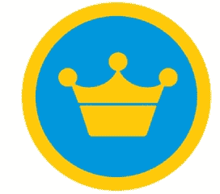

# Foursquare 完成了来自 Andreessen Horowitz、Union Square 和 O'Reilly 的 2000 万美元的 B 轮融资

> 原文：<https://web.archive.org/web/https://techcrunch.com/2010/06/29/foursquare-20-million/>

人人都试图投资或收购的地理移动初创公司 Foursquare ，现已正式结束 B 轮融资。董事会成员 [Bryce Roberts 称](https://web.archive.org/web/20230323141149/https://techcrunch.com/2010/06/29/foursquare-wire-tarnsfer/)“电汇听到‘环游世界’”的价格为 2000 万美元，使该公司的投资前估值达到 9500 万美元。正如之前报道的那样，这轮融资由 Andreessen Horowitz 牵头，现有投资者 Union Square Ventures 和 O'Reilly AlphaTech Ventures 参与其中。

首席执行官丹尼斯·克劳利表示，筹资是“大量的工作”，并计划用这笔钱来充实员工，并继续增加产品。“这一切都是为了建立一个能够生产新产品的团队，”他告诉我。“过去 10 年来，我们一直梦想着这些东西，现在我们有机会把它们都造出来。”这笔钱也将有助于支付更多的办公空间。他的 27 名员工对于这家初创公司目前在纽约的办公室来说已经太大了，Foursquare 即将搬进同一栋大楼楼上的新住处。“太棒了，”他说，“我们可以听到他们正在楼上建！”他计划雇佣更多的工程师。

整个资助过程已经拖长了。去年春天，当收购兴趣开始出现时，Crowley 正在选择追求者，首先是雅虎，然后是脸书。风投交易被搁置了。但安德森·霍洛维茨觉得自己被这个过程拖了后腿，以至于他的合伙人本·霍洛维茨非常公开地“退出”了竞标。那只不过是一种指责。现在霍洛维茨说他们当然投资了。Foursquare 有一个“伟大的创始人/首席执行官”，一个“杀手级产品”，并且正在追求一个“巨大的市场”。具体来说，在克劳利身上，霍洛维茨看到了他们喜欢投资的领导特质:一位“产品愿景守护者”的首席执行官。

卖给雅虎将是一个错误。脸书会更有趣。无论如何，Foursquare 现在将单干，开发产品不受一个有着不同目标的更大组织的阻碍。但请记住，马克·安德森是脸书董事会的成员，所以这条路并没有完全关闭。

让 Foursquare 保持独立会让它找到自己的路。geo check-in 服务可以让你向你所有的朋友广播你的位置，它的增长曲线非常好，每天增加 15000 名用户。现在它的注册用户已经从去年四月的 100 万增加到了 180 万。当你以后可以买到一件好东西时，为什么要把它弄糟呢？

Horowitz 否认了 Crowley 选择他们是为了以后去脸书的说法。“我认为这是过度解读了，”他说。“丹尼斯和马克·扎克伯格关系很好。他不需要我们或者马克来做。至少在我看来，他们和我们一起去的原因是，他们认为我们会帮助他们从一个伟大的产品变成一个伟大的公司。”

退出 M&A 谈判并不容易。“这是一个真正宣泄情绪的决定，”霍洛维茨说。“如果你看看那些人不得不放弃的东西——为了建立一家伟大的公司，你的员工几代人都在财务上受到限制——那需要很大的勇气。”

至于让 Foursquare 成为一家赚大钱的大公司，Horowitz 说“货币化”的机会是“非常明显和直接的”一旦 Foursquare 达到较大规模，它可以通过许多方式开始向企业收费。“你会花钱去了解你最常光顾的顾客吗？”霍洛维茨反问道。“大概吧。”更大的问题是如何将 Foursquare 的用户从近 200 万增加到数千万甚至更多。

Horowitz 说，Foursquare 的价值不在于位置，他认为这将成为“也许每件产品的一个特征。”真正的价值在于网络效应，随着你认识的人越来越多，去的地方越来越多，这种效应开始显现。“如果你认识的每个人都在 Foursquare 上，无论你去哪里，它就越有价值，”他指出。换句话说，Foursquare 不仅仅是签到。这只是起点。