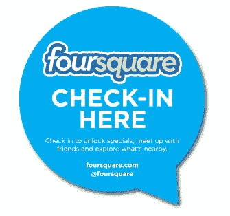

# Foursquare 开始众包本地商业数据收集，问题出现在签到之后 

> 原文：<https://web.archive.org/web/https://techcrunch.com/2013/08/21/foursquare-begins-crowdsourcing-local-business-data-collection-with-questions-that-appear-after-check-ins/>

Foursquare 是一家专注于将自身转变为本地商业信息来源并更多地按照 Yelp 的方式进行评论的公司，它将发布一项功能，希望该功能有助于从用户的签到中提取更多价值。该公司表示，现在可能会向用户提出一个简短的问题，询问他们入住后正在访问的企业，然后他们可以在应用程序中直接回答这些问题。

在该公司提供的例子中，这些问题可能是像餐厅是否有户外座位，或者是否送货，或者是否接受信用卡或只接受现金。然而，Foursquare 不想让用户在签到后的问答环节不知所措，所以不仅一次只问一个快速问题，用户也不会在每次签到后看到问题出现。相反，该公司将只是偶尔开始询问这类问题，允许它利用那些仍然通过签到更积极地参与 Foursquare 社交体验的人。

Foursquare 从其用户处收集的数据将用于增强 four square 应用程序本身中的企业档案。如今，这些企业名录已经包括地址、地图位置和电话号码等信息，这些信息会出现在用户提交的提示上方。目前，Foursquare 表示，它要求用户在食物、夜生活和商店类别中提供场所的详细信息。(店铺范围从古董店到健身房到花店等等。)

几天前，问答功能首次向 Android 用户推出，今天刚刚推广到 iOS。

这似乎是利用 Foursquare 用户群的一个聪明的方法，该用户群现在已经达到了 3500 万。然而，该公司仍然面临着一个更严重的问题:人们不再经常签到。尽管他们可能仍在推出并使用 Foursquare 作为查找当地商业信息的一种方式，但签到人数的增长并不明显。例如，今年 3 月，当 Foursquare 接近提高其 D 轮融资时，[该公司表示](https://web.archive.org/web/20221205163859/https://beta.techcrunch.com/2013/03/16/foursquare-aims-at-a-moving-target-as-it-tries-to-close-another-round-of-funding/)其当时的 3000 万用户每天有大约 500 万次签到。不幸的是，这与一年前[报道的数字相同。对许多人来说，签到的新鲜感已经消失，就像“市长战争”和应用程序中的其他游戏化元素一样，比如积分系统和徽章。](https://web.archive.org/web/20221205163859/http://mashable.com/2012/02/28/foursquare-hq-tour/)

Foursquare 一直试图通过向用户提供更多价值的签到来解决这一问题，例如当它[推出自己的量化自我趋势](https://web.archive.org/web/20221205163859/https://beta.techcrunch.com/2013/05/09/as-users-tire-of-mayorship-wars-foursquare-finds-a-new-way-to-encourage-check-ins-by-tapping-into-quantified-self-buzz/)时，增加了社交分享签到信息的能力，这些信息告诉你多久访问一个地方，或者从你上次访问到现在有多长时间了，等等。它还推出了品牌实验，如[三星赞助的“时间机器”](https://web.archive.org/web/20221205163859/https://beta.techcrunch.com/2013/06/13/foursquare-tries-to-find-revenue-by-turning-your-data-into-a-samsung-galaxy-s4-ad/)让用户以新的方式可视化他们的签到历史——这是保持用户签到的另一个不太微妙的推动。最近，[它与 Deezer 签署了一项协议，鼓励在现场音乐活动中签到，有机会获得为期三个月的 Deezer 付费订阅。这样的举措可以帮助用户重新培养他们的登录“习惯”，即使音乐场所不是 Foursquare 真正需要更多数据的那种本地企业。](https://web.archive.org/web/20221205163859/https://beta.techcrunch.com/2013/07/02/foursquare-tunes-into-international-growth-inks-live-music-check-in-deal-with-deezer-to-promote-paid-subs/)

2013 年对公司来说是变革和试验的一年。Foursquare 的[营收一直在增长](https://web.archive.org/web/20221205163859/https://beta.techcrunch.com/2013/08/06/inside-foursquares-growing-revenue-which-could-reach-20m-in-2013/)，估计今年的营收在 1500 万美元到 2000 万美元之间。它已经尝试了一些创收策略，包括上面提到的品牌赞助和促销，并且[计划](https://web.archive.org/web/20221205163859/http://www.businessinsider.com/leaked-pitch-deck-reveals-exactly-how-foursquare-plans-to-make-money-2013-4)进军入住重定向和入住后广告。该公司在该平台上有大约 140 万本地商户，它希望通过按行为收费的方式对广告产品收费来赚钱(例如，当用户出现以利用午餐特价时，广告商付费)。

在通过众包问答充实 Foursquare 的商家档案数据之前不久，[的竞争对手 Yelp 采取了自己的一步](https://web.archive.org/web/20221205163859/https://beta.techcrunch.com/2013/08/13/to-square-up-to-foursquare-yelp-now-lets-users-post-reviews-directly-from-its-mobile-app/)，以保持其在本地评论领域的顶级应用的地位:它终于推出了一种让用户从移动设备写评论的方式。这一变化暗示，Yelp 感受到了来自该领域其他公司的竞争，包括 Foursquare、谷歌、square、Groupon [和脸书](https://web.archive.org/web/20221205163859/https://beta.techcrunch.com/2013/08/12/facebook-opentable-useful-not-just-social/)，这些公司都专注于收集用户访问当地企业的数据。

更新后的 Foursquare 应用程序现已在 Android 和 iOS 上发布。