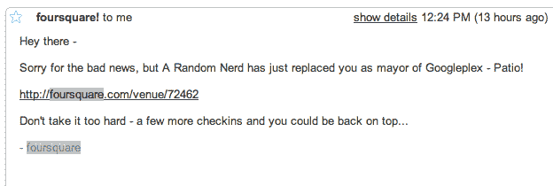

# 除了 four square rehabilitation，其他地方都有人签到 

> 原文：<https://web.archive.org/web/https://techcrunch.com/2010/02/16/foursquare-cheating/>

今天早些时候，我被免去了 Foursquare 谷歌广场的市长一职。原来，是[这个家伙](https://web.archive.org/web/20221001105235/http://www.krazydad.com/blog/2010/02/mayor-of-the-north-pole/)。KrazyDad 是一个肩负使命的人:展示 Foursquare 基于签到系统的漏洞。男孩他做到了。

需要说明的是，任何经常使用 Foursquare 的人可能都很清楚这些漏洞。例如，没有什么可以阻止你在世界上任何你想去的地方签到，除了在附近的一个自动出现在你的列表上的地点更容易办理*。但是这个家伙，KrazyDad，用 Foursquare 的 API 和一些脚本来干他的脏活。最终，他通过一系列虚假的 Foursquare 账户获得了几十个市长职位。*

 *过去，作弊在 Foursquare 上并不是什么大问题，因为，谁在乎呢？你作弊的唯一结果就是让那些抓住你的人知道你很可悲。但是 Foursquare 越来越多地获得奖励大量参与的特殊交易。例如，如果你是 Foursquare 上那个地方的市长，旧金山的一个披萨店会给你一个免费的披萨。在那里当市长比去那里几次容易得多。

这与 Foursquare 面临的“混球”问题没什么不同。也就是说，在早期，该服务的第一批采用者并不介意有一个名为“混球”的徽章。事实上，它为游戏增加了有趣的元素。但现在，随着 Foursquare 变得更加主流，一些用户开始抱怨它。同样，越来越多的用户开始抱怨作弊。

那么他们能做什么呢？

嗯，至少自从我使用这项服务以来([大约一年了](https://web.archive.org/web/20221001105235/http://digital.venturebeat.com/2009/03/10/dodgeball-founder-pegs-google-in-the-face-with-foursquare/))，Foursquare 一直在思考作弊问题。问题是，关于虚假的签到，唯一可靠的方法是在你实际的 GPS 坐标上签到。正如戈瓦拉[非常了解](https://web.archive.org/web/20221001105235/https://beta.techcrunch.com/2009/11/24/gowalla-business-models/)的那样，这样做的问题是，当用户在室内时，很难(在某些情况下是不可能的)获得 GPS 数据。显然，如果你打算在某个地点签到，这是一个大问题。Gowalla 实际上不得不放松其 GPS 登记限制，以确保更多的人可以使用这项服务。

Foursquare 曾经做过的一件事(虽然我不确定它是否还在)是观察签到率。如果你太快做了两个或更多，他们会警告你慢下来(甚至会因为作弊而叫你出去)。尽管如此，如果有人真的想作弊，这并不是一个很大的威慑。

那些在 Twitter 上关注[迈克](https://web.archive.org/web/20221001105235/http://twitter.com/arrington)的人可能已经注意到，他不停地在以色列等地办理登机手续，下一分钟就去伯班克机场。他基本上一直在玩与 KrazyDad 相同的作弊游戏，但他已经这样做了几个月(帖子在哪里，迈克？).坦白地说，我不确定 Foursquare 对作弊方面有多关心。我相信他们会说他们是，但真的，这些骗子只是推动其他人更关心游戏的重度用户。当我看到那个家伙把我从谷歌总部市长的位置上赶了下来，我的第一反应就是想去那里夺回它。我并不孤单。

也就是说，随着越来越多的实际盈利交易出现，Foursquare 必须尽快解决这个问题。每场比赛的目的都是赢得比赛。可悲的是，哪里有游戏，哪里就有人愿意作弊。

*