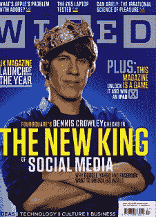

# Foursquare 创始人从上一轮 2000 万美元融资中为自己拿出 460 万美元

> 原文：<https://web.archive.org/web/https://techcrunch.com/2010/07/14/foursquare-founders-4-6-million/>

# Foursquare 创始人在上一轮 2000 万美元融资中为自己拿出了 460 万美元

如果丹尼斯·克罗利把 Foursquare 卖给了脸书，他就不会有那么高的个人收入，而他也差不多做到了。但克罗利和联合创始人纳文·塞尔瓦杜莱对他们从安德森·霍洛维茨、联合广场和奥莱利·阿尔法技术公司(O'Reilly AlphaTech)筹集的 2000 万美元 B 轮融资(T2)做得很好。根据一份 [SEC 文件](https://web.archive.org/web/20230326215301/http://www.sec.gov/Archives/edgar/data/1470908/000147090810000002/xslFormDX01/primary_doc.xml)(最早由 [Dan Frommer 在 SAI](https://web.archive.org/web/20230326215301/http://www.businessinsider.com/foursquare-series-b-sec-filing-2010-7) 发现)，这两位创始人从那一轮融资中个人获得 4636688 美元，占融资总额的 23%。

根据文件中题为“收益的使用”的部分，该公司必须披露“已经或计划用于支付任何需要被任命为高管、董事或发起人的人员的发行总收益金额，以回应上述第 3 项。”被列为“高管、董事或发起人”的只有三个人:克劳利、塞尔瓦杜拉伊和联合广场的董事会董事阿尔伯特·温格。董事会中的一位风投在他的公司之前取消个人流动性是极不寻常的。联合广场在这一轮投入了更多资金。

难怪克劳利在世界杯结束后立即飞往南非观看了一些比赛。(公平地说，这也是他在“连续奔波”18 个月后的第一次休假，”他说。不妨做得有格调一点)。

随着 IPO 市场不再像过去那样有吸引力，公司保持私有状态的时间越来越长，创始人在后来的风险投资中拿走一些钱变得越来越常见。(在最近的其他几轮风险投资中，创始人获得的金额要大得多)。只要公司做得好，没有人会责怪他们。但是如果公司遇到困难的时候，这些现金会有所帮助。。。然后会讲述一个不同的故事。

更新:Foursquare 表示，创始人出售股份本质上是为了让投资者购买更多。发言人艾琳·格里森发给我以下声明:

> 正如 B 轮融资中常见的那样，丹尼斯和纳文出售了一小部分个人股权作为二次发行，让我们的投资者实现他们的所有权目标。