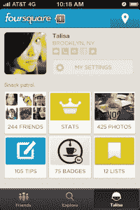
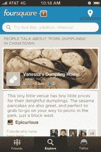
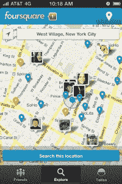

# Foursquare 焕然一新:重新设计让签到变得更加棘手和社会化

> 原文：<https://web.archive.org/web/https://techcrunch.com/2012/06/06/foursquare-gets-a-new-look-redesign-makes-checking-in-stickier-and-more-social/>

# Foursquare 有了新的面貌:重新设计使得签到更具粘性和社会性

Foursquare 是一款让人们虚拟地“签到”他们实际去过的地方的应用程序，它首次推出了一款全新的自上而下的移动应用程序。新的外观并不令人惊讶——几天来，在科技媒体上，也许大多数是总部位于纽约的[公司](https://web.archive.org/web/20221207181202/http://www.crunchbase.com/company/foursquare)自己，关于已经有了相当响亮的传言。现在，是[终于直播](https://web.archive.org/web/20221207181202/http://aboutfoursquare.com/foursquare-version-5/)了。

新的外观显然旨在让人们在网站上与其他人进行更多的互动——那些他们已经认识的人，以及他们可能还不认识的人。每个个人资料页面都将用户的照片、位置、简短简历以及各种联系信息和社交媒体个人资料放在最前面和最中间。主页的新布局也更吸引人点击查看朋友的最新活动。这显然是为了让 Foursquare 的体验“更有粘性”，并鼓励用户更频繁、更长时间地点击它。

新版本的应用程序还更加突出了 Foursquare 用户对签到地点的意见，这些意见也来自第三方网站。这似乎旨在激励用户花更多时间阅读应用程序，同时也为 Foursquare 与 Yelp 等更注重评论的网站之间日益激烈的竞争态势增加了弹药。

这款应用的位置方面有了新的亮点，它有一个更快捷的地图界面，可以让你实时看到你的朋友在哪里。

这一切看起来相当不错，因为考虑到公司的影响力，这是完全应该的:自 2009 年成立以来，Foursquare 已经筹集了超过 7100 万美元的风险投资，最近的股票销售对公司的估值超过 6 亿美元。

但是这笔钱也伴随着巨大的压力。众所周知，像脸书这样的行业巨头已经很好地融入了签到游戏，当然，现在也不缺乏本地交易提供商。新的外观表明，Foursquare 能够应对挑战，在它帮助开拓的 SoLoMo 领域保持优势——问题是，Foursquare [尚未开始创造的“大量收入”](https://web.archive.org/web/20221207181202/http://www.businessinsider.com/foursquare-investor-it-doesnt-have-a-ton-of-revenue-yet-2012-5)会最终跟上吗？当然，这是一个价值 6 亿美元的问题，只有时间能证明一切。

以下是改版后的图片(点击放大):
