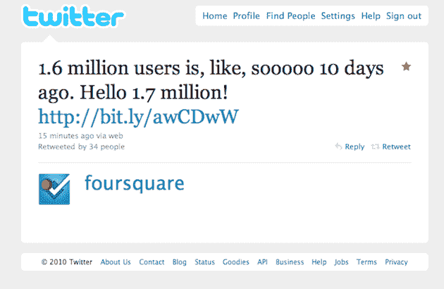

# Foursquare 现在每周增加近 10 万用户 

> 原文：<https://web.archive.org/web/https://techcrunch.com/2010/06/22/foursquare-growth/>

# Foursquare 现在每周增加近 10 万用户

在过去的几个月里， [Foursquare](https://web.archive.org/web/20221217191101/http://foursquare.com/) 已经获得了一系列令人印象深刻的数据。其中有些涉及 [SXSW](https://web.archive.org/web/20221217191101/https://techcrunch.com/2010/03/22/foursquare-gowalla-data/) ，有些涉及[总入住人数](https://web.archive.org/web/20221217191101/https://techcrunch.com/2010/02/05/foursquare-check-ins-2/)，有些涉及[交易](https://web.archive.org/web/20221217191101/https://techcrunch.com/2010/02/08/foursquare-mainstream-deals/)签约。但归根结底，任何服务最重要的指标仍然是用户数量。Foursquare 在那里也做得很好。

基于位置的服务刚刚在推特上发布消息说，他们现在已经超过了 170 万用户。令人印象深刻的是，这比一周前的[增加了 10 万用户。从这个角度来看，同样令人印象深刻的是，就在两个月前，Foursquare 的用户数量突破了 100 万——显然，这一增长速度越来越快。](https://web.archive.org/web/20221217191101/http://twitter.com/foursquare/status/16076087125)

按照这个速度，Foursquare 将在 7 月超过 200 万用户。MyTown，另一个基于位置的网络[在 5 月达到了这个数字](https://web.archive.org/web/20221217191101/http://www.businessinsider.com/sorry-mytown-is-no-threat-to-foursquare-2010-5)，但它更多的是一个游戏，而不是一个标准的基于位置的网络。另一个基于位置的网络，Brightkite，[在二月份达到了 200 万用户。与此同时，竞争对手 Loopt 和谷歌 Latitude 都拥有 300 万用户](https://web.archive.org/web/20221217191101/https://techcrunch.com/2010/02/26/brightkite-2-million-users/)。

按照这种增长速度，Foursquare 可能很快就会在规模上超过许多竞争对手。当然，Loopt 及其[新的支持后台的 iPhone 应用](https://web.archive.org/web/20221217191101/https://techcrunch.com/2010/06/21/loopt-background-location-iphone/)，以及 Latitude 及其[新的 API](https://web.archive.org/web/20221217191101/https://techcrunch.com/2010/05/19/google-latitude-api/) ，可能会对此有所表示。