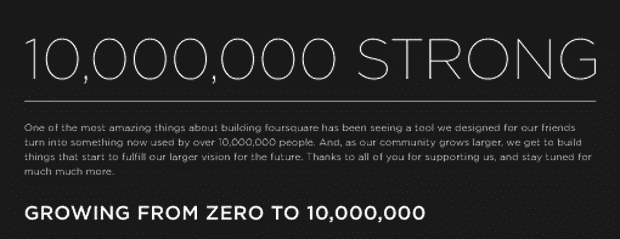
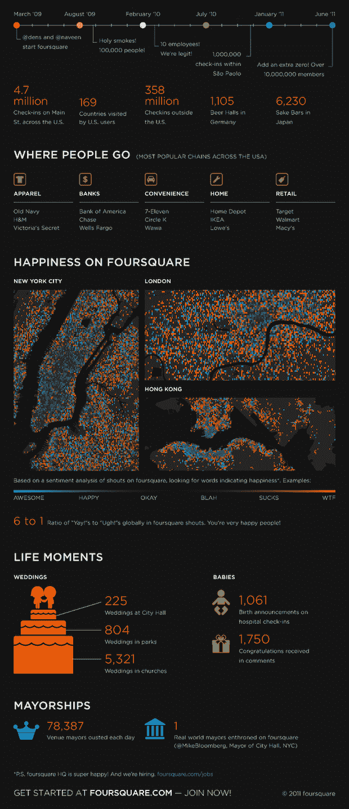

# Foursquare 现在正式拥有 1000 万用户 

> 原文：<https://web.archive.org/web/http://techcrunch.com/2011/06/20/foursquare-now-officially-at-10-million-users/>

# Foursquare 现在的官方用户数是 1000 万

 
在经历了大约两周的虚惊之后，刚刚成立两年多的 Foursquare】今天刚刚宣布了一个重要的里程碑，1000 万用户账户——比上次在 5 月宣布里程碑时增加了 70 万注册用户账户(该公司没有公布活跃用户数量)。该公司将在本周晚些时候通过 7.5 亿次签到，用户现在平均每天约有 300 万次签到。

目前，Foursquare 用户的人口统计数据显示，男性和女性各占一半，国际用户和美国用户各占一半。根据 Foursquare 的数据，该公司已有 3.58 亿次国际用户签到。

现在[将近 50 万品牌](https://web.archive.org/web/20230204233133/http://www.adweek.com/internet-week-blog/dennis-crowley-developers-share-and-share-alike-132313)和公司正在使用 Foursquare 与用户联系，超过 10K 的开发者正在利用它的 API。

Foursquare 也刚刚在旧金山注册了一个新办公室，并计划在旧金山增加一倍的新员工，其中包括谷歌的西蒙·法夫罗-莱萨尔，Twitter 的库珀·贝瑟亚和本杰·温伯格。

据传，除了目前的 2140 万美元资金外，该公司还将筹集新一轮资金，估值约为 10 亿美元。当被问及 Foursquare 已经达到 1000 万大关，他是否有什么宏伟的计划时，联合创始人丹尼斯·克劳利回答说:“是的，继续让产品变得更好。我们还有很长的路要走:)

