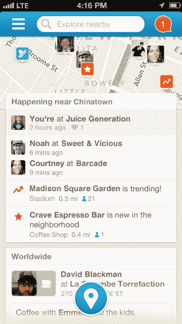
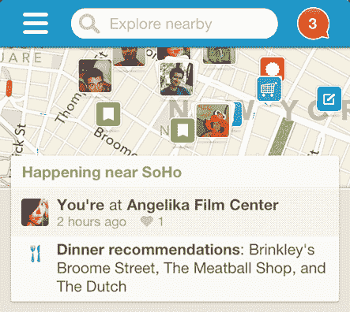

# Foursquare 即将发布的 iOS 对该公司来说是一个关键时刻，因为它是“机不可失，时不再来”

> 原文：<https://web.archive.org/web/https://techcrunch.com/2013/04/09/foursquares-upcoming-ios-release-is-a-pivotal-moment-for-the-company-as-in-its-now-or-never/>

# Foursquare 即将发布的 iOS 对该公司来说是一个关键时刻，因为这是“机不可失，时不再来”

我们都非常了解 Foursquare 的故事:四年前在 SXSW 推出的应用程序，从那以后相当多的人一直用它来签到。该公司正在发布其[旗舰 iOS 应用程序](https://web.archive.org/web/20221124021503/https://itunes.apple.com/us/app/foursquare/id306934924?mt=8)的新版本，该应用程序将把 35 亿次签到置于搜索和探索功能的最前沿。自从 10 月份他们在他们的网站上做了[几乎同样的事情](https://web.archive.org/web/20221124021503/https://beta.techcrunch.com/2012/10/15/meet-the-new-foursquare-the-one-that-youve-helped-build-and-continue-to-power/)以来，我们就已经看到了这一举动。

有了[之后，在应用程序上签到](https://web.archive.org/web/20221124021503/https://beta.techcrunch.com/2013/03/06/the-checkin-is-dead-long-live-the-checkin-as-foursquare-adds-quick-glide-feature-on-ios/)变得更容易了，Foursquare 现在想让你一头扎进你周围的地点，希望利用应用程序来帮助你决定下一步去哪里。这些举措看起来有点疯狂，尽管很明显该公司拥有大量信息，并且迫切希望用户开始与之互动。

这款新应用将于周三上午推出，现在分为四个部分。搜索框在屏幕上方，下方是你附近朋友的地图。这些主要区域之后是针对这一特定时刻的个性化推荐，当然，底部还有签到按钮。基本上，Foursquare 希望你去某个地方，而且要快。

我们听说[公司在筹集下一轮](https://web.archive.org/web/20221124021503/https://beta.techcrunch.com/2012/11/02/foursquare-looks-into-a-hefty-fourth-round-some-investors-skeptical/)资金时遇到了困难，可能正在进行收购谈判。有些感觉像雅虎！会是一个完美的服务场所，我也同意这一点。所有这些都取决于这个特定版本的应用程序能否引起消费者的新共鸣。

话虽如此，Foursquare 目前还没有任何其他大修式的迭代，这次更新被称为 6.0 版。这是一个成熟的产品，这个最新版本必须抓住一批新用户，他们依赖 Yelp 和谷歌等服务来获取关于场馆的信息和去哪里闲逛的建议。

人们现在肯定会说，Foursquare 是一款让你在现实世界中忙着做事情的应用。在某种程度上，这个应用程序必须是你的私人助理，使用你给它的所有信息，以及你的朋友给它的信息，来帮助引导你到达下一个目的地。但这是 Foursquare 可以发布的最后一个版本，以抓住它还没有的一批消费者。如果这次它做不到，未来就不太好看了。

徽章一度很有趣；签到让人上瘾；收集积分并在由你的朋友组成的排行榜上名列前茅是一种狂欢；成为一个场馆的市长是一件有趣的事情。但那是过去，这是现在。

这些数据来自我们这些多年来提供数据的人。发现的能力是预先的，并且推荐技术是适当的。社区的 3000 多万成员已经完成了他们的工作。

会有新人蜂拥而至吗？Foursquare 会让我们的生活更美好吗？一旦发射，我们就知道了。它存在了这么久，仅此一点就令人印象深刻。剩下的问题是，在没有惊天动地、令人瞠目结舌的击倒的情况下，它还能打多少回合？

[图片来源: [Flickr](https://web.archive.org/web/20221124021503/http://www.flickr.com/photos/nanpalmero/4432186135/)