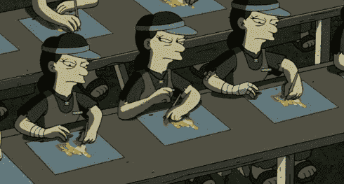
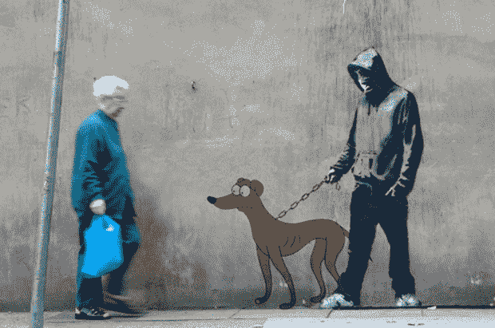

# 福克斯从 YouTube 上撤下班克斯的《辛普森一家》视频

> 原文：<https://web.archive.org/web/https://techcrunch.com/2010/10/11/fox-pulls-down-banksy-video-from-youtube/>

# 福克斯从 YouTube 上撤下班克斯的《辛普森一家》视频

> *“我没见过他，甚至不知道他长什么样，除了网上暗示的[。”](https://web.archive.org/web/20221202032631/http://artsbeat.blogs.nytimes.com/2010/10/11/the-simpsons-explains-its-button-pushing-banksy-opening/) —《辛普森一家》制片人阿尔·让谈班克斯*

如果你在过去的一天左右根本没有阅读 Twitter*[，](https://web.archive.org/web/20221202032631/https://twitter.com/#!/MJ_Isaac/status/27056292360)* 昨晚“班克斯”既是 Google Trends 上的第六个搜索词，也是 Twitter 上的第六大热门话题(直到今天早上还在 Twitter 上)，这一切都是因为这位难以捉摸的街头艺术家对动画系列“臭名昭著的介绍”令人难以置信的黑暗和元故事板，福克斯刚刚因侵犯版权而从 YouTube 上删除了该系列。

在福克斯将其删除之前，YouTube 视频目前已经积累了 42305 次观看，可以肯定地说，我们几乎没有人真正在电视上看过它，甚至很快就消除了关于该片段是否实际播出的猜测。

而学习技术的博客 [Gizmodo](https://web.archive.org/web/20221202032631/http://gizmodo.com/5660618/this-is-the-simpsons-title-scene-secretly-created-by-banksy) 、*Mashable甚至 [Daring Fireball](https://web.archive.org/web/20221202032631/http://daringfireball.net/linked/2010/10/10/banksy-simpsons) 毫不犹豫地立即发表博客，尽管这与他们通常涉及的垂直领域没有任何直接关系(哦[商业内幕！](https://web.archive.org/web/20221202032631/http://www.google.com/search?sourceid=chrome&ie=UTF-8&q=business+insider+banksy))，[《福布斯》科技](https://web.archive.org/web/20221202032631/http://blogs.forbes.com/velocity/2010/10/11/pop-artist-banksys-intro-on-the-simpsons-makes-cultural-commentary-on-outsourcing/)更加努力地尝试，并在今天早上提出了令人印象深刻的[“流行艺术家班克斯对《辛普森一家》的介绍对外包进行了文化评论”](https://web.archive.org/web/20221202032631/http://blogs.forbes.com/velocity/2010/10/11/pop-artist-banksys-intro-on-the-simpsons-makes-cultural-commentary-on-outsourcing/)。*

我的观点是，没有互联网和 Youtube，许多人不会知道班克斯做了《辛普森一家》的介绍——直到我们说它是主流新闻，它才是有价值的。事实上，如果没有互联网和网络文化，班克斯本人也不会声名狼藉，因为他的身份仍然是个秘密。

简而言之，在今天的流行文化中，总有一个不断发展的技术角度。

****更新:** [鲁珀特·默多克的下属](https://web.archive.org/web/20221202032631/http://www.newscorp.com/) [彼得·卡夫卡](https://web.archive.org/web/20221202032631/http://allthingsd.com/) [在评论](https://web.archive.org/web/20221202032631/https://beta.techcrunch.com/2010/10/11/fox-pulls-down-banksy-video-from-youtube/#comment-86004497)中指出，这个片段现在可以在 [Hulu](https://web.archive.org/web/20221202032631/http://hulu.com/) 上看到，如果人们在节目播出 12 小时后才在那里看到它，它的病毒效应将是一样的。**

> ***“呸。如果这件事昨晚没有上传到 YouTube 上，那么整个场景仍然会以同样的方式进行。大约 12 个小时后，这段视频在 Hulu 上合法地出现了。这就是 Hulu 的意义所在:福克斯、NBC 等可以获得班克斯剪辑或《懒惰的星期天》的病毒式好处，而不必将发行权(和可能的货币化)让给谷歌或其他人。这种方法很有效。”***

我不同意，原因有三个:A)在讨论和实际观看内容之间有 12 个小时的滞后时间，这对我们短暂的千禧年注意力跨度来说不是好兆头。b)目前我在 Hulu 上能找到的只有 [21:31 分钟的完整广告片段，](https://web.archive.org/web/20221202032631/http://www.hulu.com/watch/184048/the-simpsons-moneybart#s-p1-so-i0)不完全是最“分享友好”的格式。c)

 *这就好像福克斯让 YouTube 做了所有的口碑传播的肮脏工作，然后在视频变得流行时收获战利品。错过视频的国外读者 **[仍可在此查看。](https://web.archive.org/web/20221202032631/http://www.clarin.com/espectaculos/Simpson-Bansky_0_351564993.html)**

如果你住在美国，你可以在 Hulu 上看完整集，如下:

照片来自 [JBOY via 笑乌贼](https://web.archive.org/web/20221202032631/http://laughingsquid.com/simpsons-themed-parody-of-bansky-by-jboy/)，很多[人第一次看到这个视频。](https://web.archive.org/web/20221202032631/http://laughingsquid.com/banksy-storyboarded-directed-opening-of-the-simpsons/)*