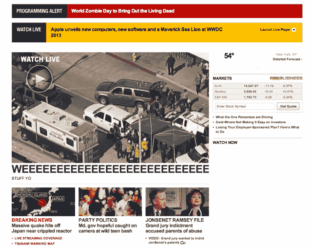

# FoxNews.com 似乎黑了(或者有人搞砸了)TechCrunch

> 原文：<https://web.archive.org/web/https://techcrunch.com/2013/11/05/foxnews-com-seemingly-hacked-or-someone-just-screwed-up-big-time/>

# FoxNews.com 似乎被黑了(或者有人搞砸了)

哎呦！看起来有人找到了进入 fox news . com CMS 的方法(或者一个实习生将一个旧的测试页面推送到 live。)

虽然还不是 100%清楚这里发生了什么，但我们的提示收件箱刚刚着火，因为人们争先恐后地指出 FoxNews.com 发生了一些奇怪的事情。

“Weeeeeeeee”，这是头版头条的标题。“玩意儿哟”，说得详细。

与此同时，页面顶部的突发新闻提醒提到了“活死人”,苹果公司在 2013 年 WWDC 发布了“海狮”,将“ol”WTF 表提升了几个等级。有趣的是，这两个都是完全真实的福克斯新闻频道故事——它们都是几周前的事了，而且没有上下文(“世界僵尸日”是一年一度的僵尸粉丝郊游，“海狮”是在苹果发布会期间开的一个玩笑)尤其荒谬。

尽管看起来和闻起来都很像黑客，但福克斯的推特账户将其归因于“内部制作问题”。

**更新:**看起来他们已经修好了。

**更新#2:** 一条来自福克斯新闻频道的[新评论](https://web.archive.org/web/20221004190351/http://www.huffingtonpost.com/2013/11/05/fox-news-website-hacked_n_4220504.html?ncid=edlinkusaolp00000009)强化了实习生搞砸理论:

> “在例行的网站维护过程中，一个主页原型被意外地移到了实际的网站上。正如测试中的任何错误一样，工程师们注意到了这个错误，并迅速将网站恢复到正常功能。”

这就是为什么你要使用 Lorem Ipsum T1。