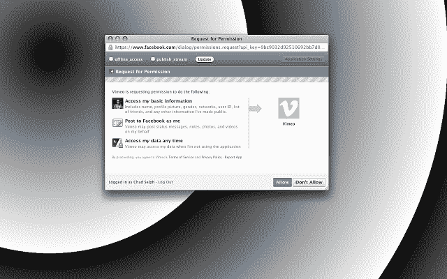

# fPrivacy 让您控制脸书应用权限 TechCrunch

> 原文：<https://web.archive.org/web/http://techcrunch.com/2011/12/18/fprivacy-lets-you-control-facebook-app-permissions/>

# fPrivacy 可让您控制脸书应用权限

fPrivacy 是一个 Chrome 插件，每当应用程序授权对话框出现时，你可以精确地选择退出跟踪者式的脸书应用程序权限，如“张贴到我的墙上”或“访问个人资料信息”。呜哇！

创建者[查德·塞尔夫](https://web.archive.org/web/20230209124924/http://www.twitter.com/chadselph)做出了扩展，因为脸书应用程序太贪婪太久了——对权限采取全有或全无的方法。

fPrivacy 通过允许你指定你想要允许的权限和你想要阻止的权限来设置这些 gladhandling 应用程序。关于 fPrivacy 最好的事情是我帮助 [Selph](https://web.archive.org/web/20230209124924/http://www.chadselph.blogspot.com/) 想出了这个标志/名字——拜托，想想吧…

Selph 在这个过程中说，“有人从 github 建议使用 Defangbook，我也很喜欢，因为这样的话这个 logo 可能会有尖牙。我有点觉得这可能太可爱或者太聪明了。我对 fPrivacy 有 82%的信心。”

我百分百相信，查德。总统的隐私。fPrivacy，当你不想在你的墙上张贴一些 shadyass 脸书应用程序，但你仍然想阅读你的[生物趋势星座](https://web.archive.org/web/20230209124924/http://blog.biotrend.us/2008/07/biotrend-ultimate-horoscope-facebook.html)或其他什么的时候。

我知道这个帖子是史诗般的。请在评论中留下您的宝贵意见。