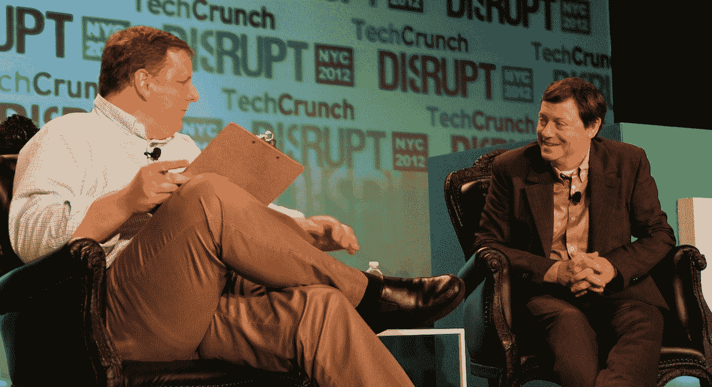

# 更新:“自从谷歌承诺支持谷歌+(Google+)，谷歌就没有兴趣收购 Twitter 弗雷德·威尔逊 

> 原文：<https://web.archive.org/web/https://techcrunch.com/2012/05/21/fred-wilson-angels/>

迈克尔·阿灵顿说，谷歌有机会收购 Twitter，但这个搜索巨头放弃了。“自从他们致力于 Google+以来，谷歌一直没有兴趣收购 Twitter，”联合广场风险投资公司创始人和前 Twitter 董事会成员弗雷德·威尔逊说，他今天早上在 TechCrunch Disrupt 纽约会议上与阿灵顿进行了炉边谈话。【**更新**:澄清一下，我认为谷歌在收购 Twitter 上错失良机，而[威尔森只是说](https://web.archive.org/web/20221208211857/http://www.avc.com/a_vc/2012/05/setting-the-record-straight.html)谷歌对这样的收购不感兴趣，因为它致力于 Google+。威尔逊没有对谷歌不收购 Twitter 做出价值判断，也没有证实曾经进行过收购讨论。]

现在，Google+被广泛视为鬼城，不收购 Twitter 可能是一个错误，在未来几年里一直困扰着山景城。威尔逊的投资组合是风险投资中最令人羡慕的投资组合之一，联合广场风险投资公司在 Twitter、Zynga、Etsy 和 Tumblr 上的投资较早。但是未来可能不会如此光明。“我不认为我会非常擅长投资下一件大事。我不是从那里来的。我没有在里面工作。下一件事不会是进化。这将是完全不同的事情。”

阿林顿在最近的 AVC 博客文章中抨击威尔逊写下“硅谷可能成为下一个底特律”。威尔逊解释说“我不是有意这么说的。硅谷是数字革命的中心。但如果有另一场革命，(比如)传送革命，而传送是在孟买发明的，硅谷可能不会是下一个大事件的发生地。”

#### 谷歌失去了羊群

在关于未来社交的战争中，阿林顿问道“你认为脸书被高估了吗？”尽管这家新上市公司的股价较周五收盘价下跌了 10%以上，但威尔逊为马克·扎克伯格的创造辩护。“市场来来去去，好公司才能生存。脸书股票的价格并不重要。马克建立了一个令人难以置信的平台和组织。我不认为它的交易价格是 25 美元还是 50 美元有多大关系。”但阿林顿追问“这将是一家价值 5000 亿美元的公司吗？”威尔逊承认“他们必须成长为那样的人。”

谷歌曾有一个与脸书竞争的大好机会，但那已经过去了。阿灵顿引用了一个谣言，Twitter 首席执行官迪克·科斯特罗带着公司去谷歌说，它正在以这个估值筹集这么大的一轮融资，并给了搜索巨头一个收购 Twitter 的机会，但“谷歌嗤之以鼻”。聊天结束后，阿林顿告诉我，这是 Twitter 最终以 37 亿美元的估值筹集到 2 亿美元的时候[，所以谷歌必须支付的价格可能就在那里。](https://web.archive.org/web/20221208211857/https://beta.techcrunch.com/2010/12/15/the-smoke-has-cleared-twitter-now-worth-3-7-billion-gets-200-million-and-two-new-board-members/)

威尔逊是 Twitter 的投资人，也是前董事会成员，这一定让他对讨论很熟悉。他说，谷歌决定建立社交网站，从那以后就没有考虑过在这个领域收购像 Twitter 这么大的公司。[ **更新** : Wilson 从未证实 Arrington 的谣言，也没有暗示不收购 Twitter 是谷歌的错误举措] Google+起步缓慢，至少从人们实际使用它的角度来看，而不仅仅是注册。但 Twitter 可能并不合适。谷歌需要一个可以整合到其所有产品中的社交层，而不仅仅是一个微博平台。尽管如此，谷歌现在在社交领域远远落后于第三名，Twitter 也不在考虑之列。威尔逊说，Twitter 的创始人和董事会现在坚决主张保持独立。

更新:谷歌最好希望它不会像雅虎那样结束，众所周知，雅虎在 2006 年降低了收购脸书的出价，然后输掉了这笔交易。现在，威尔逊说雅虎前首席执行官、名誉扫地的斯科特·汤普森“是个糟糕的首席执行官”。他做的第一件事是起诉脸书是专利流氓，证明他对这个世界的运作方式一无所知。他是该公司一连串糟糕的首席执行官之一。”不过，汤普森还有机会挽回自己。“埃利奥特·斯皮策康复了，”威尔逊说，“我认为人们可以改过自新，但在简历上撒谎绝对不是一件好事。”

#### 天使的价值是什么？

“我从来没有见过天使偷懒”Wilson 说，反驳了本·霍洛维茨关于天使投资者做太少的工作却赚太多的钱的说法。威尔逊发表了大量关于脸书估值和硅谷未来的见解

“风险投资并不是等式中最冒险的部分。威尔逊说:“我们会等到事情发展得更好的时候。他相信天使和他们所做的早期跑腿工作和勤奋。“我不知道‘懒’从何而来。他们可能是资本堆栈中最重要的部分，因为他们比风投更相信创业者。”

*【图片鸣谢:[伊藤约伊](https://web.archive.org/web/20221208211857/http://www.fotopedia.com/users/joi)*