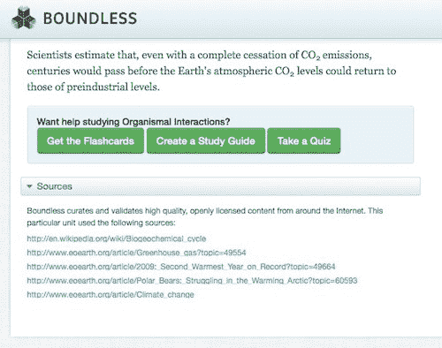

# 免费、开源的数字教材提供商 unlimited 在 Creative Commons TechCrunch 下发布其内容

> 原文：<https://web.archive.org/web/https://techcrunch.com/2013/01/22/free-open-source-digital-textbook-provider-boundless-releases-its-content-under-creative-commons/>

自去年年初首次出现以来，总部位于波士顿的初创公司[unlimited](https://web.archive.org/web/20221209140734/https://www.boundless.com/)一直致力于为学生提供一种免费的选择，以取代装满昂贵纸质教科书的笨重背包的财务和物理成本。联合创始人阿里尔·迪亚兹(Ariel Diaz)、布莱恩·鲍尔弗(Brian Balfour)和亚伦·怀特(Aaron White)认为，多年来，老牌教科书出版商(其中四大出版商仍控制着市场)一直在推高教育内容的成本，因此 unlimited 一直在通过提供从现有开放教育资源中挑选出来的免费数字替代方案来对抗权力。

自然，由于他们对教育内容的“开放”管理方式，unboundary 遇到了顶级教科书出版商的大量诉讼，目前正试图在法庭上解决这些分歧。但是，与此同时，它继续前进，今天通过知识共享，正式为它的开放教科书增加了一个熟悉的名字——一些合法性。

这家初创公司已经发布了 18 本开放教材，内容由知识共享许可，事实上与维基百科使用的许可完全相同。这 18 本教科书涵盖了从会计和生物学到社会学和经济学的大学科目，并且随着内容现在在知识共享协议下获得许可，unlimited 正在缓解教师对使用开放教科书的一些担忧——与来自熟悉名称的更“可信”(或受控)的内容相比。

联合创始人阿里尔·迪亚兹(Ariel Diaz)说，迄今为止，美国一半以上大学的学生已经使用了无限的资源，由于知识共享的支持，他预计这个数字还会增长。

[unlimited 在其网站上提供了整整一个部分](https://web.archive.org/web/20221209140734/https://www.boundless.com/oer/)，专门解释它如何使用开放教育资源，并为用户描述最佳实践，但其免费教科书的用户会发现，在每章的结尾，资源被引用为学生可以找到原始材料的链接列表。

例如，上一章引用了《地球百科全书》中的几篇文章，如果读者点击这些链接，他们会看到这些文章是由知识共享“BY-SA”许可“OER 管理”的。

显而易见，为什么开放教育资源和利用这些资源的创业公司让传统的教科书出版商感到害怕。无限教科书是完全免费的，没有教科书租赁平台上的到期日，也不要求学生去书店回购。

相反，随着理论的改变，新内容的增加，我们在火星上发现了智慧生命等等,《无边无际》不断更新它的内容。而且，由于数字技术的魔力，它可以将这些变化无缝地融入到内容中，而无需高昂的成本，也无需强迫学生再买一本书。此外，它使得所有的主题在页脚处都很容易导航。

为了赚钱，unboundary 可能会将其转变为免费增值模式，在其平台和教科书中添加可选的增值前功能，这将有助于学生更有效地学习(变得更聪明等)。)并将付费提供。

迪亚兹还表示，该公司现在将提供额外的功能(如上所示)，例如抽认卡、测验和学习指南，其中将包括知识共享许可的材料，并将在其教科书中提供。通过这种方式，unlimited 希望超越传统教科书所提供的内容，与 Inkling 和 Kno 这样的初创公司一起推动这个领域的发展。

迪亚兹说，为了利用这些优势，学生必须创建一个用户帐户，然而，对其教科书的访问仍然是免费的。如果你想知道在哪里可以找到你的书，在这里查看它的可用教科书列表。该公司将不断更新，因为它继续增加更多。

你可以在这里和这里查阅几本浩如烟海的教科书。