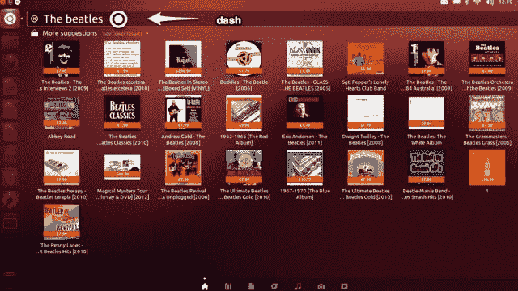

# 自由软件领导者理查德·斯托尔曼:亚马逊搜索整合到 Ubuntu 相当于间谍软件 

> 原文：<https://web.archive.org/web/https://techcrunch.com/2012/12/07/free-software-leader-richard-stallman-amazon-search-integration-in-ubuntu-amounts-to-spyware/>

# 自由软件领袖理查德·斯托尔曼:亚马逊搜索整合到 Ubuntu 相当于间谍软件

自由软件领导者[理查德·斯托尔曼](https://web.archive.org/web/20221225071834/http://en.wikipedia.org/wiki/Richard_Stallman) [声称 Ubuntu 相当于间谍软件](https://web.archive.org/web/20221225071834/http://www.fsf.org/blogs/rms/ubuntu-spyware-what-to-do)，亚马逊搜索被集成到其 Unity 界面的“dash”中。他呼吁开发者避开开源操作系统。

[Canonical](https://web.archive.org/web/20221225071834/http://canonical.com/) 是 Ubuntu 背后的公司。斯托曼称广告搜索结果相当于监视，并辩称个人数据在 Canonical 的服务器上。虽然 Canonical 没有将数据发回给 Amazon，但数据驻留在 Canonical 的系统上这一事实对 Stallman 来说已经足够了。

Stallman 作为自由软件基金会的领导人有着巨大的影响力，他在今天的博客中说:

> Ubuntu，一个广泛使用和有影响力的 GNU/Linux 发行版，已经安装了监视代码。当用户使用 Ubuntu 桌面在自己的本地文件中搜索字符串时，Ubuntu 会将该字符串发送到 Canonical 的一个服务器。(Canonical 是开发 Ubuntu 的公司。)

 在他最慷慨激昂的时候，他呼吁用户拒绝 Ubuntu:

> 如果你推荐或重新发布 GNU/Linux，请从你推荐或重新发布的发行版中删除 Ubuntu。如果它安装和推荐非自由软件的做法没有说服你停止，那就让它说服你吧。在你的安装活动中，在你的软件自由日活动中，在你的 FLISOL 活动中，不要安装或推荐 Ubuntu。相反，告诉人们 Ubuntu 因为间谍而被避开。
> 
> 当你这么做的时候，你也可以告诉他们 Ubuntu 包含非自由程序，并推荐其他非自由程序。(参见[http://www.gnu.org/distros/common-distros.html](https://web.archive.org/web/20221225071834/http://www.gnu.org/distros/common-distros.html)。)这将抵消 Ubuntu 对自由软件社区施加的另一种形式的负面影响:使非自由软件合法化。

Canonical 首席执行官马克·舒托沃尔斯将这种指控称为“FUD”在一篇[9 月的博文](https://web.archive.org/web/20221225071834/http://www.markshuttleworth.com/archives/1182)中，他写道:  

> 在 12.10 中，我们将迈出第一步，在网上和本地寻找可能的结果。Home lens 将一如既往地向你展示应用程序和音乐等本地内容，以及来自亚马逊的搜索结果。请注意，这些不是广告，而是您搜索的结果。我们不促进任何产品或服务的投机，这些不是横幅或间谍软件。这些是从潜在的范围，浮出水面到家庭镜头的结果，因为你没有把范围缩小到一个特定的，井的范围。

今天，在 Canonical 负责社区管理的 Jono Bacon 在他自己的博客[中呼吁 Stallman。他在这里阐述了 Canonical 想要做的事情:](https://web.archive.org/web/20221225071834/http://www.jonobacon.org/2012/12/07/on-richard-stallman-and-ubuntu/)

> Ubuntu 中 dash 的目标一直是提供一个中心位置，在这里你可以搜索和找到你感兴趣和相关的东西；它旨在成为您计算体验的中心。现在，这是一个大目标，我们只是在实现它的道路上走了一段路。
> 
> 今天，它并不完美——我们需要提高结果的准确性，更有效地呈现数据，并继续扩大 dash 搜索中数据的覆盖范围和能力。随着 Ubuntu 的每一个新版本，我们都从我们的社区和用户那里获得了令人惊叹的反馈，我们努力在所有这些领域进行改进和迭代，以便后续版本为所有人提供越来越令人信服的体验，免费提供和共享。

斯托曼加入了批评亚马逊整合的合唱团。

斯托曼认为非自由软件在开源中没有位置。他对开源软件的发展方式有强烈的看法。像任何有热情观点的人一样，斯托曼有他的支持者和批评者。

我明白 Canonical 想做什么，但亚马逊似乎不太适合 Ubuntu 的文化。亚马逊采用专有技术——Ubuntu 是 Linux 发行版。但是否应该划定界限，公开还是不公开？