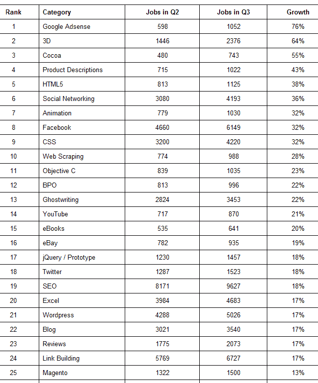

# Freelancer.com:脸书应用程序、3D、HTML5 和 Cocoa Jobs 正在崛起 

> 原文：<https://web.archive.org/web/http://techcrunch.com/2011/10/17/freelancer-com-facebook-app-3d-html5-and-cocoa-jobs-on-the-rise/>

# Freelancer.com:脸书应用程序、3D、HTML5 和可可工作正在崛起

今天晚些时候，Freelancer.com 准备发布一份报告，列出 2011 年第三季度增长最快的 50 份外包工作，这份报告是基于同期在网站上发布的 114，455 份工作。

我们提前看到了这份报告，报告显示，在谷歌的熊猫更新之后，内容和 AdSense 相关的工作岗位在上个季度下降后再次上升。“代笔”(增长 22%)、博客(增长 17%)和评论(增长 16%)等类别显示了这一趋势。

产品描述和 Adsense 项目分别增加了 43%和 76%。

报告中其他有趣的发现:

–脸书和社交网络项目分别增长 32%和 36%
–html 5 项目增长([再次](https://web.archive.org/web/20230204121944/https://techcrunch.com/2010/07/06/freelancer-geolocation-html5-jobs/))令人印象深刻的 38%，Flash jobs 下降 10%
–继上个季度增长 20%后，Android 本季度仅增长 8%
–iPhone 项目仅增长 3%；黑莓和塞班的乔布斯都下降了 6%
——与苹果产品相关的工作很受欢迎，可可乔布斯上升了 55 %, Objective C 上升了 23%。与此同时，Java 工作岗位下降了 13%，而 PHP 相关工作岗位上升了 3.3%。
–3D 工作岗位增加了 64%，在前 50 名中增幅第二大

