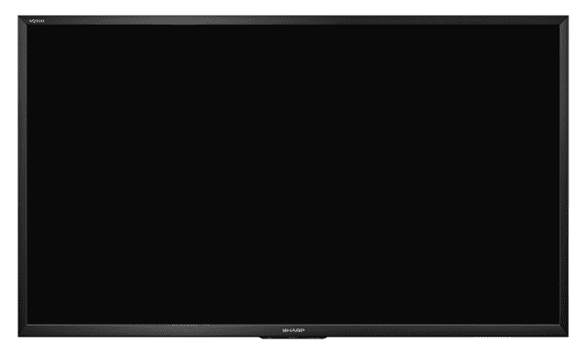
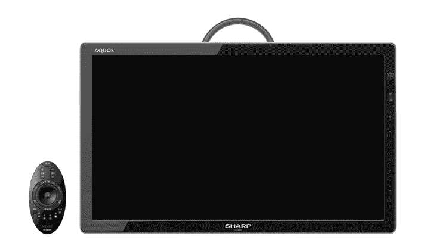
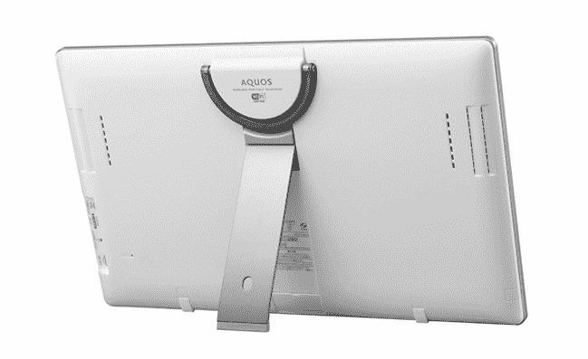

# 自由式 AQUOS:夏普日本推出 4 款便携式无线超薄液晶电视 

> 原文：<https://web.archive.org/web/http://techcrunch.com/2011/08/25/freestyle-aquos-sharp-japan-rolls-out-4-portable-wireless-ultra-thin-lcd-tvs/>

# 自由式 AQUOS:夏普日本推出 4 款便携式无线超薄液晶电视

[日本的夏普](https://web.archive.org/web/20230203045908/https://techcrunch.com/tag/sharp)[用所谓的自由式](https://web.archive.org/web/20230203045908/https://techcrunch.com/2011/04/21/freestyle-aquos-sharps-portable-battery-powered-20-inch-lcd-tv-video) [AQUOS F5 系列](https://web.archive.org/web/20230203045908/http://www.sharp.co.jp/corporate/news/110825-a.html)【JP】更新他们的 [AQUOS](https://web.archive.org/web/20230203045908/https://techcrunch.com/tag/aquos) 液晶电视系列。该系列中的四款电视，尺寸分别为 20/32/40 和 60 英寸，有一些共同的卖点:它们非常薄、轻(其中一款是“便携式的”)，并且可以联网。

60 英寸旗舰机型(上图和下图)配有[一个 UV ² 一个面板](https://web.archive.org/web/20230203045908/http://sharp-world.com/corporate/news/090916.html)全高清分辨率，LED 背光，100 万:1 对比度，176 度视角，2x10W 扬声器，一个 HDMI 接口，两个 USB 端口(可以连接外部硬盘)，以及以太网。重 21kg，最薄处 2.1cm(最厚处 3.5cm)。

32 英寸和 40 英寸型号拥有相同的主要规格，但重量要轻得多(分别为 8.5 千克和 5.5 千克)，这促使夏普为该系列选择了“自由式”一词(该公司表示，它们可以移动并安装在任何地方)。

与 32 英寸的 AQUOS 一样，20 英寸的型号仅提供 1366×780 的分辨率。该系列中最小的电视是基于夏普今年早些时候展示的一款型号，重量仅为 2.5 千克。只需额外支付 80 美元，用户就可以在上面挂上一个挂钩，让它变得真正便携(见下文)。

 

所有型号的共同点是 IEEE802.11n/IEEE802.11a Wi-Fi 和与夏普设备的无线连接，例如 AQUOS 蓝光播放器或智能手机，以及各种视频点播服务和 YouTube。

夏普计划从下个月开始在日本销售他们的新电视(价格:最大型号为 4930 美元，40 英寸型号为 1950 美元，32 英寸型号为 1430 美元，最小型号为 1040 美元)。