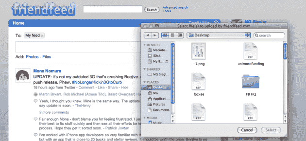
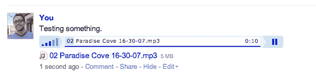

# FriendFeed 增加了文件共享功能。没有电影，但是 MP3 也可以。TechCrunch

> 原文：<https://web.archive.org/web/https://techcrunch.com/2009/06/24/friendfeed-adds-file-sharing-no-movies-but-mp3s-are-fine/>

# FriendFeed 增加了文件共享功能。没有电影，但是 MP3 也可以。

FriendFeed 的杀手锏还在继续。今天，[服务刚刚增加了](https://web.archive.org/web/20221005152212/http://blog.friendfeed.com/2009/06/you-can-now-share-files-on-friendfeed.html)在服务上分享文件的方式。因此，现在共享 PDF 或文本文件就像共享图片一样简单。FriendFeed 的联合创始人布雷特·泰勒说:“你可以通过网络界面或者通过电子邮件将文件附件发送给 share@friendfeed.com，从而将(几乎)任何文件附加到你的 FriendFeed 帖子上。”。

真正伟大的是，使用 FriendFeed direct messaging aspect，你可以很容易地同时将文件传输给某些个人或群体。

遗憾的是，它看起来不能做共享电影之类的事情，但它可以共享 MP3 文件，这很棒。是的，这些 MP3 可以直接在 FriendFeed 中在线播放。显而易见的问题是，这会导致 PiracyFeed 吗？毕竟，你可以在分享后下载这些 MP3。虽然一次一首的歌曲对于疯狂的盗版来说可能有点乏味。

**更新**:显然一天只能上传 3 首 MP3，这是 FriendFeed 为了防止全面盗版的尝试。截至目前，你只能在 FriendFeed 上播放真正的 MP3 文件，但泰勒指出，他希望很快添加 M4A (AAC)文件，以便 iPhone 语音备忘录得到支持。

以下是泰勒的更多报道:

> 我们有一个滚动的 24 小时上传限制，所以如果你上传了许多大文件，你最终会达到它。
> 
> 我们对音频文件上传有更严格的限制(现在每个用户每天 3 个，但将来可能会改变)。对于受版权保护的材料，我们的政策是响应符合适用知识产权法(包括数字千年版权法)的涉嫌版权侵权通知，并终止屡次侵权者的帐户。你可以在这里看到我们政策的细节:http://friendfeed.com/about/dmca.
> 
> 我们这次发布的目标用户是使用 FriendFeed 群组进行协作的人，所以我们优化了共享较小文档的功能，而不仅仅是媒体文件。

