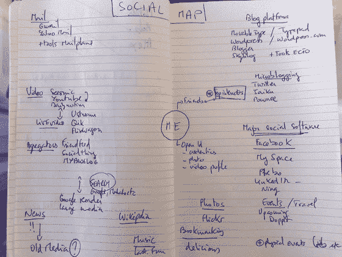

# FriendFeed、集中式 Me 和数据可移植性

> 原文：<https://web.archive.org/web/https://techcrunch.com/2008/03/30/friendfeed-the-centralized-me-and-data-portability/>

这绝对是硅谷的 [FriendFeed](https://web.archive.org/web/20230226021637/http://www.friendfeed.com/) 月。这家由前谷歌员工创办的公司[，可以让你聚合你在互联网上使用的各种服务的信息和活动流——Flickr 照片、YouTube 视频、博客帖子、美味书签、Twitter 消息和其他东西(迄今共有 33 项服务)。你的朋友订阅你的东西，并在他们的主页上看到来自他们关注的每个人的数据流。](https://web.archive.org/web/20230226021637/http://www.crunchbase.com/company/friendfeed)

该网站还允许用户直接添加内容，对信息发表评论，最近还增加了一个极好的搜索功能，这是 Twitter 非常缺乏的。该站点不仅仅是一个可以重新导出的提要列表。FriendFeed 也想成为一个目标网站。

鉴于这项服务仅在一个月前公开推出，他们的增长非常强劲。本月早些时候，用户数量以每周 25%的速度增长。

上周，该网站宣布了一个 API 的可用性，它允许第三方服务轻松地添加 FriendFeed 数据和功能。这些申请的第一批[现在开始发布](https://web.archive.org/web/20230226021637/https://techcrunch.com/2008/03/29/adobe-air-desktop-app-for-friendfeed-coming/)。
 **中央集权我**

但是 FriendFeed 有点奇怪，有些人开始嘀咕了。它是一个聚合的“我”，但它位于一个集中的站点中(事实上，集中是一种意义)。FriendFeed 是一个(并希望成为“那个”)集中的我。这是一个数据仓库。没错，这是一个友好的数据仓库，通过 API 和 RSS feeds 来移动一些数据，但它最终驻留在他们的服务器上，并将永远如此。

Loic Le Meur 今晚在一篇博客中总结了这一切，他说，在所有这些服务出现之前的日子里，我们已经习惯了一个集中的我，从 2004 年开始，并从那时起传播开来。让我集中精力的是博客。然后我们习惯了分散的我——你的东西到处都是。这里是照片，这里是博客，这里是视频，这里是书签。今天的罗伯特·斯考伯是典型的去中心化的我——他的东西到处都是，他似乎喜欢混乱。

Loic 想要的，我想其他人也会想要的，是一个他们控制的信息聚集的地方。对于一些人来说，这可能会回到博客上。对其他人来说，可能是脸书([完全理解这一点](https://web.archive.org/web/20230226021637/https://techcrunch.com/2008/02/22/facebook-targets-feedfriend/))。无论一个人认为自己的家园在哪里，他们都会想要所有这些数据。

FriendFeed 可以成为那样的地方，但这是一个艰难的过程。许多其他服务已经成为用户的心理家园。改变这一点就像逆流而上。

 **数据可移植性是反 FriendFeed 的吗？**

数据可移植性项目可能是人们正在寻找的答案。这可能是一种反饲料朋友。数据可移植性的全部意义在于，让社交网络在得到用户明确许可的情况下相互交流，交换用户数据。想要将您的 flickr 照片、twitter 消息和 YouTube 视频添加到您的博客中吗？数据可移植性正在通过共识驱动的政策和程序来帮助实现这一目标。本质上，数据可移植性包含了分散的 Me，但是允许用户在他们喜欢的任何地方重新集中它。

坦率地说，还没有足够多的人了解数据移植。这种情况将开始改变，因为创始人克里斯·萨阿德(Chris Saad)正在开始一场路演，从高层次上谈论他试图实现的目标。一些[大合作伙伴正在加入](https://web.archive.org/web/20230226021637/https://techcrunch.com/2008/01/08/this-day-will-be-remembered-facebook-google-and-plaxo-join-the-dataportability-workgroup/)，即使目前为止只是在精神上。

最终，数据可移植性对于集中的 Me(你的所有东西)就像 OpenID 对于身份(你的字面身份)一样。正如大玩家在某种程度上支持/利用 OpenId 来维护他们的用户账户一样，他们也将支持/利用数据可移植性来保持用户认为集中的 Me。

严重的政治和权力游戏即将到来。我想知道的是，FriendFeed 是否能足够快地发展壮大，并让足够多的用户认为它是他们的集中的我，参与到这个游戏中来。