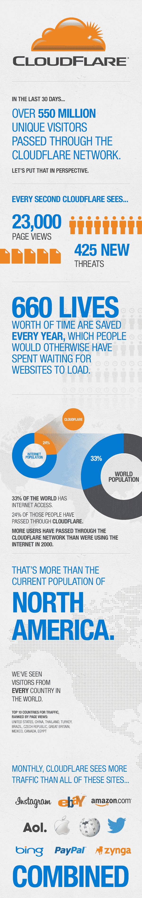

# 从 Disrupt 亚军到 2200 万美元的资金，CloudFlare 告诉 All TechCrunch

> 原文：<https://web.archive.org/web/https://techcrunch.com/2012/09/03/from-disrupt-runner-up-to-22-million-in-funding-cloudflare-tells-all/>

据让网站更快更安全的服务公司 [CloudFlare](https://web.archive.org/web/20221205130902/http://www.cloudflare.com/) 的首席执行官[马修·普林斯](https://web.archive.org/web/20221205130902/http://www.crunchbase.com/person/matthew-prince)称，他和联合创始人[米歇尔·扎特琳](https://web.archive.org/web/20221205130902/http://www.crunchbase.com/person/michelle-zatlyn)自 TechCrunch Disrupt 被称为 [TechCrunch50](https://web.archive.org/web/20221205130902/http://www.techcrunch50.com/) 以来，就一心想要在 TechCrunch Disrupt 上发布。他们最终得到了机会——尽管不是在 TC50。相反，在 TechCrunch Disrupt SF 2010 上，CloudFlare [最终以亚军](https://web.archive.org/web/20221205130902/https://beta.techcrunch.com/2011/02/24/disrupt-cloudflare-omfg/)败给了 Qwiki 。但他们的故事是一个很好的故事，因为它证明了你不一定要把奖杯带回家才能赢。

自那以来，该公司已经筹集了 2200 万美元的资金，帮助美国制定关于互联网如何工作的政策，并将 CloudFlare 的网站数量增加到 50 多万，从小型创业公司到财富 500 强。该公司现在一个月的流量超过了 Instagram、易贝、亚马逊、美国在线、苹果、推特、维基百科、必应、贝宝和 Zynga 的总和。

我们最近采访了 Prince，他谈到了在 TechCrunch Disrupt 上发布的情况，以及他可能对新的 Disrupt 参与者有什么建议。自从差一点赢得 Disrupt 以来的几个月里，普林斯一直参与其中，例如，他在[TechCrunch Disrupt Beijing](https://web.archive.org/web/20221205130902/https://beta.techcrunch.com/events/disrupt-bj-2011/event-info/)担任评委，还帮助新的 Disrupt 初创公司为流量的冲击做准备。CloudFlare 曾与之前的决赛选手合作过，如 [Bitcasa](https://web.archive.org/web/20221205130902/http://www.bitcasa.com/) 、 [CakeHealth](https://web.archive.org/web/20221205130902/https://cakehealth.com/) 、[最近收购的 sales force](https://web.archive.org/web/20221205130902/https://beta.techcrunch.com/2012/07/09/salesforce-com-reported-to-buy-goinstant-for-70-million/))[goin stant](https://web.archive.org/web/20221205130902/http://www.goinstant.com/)和许多其他人，普林斯说这让他们一次又一次地体验到了 Disrupt 的体验。

利用在 Disrupt SF 2011 和 Disrupt NY 2012 期间从 15 到 20 家公司收集的数据，他确切地知道初创公司面临着什么:

*   在 TC Disrupt 的 3 天里，初创公司的网站流量平均增长了 3 到 10 倍。
*   在活动期间，初创公司每天会有 10，000-20，000 的浏览量，其中 20%的流量是在他们登台期间点击的。
*   在整个比赛过程中，流量不断增加，但当 TC 帖子出现时，流量会激增。
*   对于决赛选手，在舞台上和获奖者宣布期间，流量可以达到每秒数百个请求。

TechCrunch :从 Disrupt 2010 到现在，有哪些亮点？

**王子**:在内部，我们已经采取了雇佣非常聪明的人的方法。我们不是让尽可能多的人去解决问题，而是让尽可能多的人来解决问题。因此，建立我们的团队是不可思议的——这是一种俗气的说法——但这是最大的亮点。

当我们接到土耳其政府一名高级官员的电话时，我们感到非常兴奋，他在上次选举中将官方选举结果页面放在了 CloudFlare 上。他们打电话给我们，说“谢谢你们帮助我们维护土耳其的民主。”你知道，我们只是一群呆头呆脑的工程师，坐在旧金山的角落里。看到你能有如此大的影响力…真是太神奇了。

能够坐下来帮助制定互联网应该如何运作的政策也是令人惊奇的。米歇尔，我的联合创始人之一，最近被邀请成为联邦通信委员会的代表——唯一一位来自互联网创业公司的网络中立建议代表——她是 15 位制定网络中立政策的代表之一。

**TechCrunch**:Disrupt 之后是什么样的？

Prince :导致 Disrupt 的最令人伤脑筋的是，我们知道它在少量用户的情况下会起作用，但我们不知道有多少人会注册。我们不想说“哦，今天，你可以注册了。”我们不想有一个等候名单。我们想登上舞台，打开开关，让服务真正开始。我记得走在后台，仍然有 34 个关键的错误需要解决，然后我们才能真正打开服务。米歇尔和我实际上坐在后台观看团队聊天，所有的工程师都在说“好的，我有#12，我有#13，”但当走上舞台时，仍然有少数人。

当人们开始注册时，这是值得注意的。值得注意的是，注册用户中的很大一部分——他们中的很多人都曾是 Disrupt watching 的观众——仍然是我们今天最大的用户，也是我们最大的拥护者。

**TechCrunch** :在 Disrupt 舞台上发布是什么感觉？

王子:我们遇到了一个演示问题。我们可以说“这是如何工作的”，但这是一个很难展示的产品。这就像是，“我们做网站更快”，但是很难证明你不是假装的。

迈克·阿灵顿描述说，有一家公司非常无聊，他们本质上是在为互联网做消声器维修。这可不太性感。还有另一家公司，本质上是法拉利，但我们不确定它是否会走出车库。原来修消声器不是很性感，原来很多人都需要修消声器。

**TechCrunch** :那之后对投资者关系有什么影响？

**王子**:嗯，它没有伤害我们。我们 2010 年 9 月 27 日上线，29 日是总决赛。你知道，你为此工作了几个月。事后大家都只是筋疲力尽。有一种奇怪的失望。什么都没坏，一切正常。但接下来的几天，投资者没有立即打电话来。这就是投资者工作的循环。但大约两周后，我们的电话开始疯狂地被投资者打来。10 月中旬，我们开始与几乎所有你听说过的公司交谈，每个人都有兴趣加入我们。这是一件非常令人羞愧的事情。我们从来不做展示平台，我们只是去和人们见面。投资者会来找我们。

我们筛选出了前五家公司，有一个特别的星期一，我们和五家不同的公司开了五次最后的会议。米歇尔和我从一家公司跑到另一家公司。我们最终从一些不同的人那里得到了很多不同的选择。很难对我们收到的不同报价进行排序。其中脱颖而出的是 NEA 大学的[斯科特·桑德尔](https://web.archive.org/web/20221205130902/http://www.nea.com/team/default.aspx?id=14)。

[CloudFlare [继续筹集 2000 万美元，但推迟了一段时间才宣布。](https://web.archive.org/web/20221205130902/https://beta.techcrunch.com/2011/07/12/oh-by-the-way-cloudflare-raised-20-million-last-november/) ]

王子:我认为筹款故事很无聊。我认为，融资往往会破坏公司文化，这不一定是值得骄傲的事情。每次都要筹钱，都是失败的。这意味着你没有从你的客户那里获得足够的收入，这没什么，但这不是一件值得宣扬的事情。所以这就是为什么我们把我们的筹款活动保密了 8 个月。我本来可以保密更久，但是有人开始知道这件事。

**TechCrunch** :对于即将在 Disrupt 上发布的新公司，你有什么建议吗？

**王子**:有一点是他们绝对应该报名参加 CloudFlare。

TechCrunch:我就知道你会这么说。

王子:真的很悲伤。有公司会推出，他们的网站会崩溃。这极大地增加了压力。所有使用 CloudFlare 发布 Disrupt 的公司都实现了 100%的正常运行时间。

还有，讲故事，要真实。我认为我们做的事情——已经变得有点过时的事情——实际上是*发射*。如果你说，“现在我们将在六个月后推出这款产品，这与”…我们今天就推出它是非常不同的。“如果你做得对，你就可以像我们一样——继续疯狂增长，完全摆脱最初的势头。

