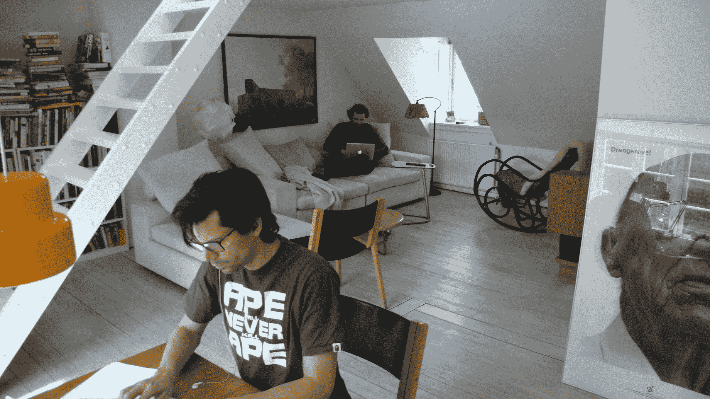
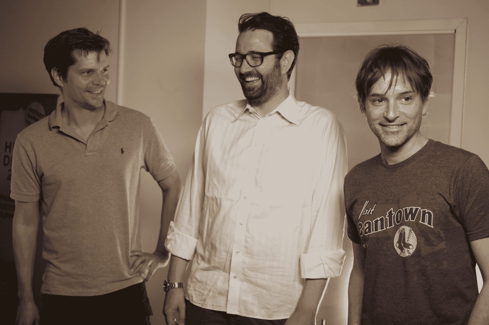

# 从丹麦的一个阁楼开始，Zendesk 稳步上升到服务台的顶端

> 原文：<https://web.archive.org/web/https://techcrunch.com/2013/11/16/from-its-beginnings-in-a-denmark-loft-zendesks-steady-rise-to-the-top-of-the-helpdesk-heap/>

与许多创业公司一样， [Zendesk 的](https://web.archive.org/web/20230320003404/http://www.zendesk.com/)起源于一张桌子，上面有几台笔记本电脑、三位联合创始人和许多咖啡。但这家客户服务软件公司的创立有一个非正统的转折:Zendesk 是在丹麦哥本哈根的一个阁楼里创立的，而不是在硅谷。

[2006 年，Mikkel Svane](https://web.archive.org/web/20230320003404/http://www.crunchbase.com/person/mikkel-svane) 和同事兼工程师 Morten Primdahl 在公司实施老派的客户服务解决方案。正如 Svane 解释的那样，他们建议公司采用的客户跟踪和事故报告软件是上一代产品，安装和使用起来极其复杂。如此之难，以至于公司不得不召集顾问来执行实施。Svane 和 Primdahl 意识到在提供这项技术的对立面时有一个问题需要解决，并开始思考一个新的想法。与此同时，网络上出现了 Salesforce.com 和 SaaS 模式。

他们打电话给 Svane 的一个老设计师朋友 Alexander Aghassipour，向他解释了他们对一个新的在线软件的想法。Svane 回忆说，推销重塑客户服务和服务台的想法是最不性感的事情，当你把它与在热门消费创业公司工作相比较时。

“帮助台软件听起来并不令人兴奋，我也没有任何领域知识。“我是煤矿里的金丝雀，但我痴迷于清洁设计，当我看到存在的东西时，我意识到公司没有得到足够的服务，”Aghassipour 说。

但是像 Svane 和 Primdahl 一样，Aghassipour 看到了在一个设计是事后想法的世界里创造美好事物的机会，并成为一名企业家。Primdahl 以前曾与 Svane 合作过，知道可以通过 SaaS 模型在线解决的工程挑战。Aghassipour 告诉 Svane，他将帮助保持这个软件“非常简单”

## 从阁楼到服务台

2006 年末，他们都辞去了全职工作，在哥本哈根的一个小阁楼里开了家店。阁楼里有一张大桌子和一张沙发，Svane、Aghassipour 和 Primdahl 花了很长时间来构思他们的软件会是什么样子，以及它将如何成为一项业务。

他们都认为 Zendesk 将是复杂混乱的客户服务的简单替代品。从一开始，Zendesk 就提供了一个基于网络的、由 SaaS 交付的帮助台/支持票务应用程序，让公司能够轻松管理来自最终客户的支持请求。

> 我们不知道它会是什么样子，当我们打开服务器的开关时，我们很紧张。

为了赚钱(Svane 要养活一个家庭)，他们每个人都兼职做个人顾问。Svane 说，有一段时间他们会集中工作，但在欧洲不容易获得资本，所以他们必须启动并以其他方式赚钱。

三人组开始开发和创造产品，但也有怀疑的时候。到 2007 年初，没有人真正解决为公司重建在线帮助台的问题，团队开始变得偏执。“我想，如果这真的是一个机会，为什么没有人在这个领域做任何事情来验证我的想法，”Svane 说。事实上，他甚至申请 Zendesk 在 2007 年 9 月的 TechCrunch 40 上发布，但是被拒绝了。

尽管面临没有资金的挑战，也有问自己“我们为什么要这样做？”创始人决定加倍投资 Zendesk，只专注于构建和推出产品。

到 2007 年秋天，他们已经在网上试运行了服务台软件。Svane 和他的联合创始人迫不及待地想让人们尝试这款产品，并给他们所有的朋友和网络发电子邮件，让任何有客户服务需求的人尝试这款产品。“我们不知道它会是什么样子，当我们打开服务器的开关时，我们很紧张，”Primdahl 说。

几个月后，客户开始蜂拥至 Zendesk 试用。这家初创公司很快获得了大约 1000 名试用客户。“我们早期的许多客户都是网站，他们需要一种简单的方式来管理入站客户服务和通信，”Svane 说。“我们意识到，通过为精通网络的受众配置产品，我们能够接触到传统类型的软件无法接触到的受众，这是我们的第一次验证。”

## 投资的种子

与传统的消费者成功创业故事不同，Zendesk 的道路并不是从爆炸式增长开始的。该公司的使用主要来自口头推荐。到 2008 年初，Svane 决定他们不能再启动公司，他开始接触欧洲投资者。但是他们收到了一堆礼貌的拒绝。“我被告知没有钱给我们，”他说。但是 Svane 和他的团队引起了一位天使投资人的注意，德国投资人 Christoph Janz 问 Svane 怎样才能让公司更上一层楼。在创始人开始开发产品近两年后，Janz 向该公司投入了约 50 万美元，这是其第一笔外部资金。

客户的声音越来越大，这种变化使 2008 年成为市场的转折点。客户在线互动对公司来说变得越来越重要。随着社交网络的兴起，客户可以更容易地通过评论、论坛、脸书甚至 Twitter 分享好的和坏的体验。

现在 Janz 作为一名倡导者加入了，他开始帮助 Zendesk 扩大其在投资界的影响力。2008 年夏天，他在 Sand Hill Road 为 Svane 及其团队安排了一系列会议，该公司开始考虑通过 A 轮融资。Svane 甚至有了一个向投资者兜售的新客户:MSNBC。

> 我们只是哥本哈根的一个三人小组，我不知道硅谷的人听说过我们。

当 Svane 在硅谷时，他被邀请参加 TechCrunch/August Capital 的年度派对。当他走过写有他的名字和 Zendesk 的贴纸徽章的聚会时，创业界的一些人走近他，告诉他他们正在使用他的软件。

“这让我们大开眼界，”他说。“我们只是哥本哈根的一个三人小组，我不知道硅谷的人听说过我们。”那年夏天访问硅谷并参加 TechCrunch 活动提醒了他正在努力的方向。“我有 TechCrunch 的癖好，想要建立一家科技创业公司，就像我在博客上读到的那些创始人一样。我想加入这个俱乐部，”他补充道。

当球队在旧金山的时候，他确实吸引了一些沙丘路投资者的目光。事实上，Zendesk 非常接近从一家知名的未披露公司获得资金。合作伙伴告诉他们，交易即将完成，只需在合作伙伴会议上获得批准。这位投资者说他会在会议结束后马上给 Svane 打电话。但电话从未打来，在酒店房间里等待投资者电话的 Svane 意识到他必须重新开始寻找投资者。怀着沉重的心情，他离开旧金山去了哥本哈根。

## 去美国？

Svane 回到丹麦加入 Aghassipour 和 Primdahl 后不久，Charles River Ventures 的合伙人 Devdutt Yellurkar 在研究 SaaS 行业的新投资时遇到了 Zendesk。Yellurkar 在电话中与 Svane 进行了简短的交谈，在进行尽职调查时，他意识到该公司的许多投资组合公司已经在使用 Zendesk，并且喜欢使用该产品。“我从未见过对企业软件的那种热爱，”他回忆道。

这些早期用户之一是 Twitter(由 CRV 支持)，他们开始使用 Zendesk 提供客户支持。Primdahl 回忆说，当 Twitter 刚开始使用 Zendesk 时，Zendesk 的流量翻了两番。他说，该公司花了接下来的三个月时间，试图消除 Twitter 使用造成的软件瓶颈。“没有其他客户像这样质疑我们的软件，”他说。

在听到客户的经历后，Yellurkar 决定支持 Svane 和他的团队，并于 2008 年底立即飞往哥本哈根。

Primdahl(餐桌旁)和 Svane 在哥本哈根的阁楼里工作，Zendesk 于 2007 年在这里成立。

Yellurkar 解释说，创始人团队的实力也吸引了这家公司加入 Zendesk。“这是一个三连胜——Mikkel 了解客户支持领域，Alex 拥有出色的设计美学，Morten 是一名非常有才华的工程师。”到 2009 年初，来自 CRV 的几百万美元进入了这家成立三年的 SaaS 公司。有了这些新资金，Svane 开始雇佣更多的开发人员。

为了更接近 Yellurkar，三人开始讨论将公司搬到美国的可能性。对于 Svane 来说，他一直希望有一天能在美国生活。此外，他们将更接近投资者和他们的客户，而当时他们的客户大多在加州。但是让家庭远离家乡的挑战是令人生畏的。

就在 Zendesk 考虑搬迁的时候，一群风投开始打电话过来。包括 Yelp、Twitter 和 OpenTable 投资者 [Benchmark Capital](https://web.archive.org/web/20230320003404/http://www.crunchbase.com/financial-organization/benchmark) 在内的许多公司通过使用客户服务软件的投资组合公司发现了 Zendesk。在 10 天的时间里，三家不同的沙山路风投公司飞来了。

对于 Svane 来说，Yellurkar 自加入以来一直觉得自己是团队的一员，因此接受另一家风投的门槛很高。并不是他不信任机构投资者，而是在被烧伤后，对不想弄脏手的风投有所警惕。他知道 Zendesk 还有很长的路要走，他想要一个合作伙伴，而不仅仅是一个投资者。

> 消费者谈论 Zendesk 的方式就像脸书刚推出时消费者谈论它一样。

Benchmark 的最新合作伙伴马特·科勒(Matt Cohler)是其中一名风投。斯万说，当时他不知道科勒是谁，他在早期作为员工帮助 LinkedIn 和脸书发展。与 Yellurkar 类似，Cohler 实际上已经从使用该软件的公司投资组合中听说过 Zendesk。“这是我们应该投资的最有意义的信号，”他表示。也像 Yellurkar 一样，他从未见过人们如此热爱地谈论企业软件。“当 Zendesk 刚推出时，消费者谈论它的方式就像消费者谈论脸书一样，”他补充道。

苛勒最后飞到哥本哈根与斯万及其团队会面，斯万喜欢上了他，所以他投资苛勒到他家和他的孩子一起吃晚饭。

据 Svane 说，使 Cohler 和 Benchmark 与众不同的是，他们从一开始就感觉像一家人。苛勒和他在哥本哈根的家人和朋友在斯万的家里共进晚餐，斯万说有苛勒在身边感觉很自然很轻松。席间，苛勒和孩子们一起在斯万家里的客厅里，和他们一起看了电影《长袜子皮皮》(这部电影是丹麦语的，苛勒说，所以他什么也不懂)。

几个月后，Svane 从 Benchmark 和 [Charles River Ventures](https://web.archive.org/web/20230320003404/http://www.crunchbase.com/financial-organization/charles-river-ventures) 获得了约 600 万美元的 B 轮融资。基准合伙人彼得·芬顿加入了 Zendesk 的董事会。

也是在这个时候，Svane、Aghassipour 和 Primdahl 决定搬到美国。最初他们决定将自己的基地设在波士顿，以便离 Yellurkar 更近，但他们很快意识到他们需要在硅谷。Aghassipour 补充说，搬家真的是一个艰难的决定，但感觉更接近发生一切的中心是正确的。

到 2009 年末，客户蜂拥至 Zendesk。收入稳定，在产品生命周期的早期拥有像 Twitter 这样的大客户，有助于解决一些增长问题。这也是该领域现有公司开始对收购感兴趣的时候。

Primdahl、Svane 和 Aghassipour(左-右)在 2009 年刚搬到美国时的照片。

Svane 拒绝透露是哪家公司向 Zendesk 提出了收购要约，但我们从消息来源处获悉，Salesforce 在这个时候向 Zendesk 提出了一个非常有利可图的收购要约。“拒绝很多钱真的很难，尤其是对你和你的员工来说可能会改变生活的钱。因为你不能和任何人谈论收购谈判，这是一种令人难以置信的孤立体验，”他说。"但是创建 Zendesk 从来不仅仅是为了钱."他补充说，拒绝高额收购要约是一个艰难的决定，但他和他的联合创始人强烈认为，这家公司不适合另一家公司。他们害怕加入一个大型企业巨头而不开心，或者更糟糕的是，他们花了这么多时间开发的产品会被搁置。

所以他们拒绝了 Salesforce 和其他人。在那一刻，他们知道 Zendesk 的道路是独立。Salesforce 最终的确在 2011 年以 5000 万美元收购了一家客户服务公司 SaaS，并将其更名为 Desk.com。

与此同时，Zendesk 加倍雇佣工程师和强大的内部设计团队。因为 Aghassipour 在前世有自己的公司，产品的设计和易用性对产品来说一直是最重要的。正如创始人所解释的那样，如果产品旨在为客户服务管理这样复杂的行业增加简单性，那么产品就不能复杂杂乱。该公司一直在为其产品添加各种功能，但每一步都有条不紊，并着眼于设计和整合。

Primdahl 说，Zendesk 在 2010 年并没有开始建立一个真正的产品团队。但在过去两年里，它增加了一个网络电话系统、一个 iPad 应用程序、Twitter 集成等等。去年，Zendesk 推出了一个名为 Zendesk Apps 的应用框架，旨在通过内部和第三方系统扩展公司的功能。

“创新是一件很难平衡的事情，”Primdahl 说。“很容易陷入下一个产品路线图，但我们也需要在路线图之外继续努力。”

与传统的企业销售模式相比，销售对公司来说也是一种迟到的东西。Primdahl 表示，该公司直到 2010 年才增加了一个销售团队，第一批 1 万名客户完全是通过 AdWords 的口碑和轻度广告获得的。该公司目前在全球拥有 30，000 名客户和 450 名员工，其中包括 100 名工程师。

## 进取 IPO

为了保持独立性，Zendesk 去年又筹集了 6000 万美元，由红点风险投资公司牵头，Index Ventures、GGV 资本、高盛、硅谷银行、Charles River Ventures、Benchmark Capital 和 Matrix Partners 都参与了进来，使资金总额达到 8600 万美元。虽然 Svane 和该公司拒绝给出时间表，但目前看来该公司将在 2014 年年中左右提交文件。

“我们想上市，但这是一个艰巨的挑战，”Svane 解释说。“但是你不能永远住在你父母的地下室里。在某些时候，你需要走出去，拥有自己的房子。”目前看来，该公司将在 2014 年年中提交相关文件。由于《就业法案》，Zendesk 很可能会以保密方式提交申请。

当该公司去年 9 月宣布融资时，它还透露，自上次融资以来，每月经常性收入增加了 500%。该公司希望来年的业务翻一番。但是，如果不披露数字，很难衡量它在市场上的潜在财务成功。目前，Zendesk 还没有盈利，但我们听说这是该公司在不太遥远的将来可以完成的事情。盈利能力将是投资者在评估 Zendesk 的潜在 IPO 时关注的一个指标。

> 你不能永远住在你父母的地下室里。在某些时候，你需要走出去，有自己的房子。

国际化对该公司来说是一个巨大的机会，Zendesk 一直在稳步扩大其在工程和销售领域的影响力，在都柏林、哥本哈根和墨尔本都设有办事处。Primdahl 说，事实上，Zendesk 的一半客户都在美国以外，在国外建立工程中心也是吸引美国以外人才的好方法。

Svane、Primdahl 和 Aghassipour 认为市场上没有强有力的竞争对手，尽管有一些像 Salesforce 的 Desk.com 和 Freshbooks 这样的小公司正在试图占领市场。正如 Svane 所说，关注的焦点一直是客户而不是竞争对手。苛勒强调了这一点——“大多数伟大的公司都专注于自己的使命，而不是竞争，”他补充道。

虽然 IPO 即将到来，但早期投资者 Yellurkar 认为 Zendesk 的道路更像是一场马拉松，而不是上市公司的冲刺。Zendesk 仍然需要在产品上继续执行，创造新老客户的需求和喜爱。

## 服务台锁步

在这个世界上，我们看到科技创业公司的创始人争夺权力和战略(Twitter 的故事)，一群创始人从公司成立到最终 IPO 都团结在一起是很独特的。三人组承认他们吵架(早期也很努力)，但他们已经能把工作和个人分开。Primdahl 说，这三个人都有强烈的观点，并且“火花四溅”，但是三个创始人之间有很大的分歧是有帮助的，因为也有人来解决决胜局。他回忆说，但有时战斗变得如此激烈，以至于他们会离开阁楼几天，事情就会平息。

Svane 补充说，创始团队的力量和团结在一起在一定程度上是因为他们能够在身边雇用合适的人。已经有一些人从[离职](https://web.archive.org/web/20230320003404/https://techcrunch.com/2013/05/28/zendesk-coo-zack-urlocker-departs-the-company/)，但是公司早期的大部分首席工程师仍然在 Zendesk 工作。

虽然在谈论企业创始人时听起来很奇怪，但斯万、普里姆达尔和阿加西普尔都是以使命为基础的企业家。很明显，他们在 Zendesk 工作是出于对他们在 2007 年哥本哈根的那个小阁楼里试图解决的问题的深深的信仰和信念。