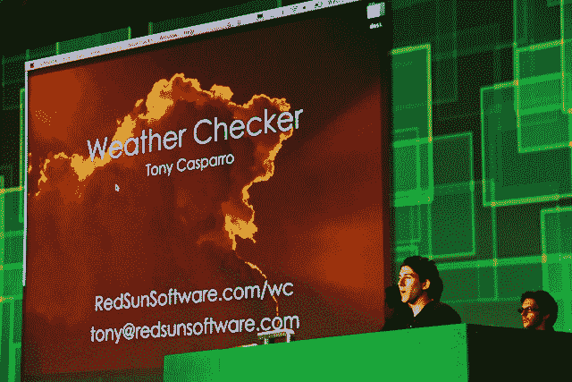

# 从 130 多名黑客中产生了终极六人:黑客马拉松获胜者登上舞台 

> 原文：<https://web.archive.org/web/https://techcrunch.com/2011/09/14/from-over-130-hacks-came-the-ultimate-six-the-disrupt-hackathon-winners-take-to-the-stage/>

# 从 130 多名黑客中产生了终极六人:黑客马拉松获胜者走上舞台

周末，400 多名黑客聚集在一起，进行了 24 小时的黑客攻击、红牛和网络活动。从这些深夜的辛劳中，超过 130 名黑客从 TechCrunch Disrupt 黑客马拉松中脱颖而出。周日下午，五位专家评委，包括 Salesforce 的开放云标准副总裁 Kevin Marks、谷歌的 Rohit Khare、Betfair 的移动工程副总裁 Raj Vemulapalli、OneTrueFan 的创始人 Eric Marcoullier 和 Ask.com 的工程、移动和平台总监 Vishal Shah，受命从过多的演示中选择前六名黑客。

评委们选择了 [FlickMunk](https://web.archive.org/web/20230204235005/http://disrupt.flickmunk.com/) 、 [Gainify](https://web.archive.org/web/20230204235005/http://www.gainify.com/) 、[天气检测器](https://web.archive.org/web/20230204235005/http://redsunsoft.com/wc/)、 [ECCube](https://web.archive.org/web/20230204235005/http://ghost-hack.com/cube/) 、 [Ex-Rated](https://web.archive.org/web/20230204235005/http://www.exrated.info/) 和 [U4Them](https://web.archive.org/web/20230204235005/http://www.u4them.org/) ，他们今天有机会在 Disrupt 向观众展示他们刚刚起步的创业公司和产品。

关于台上每一家初创公司的视频，请点击[查看 Alexia 对获胜者的报道。](https://web.archive.org/web/20230204235005/https://techcrunch.com/2011/09/11/and-the-2011-techcrunch-disrupt-sf-hackathon-winners-are/)

对于一些 TC 员工在黑客周末的最爱，点击这里查看比格斯的报道。

最后但同样重要的是，对于一些黑客风格和味道，[在这里查看一些服装华丽](https://web.archive.org/web/20230204235005/https://techcrunch.com/2011/09/11/who-said-hackers-dont-have-style/)。

**下面是黑客马拉松获胜者的简介:**

FlickMunk:FlickMunk 的应用程序是一个“电影的嬉皮士”，它会寻找你周围的当地影院，帮助你计划你的电影之旅，看看你离电影院有多远，以及你是否能及时赶到——并且在你看完电影后帮助你评价和跟踪这些电影。

购物者做笔记。Gainify 是一个漂亮的插件，可以让你把任何一个 Shopify 商店变成一个每日交易网站。

[天气检查器](https://web.archive.org/web/20230204235005/http://redsunsoft.com/wc/):谷歌日历插件，可以让你提前检查计划活动的天气。

[ECCube](https://web.archive.org/web/20230204235005/http://ghost-hack.com/cube/) :一款 HTML5 3D 配色游戏。

[Ex-Rated](https://web.archive.org/web/20230204235005/http://www.exrated.info/) :作为约会模式的一种新形式，Ex-Rated 通过创建一个允许用户对前任进行评级的系统，将 Yelp 引入约会领域。

这个黑客攻击的目标是那些无力支付医疗费用的人。U4 它们是一种将需要医疗支付帮助的人与有能力捐赠现金的人联系起来的方式。每个列表都是由医院的社会服务部门发起和批准的，并允许用户要求朋友和家人通过 PayPal 接受付款。

