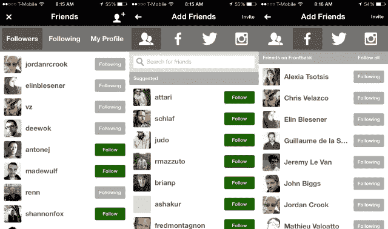

# Frontback Update 添加了用户资料和社交功能 TechCrunch

> 原文：<https://web.archive.org/web/https://techcrunch.com/2013/09/09/frontback-update-adds-user-profiles-and-social-features/>

# Frontback Update 添加了用户资料和社交功能

快速崛起的照片应用 [Frontback](https://web.archive.org/web/20221007021402/http://frontback.me/) 刚刚在 App Store 获得了首次重大更新，带来了急需的社交功能。到目前为止，这款应用还没有用户资料，因为[的原始版本](https://web.archive.org/web/20221007021402/https://beta.techcrunch.com/2013/07/22/frontback-is-a-deeply-personal-photo-taking-app-to-capture-fleeting-moments/)是在四周的过程中开发出来的。但即将改变。这次更新是拼图中的一个重要部分，因为它带来了许多其他的社交功能。随着今天的更新，拍照应用程序实际上成为了一个照片共享应用程序。

“许多人告诉我们，我们发布这样一个粗糙的 1.0 版本是疯狂的，”联合创始人兼首席执行官弗雷德里克·德拉·法耶告诉我。“这次更新是 Frontback 1.0 从一开始就应该有的，”他继续说道。

新功能代表着一天多次打开应用程序的巨大动力。当你浏览照片时，你现在可以点击一个用户名，看到他或她以前的所有照片。你可以点击赞的数量，看看谁喜欢你的帖子。

更重要的是，你可以选择你想关注的人，查看谁在关注你，并搜索用户。如果你连接你的脸书、推特和 Instagram 账户，你可以找到已经在 Frontback 上的朋友。该公司将这些社交功能藏在一个新的圆形按钮后面。

正如我在我的[第一篇帖子](https://web.archive.org/web/20221007021402/https://beta.techcrunch.com/2013/07/22/frontback-is-a-deeply-personal-photo-taking-app-to-capture-fleeting-moments/)中所写的，锋卫是一次深刻的个人经历。这就是为什么你现在可以选择从你的 feed 中删除员工选择，让应用程序只关注你的朋友。

Della Faille 告诉我，这家初创公司在未来几天有更多消息要宣布。但左上角的新小红按钮对这家初创公司来说是重要的一步，让这款应用离团队几个月前设想的社交体验更近了一步。

