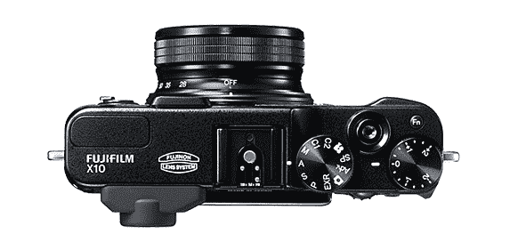
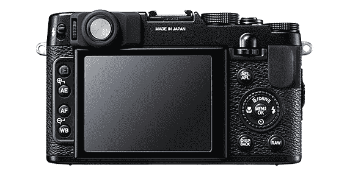

# 富士推出 X10 高端紧凑型车

> 原文：<https://web.archive.org/web/http://techcrunch.com/2011/09/01/fujifilm-makes-the-x10-high-end-compact-camera-official/>

本周早些时候，我发布了一篇对富士 X100 的评论，这是一款独特且备受期待的相机，虽然令人信服，但我觉得它根本没有兑现自己的承诺。但是几周以来，我们一直听到传言说，有一种型号的价格只有一半，但具有相同的风格和高质量的构造，但在传感器尺寸上做出了妥协，并省略了可爱的混合测距仪/EVF。富士胶片刚刚正式生产了 X10 型号。

X10 真的是为不同类型的射手准备的不同相机。而不是 X100 的固定 23mm 镜头，它有 28-112mm f/2.0-2.8 变焦，真的一点都不差。实际上，我更喜欢手动对焦的想法，尽管它在缩放时似乎延伸了相当长的一段距离。光学取景器看起来很好，虽然我会想念混合功能。

然而，这种传感器要小得多。正如你在右边看到的，X100 的 APS-C 传感器(与许多消费级单反相机中的传感器大小相同)让 X10 的 2/3”传感器相形见绌，尽管两者都产生 1200 万像素。这还没有达到瞄准射击的水平(他们的传感器通常要小得多)，但这是一个非常显著的减少。至少它是富士的 EXR 传感器，这是一个非传统的传感器，专注于优化光线，而不是最大化百万像素。不过，这并没有阻止他们加入 1080p/30 电影模式。

机身的一些变化包括对背部的一些调整(看起来像是对按钮位置和设计的改进)，对焦模式开关的新位置，不幸的是，用更传统的模式转盘取代了快门速度转盘。X10 也更小更轻:它从一边到另一边短了半英寸，从顶部到底部短了三分之一英寸，尽管它增加了十分之一英寸的深度。

据报道，它的价格为 699 美元，这可不便宜，它的竞争对手(奥林巴斯[XZ-1](https://web.archive.org/web/20230329220509/https://techcrunch.com/2010/12/29/olympus-xz-1-joins-the-high-powered-compact-camera-battle/)、佳能 G12、尼康[p 7100)](https://web.archive.org/web/20230329220509/https://techcrunch.com/2011/08/23/nikon-updates-its-coolpix-line-with-new-high-end-and-rugged-point-and-shoots/)肯定在价格上击败了它。问题是它的外观和构造是否能与更通用的可换镜头机身竞争，如和 [PEN](https://web.archive.org/web/20230329220509/https://techcrunch.com/2011/06/30/the-pen-is-mightier-than-the-point-and-shoot-olympus-announces-new-m43-line/) 系列。

在我们使用该设备一段时间后，我们将发布一份完整的评论。11 月份应该可以上市；更多信息请访问 [X10 微型网站](https://web.archive.org/web/20230329220509/http://fujifilm-x.com/x10/en/index.html)。

如果你感兴趣的话，这里有完整的新闻稿和更多的细节:

富士 X10 新闻稿

纽约州瓦尔哈拉市，2011 年 9 月 1 日——富士胶片北美公司今天发布了全新的高级紧凑型富士胶片 X10 数码相机，它采用了一个新的更大的 2/3 英寸 1200 万像素 EXR CMOS 传感器和一个明亮的高清 FUJINON1 F2.0 广角到 F2.8 长焦、4 倍手动变焦镜头(28-112 毫米)2，具有专有的超级 EBC(电子束涂层)，可从边缘到边缘产生卓越的图像质量。

sleek X10 是一款精密的紧凑型数码相机，紧随屡获殊荣的 FUJIFILM X100 的脚步，现在它结合了修剪和精致的遮光设计，易于使用的手动桶式变焦镜头和传统的光学取景器，具有 20°宽视场，可实现出色的图像合成。

X10 令人惊叹的机身由重量轻、强度超高的压铸镁合金制成，有一个带模式转盘的上层控制面板和一个铝铣纹理抛光镜头环。4 倍手动变焦镜头环兼作电源开关，确保快速启动，捕捉最短暂的拍摄场景。

富士胶片北美公司成像和电子成像部门总裁 Go Miyazaki 表示:“富士胶片致力于提升数码摄影艺术，X10 premium compact 通过提供一流的图像质量、漂亮的造型和超越消费者预期的创新技术，突出了这一承诺 X10 精心布局的设计，大型 EXR CMOS 传感器，明亮的镜头和手动变焦使其成为图像质量不能妥协的杰出选择。"
卓越的图像质量
X10 采用了新开发的更大的 2/3 " 1200 万像素 EXR CMOS 传感器，结合了富士胶片专有的 EXR 技术和 CMOS 技术，在所有拍摄条件下都能提供明亮、清晰的图像。智能 EXR CMOS 传感器可从总共 99 种不同的拍摄模式中自动选择最佳拍摄模式，完美捕捉每一种场景，即使在最困难的拍摄环境中也是如此。

X10 的 EXR CMOS 传感器为任何照明情况选择最佳拍摄模式:
SN(信噪比)高灵敏度和低噪声——产生清晰锐利的高灵敏度图像，同时保持低噪声水平，非常适合拍摄夜景或光线不足的室内环境。
·DR(动态范围)宽动态范围——提供更大的动态范围(高达 1600%),在阴影和高光处提供丰富的渐变和细节。
·HR(高分辨率)–充分利用 1200 万像素的分辨率，再现风景和人像场景中最精细的细节，非常适合在明亮晴朗的日子使用。

X10 的 fast EXR 处理器还提供高速连续拍摄功能，在 1200 万像素的全分辨率(L 尺寸)下可达每秒 7 帧，在降低分辨率的 M 尺寸下可达每秒 10 帧。

明亮的光学系统
X10 采用了新开发的高清富士龙 4x 手动变焦镜头(28-112 毫米)，具有超级 EBC(电子束涂层)，实现了边缘到边缘的卓越图像清晰度。通过使用多层超级 EBC 处理所有镜头元件，X10 专业地减少了重影和镜头眩光，并提供了一个无可挑剔的清晰图像。

该镜头由 9 组 11 个玻璃透镜元件组成，包括 3 个非球面玻璃透镜元件(6 面)和 2 个超低色散透镜元件。X10 的最大广角光圈为 F2.0，最大长焦光圈为 F2.8，可提供清晰明亮的图像。

在其宽敞的玻璃光学取景器中，X10 使用 3 个非球面透镜加上特殊的 2 个玻璃棱镜配置，以其超宽的 20°视角为摄影师提供卓越的亮度和卓越的视野。

X10 顶级拍摄体验
由于 X10 的电源开关被恰当地集成到手动变焦筒中，摄影师可以在不到一秒的时间内准备好在几乎任何情况下拍摄。这种智能而简单的设计功能加快了拍照响应速度，有助于避免错过拍照机会。

一旦准备好拍摄，X10 的全金属镜头筒和平滑的变焦旋转可以帮助您快速轻松地合成照片，其大约 0.01 秒的快速快门释放延迟时间甚至可以让您捕捉最瞬间的摄影场景。

X10 还采用了新开发的光学图像稳定机制，通过最大限度地提高传感器性能几乎消除了运动模糊，其 49 点矩阵对比度自动对焦由于快速 CMOS 功能和先进的 EXR 处理器系统而提供了高速和高精度的对焦。

X10 的镜头能够拍摄近至 1cm 的超微距照片，结合其 7 叶片光圈，X10 产生了令人惊叹的软焦“散景”效果，使其成为拍摄完美人像的理想选择。

X10 自豪地在日本制造，作为真正质量的标志，它沿着取景器附近的机箱后部突出地标有“日本制造”的字样。

X10 主要特性:
·4 倍手动光学变焦，采用富士胶片全新智能数码变焦技术，将远摄能力提高一倍，并提供高达 8 倍的变焦
·快速通电启动；X10 使用镜头环内置的开/关电源开关在大约 0.8 秒内完全准备好拍摄(必须处于快速启动模式)
高对比度和宽视角 2.8 英寸 460K 点高对比度液晶屏，即使在户外和明亮的阳光下也能提供出色的观看效果
可根据场景类型选择不同的手动拍摄模式(程序/光圈优先/快门速度优先/手动)
针对曝光、ISO 感光度、动态范围和胶片模拟的四种不同的自动包围功能
RAW 拍摄和相机内 RAW 处理(包装盒内提供的 SilkyPix RAW 转换软件)
同类最佳的 3 1080p 全高清电影录制功能
胶片模拟模式(提供八种设置，包括 Velvia / PROVIA / ASTIA)
手动弹出闪光灯，范围为 7 米(约 23 英尺)
电子水平仪，确保相机

高级配件
为了完美地补充 X10 相机机身的外观和一流的手感，将提供以下高级配件:
表壳–复古风格的“快速拍摄”表壳，配有由奢华皮革制成的配套表带(LC-X10)
镜头盖–由金属精密铣削而成，带有适配环的镜头盖也与市售的 52 毫米滤镜和镜头盖(LH-X10)兼容
TTL 闪光灯–富士胶片外部自动闪光灯 EF-20(指南编号:20)和 EF-42(指南编号

X10 将于 2011 年 11 月初上市。

1 高质量的富士龙镜头广泛应用于全球广播行业。更多
信息请访问:http://www.fujifilm.com/products/digital_cameras/fujinon/
2 台 35mm 当量
3 台配备 2/3″图像传感器的数码相机