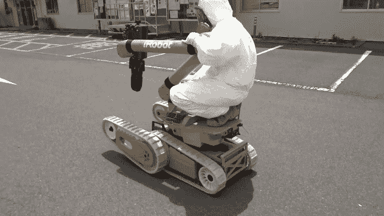
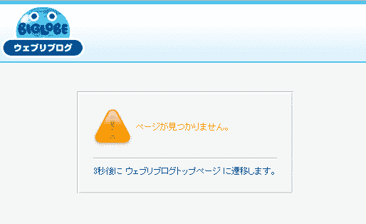

# 福岛机器人操作员的博客被删除 TechCrunch 中的互联网步骤

> 原文：<https://web.archive.org/web/http://techcrunch.com/2011/08/23/fukushima-robot-operators-blog-deleted-internet-steps-in/>

一位只知道叫 S.H .的匿名博主每天都在发布福岛基于机器人的灾难应对工作的详细描述。该博客包括技术细节和个人轶事，但没有涉及国家安全的敏感内容。然而，在 7 月初，这个博客停止了，后来又被完全删除了。S.H .上传到 YouTube 上的视频是保密的。这一清洗的起源不得而知，但可以肯定的是，高层认为该博客过于暴露，并要求 S.H .将其删除。

然而，你不可能在没有人注意的情况下从互联网上删除一些东西，尤其是像这样的博客，充满了与正在进行的反应堆遏制工作相关的有趣和及时的信息。所以当它消失的时候，IEEE Spectrum 不仅自己保存了博客的缓存版本，还[翻译并重新发布了它](https://web.archive.org/web/20230203064635/http://spectrum.ieee.org/automaton/robotics/industrial-robots/fukushima-robot-operator-diaries)。这有力地证明了基于互联网的媒体的持久性——这本身就是一本有趣的读物。

博客是技术评论和这项工作正常人性方面的混合体。下面是一些摘录，让你感受一下(格式化我的以节省空间):

今天，除了给机器人的电池充电，轮到我训练了。不过，我昨天确实动了一下。训练在低辐射的室外区域进行，但我们穿着全套防辐射服和装备，这削弱了我的思考能力。按说，我不擅长思考(LOL)。该培训旨在尽可能接近实际任务。首先，我试图打开一扇沉重的钢门(用一个普通的圆形把手)。他们说我是第一个用这样的把手成功开门的人，事实上。

今天我们去了，用两个背包去测量 3 号核反应堆建筑的一楼部分的辐射水平，昨天战士在那里清理(去污)。结果，辐射水平平均下降了约 10%。
如果你只是看测量结果，它们看起来仍然很高，但另一方面，如果你只是看[在某些领域]的差异，你会觉得它相当有效。
有些地方的水平下降到最高 80 西沃特/小时

第一个起来上厕所的 S 先生说:“喂，这里还有别人。那是谁？”于是我起身去看，有人睡在榻榻米地板上。。。我看着他的脸，没认出他来。我叫醒他，问:“你是谁？你没走错房间吧？”他也有点困惑。
“？？?"
“这是什么房间？”他睡意朦胧地说。他闻到了一点酒气，所以他可能喝醉了，睡错了房间。

你明白了。有操作环境、机器人等等的图片。总而言之，这是反应堆周围恢复和清理工作的宝贵记录。IEEE 的一位与相同机器人一起工作的评论者已经提到他发现了一些有用的信息——来自一个删节的、不完整的翻译！虽然我可以理解这种事情也应该在运营商的官方环境中分享(报告之类的)，但这个博客显然是一个非官方信息的非破坏性渠道。

图片和视频也被保留了下来:

【YouTube = http://www . YouTube . com/watch？v=PUhCPuDbUjg&w=640&h=390]

博客于 7 月消失，至今无人发表评论。有趣的是，这并不意味着它是自愿关闭的，还是因为来自 S.H .主管的压力。事实是，因为它对某些人来说是有价值的，所以删除这些内容不是他们能控制的。

这是一种网络考古学。事实上，[一个以这个名字命名的地方被建立起来](https://web.archive.org/web/20230203064635/https://techcrunch.com/2009/10/10/internet-archaeology-in-which-the-sordid-past-of-the-internet-is-preserved-forever/)用来供奉基奇金矿，也就是 Geocities。虽然这有点好玩，但这个原则同样适用于更严肃的内容，比如 S.H .的博客。设法从互联网上消失的内容通常是毫无价值的。真正敏感的信息，如维基解密或黑帽黑客发布的信息，几乎不可能完全消除。

这里的结局是什么？两极分化。如果政府官方项目不得不担心员工的个人博客，他们可能会干脆禁止员工拥有博客。另一方面，为了满足对实时信息和“透明度”的渴望，必须建立更多的官方渠道来获取这类数据。这些渠道会受到严密监管吗？是的。它们会像 S.H .的博客一样具有揭示性和趣味性吗？不会。它们会比我们五年前拥有的更好吗？大概吧。深度卧底匿名博主之类的需求永远会有，但是压制的方法和创造的方法在不断的军备竞赛。有时你可以从水龙头里得到它，但有时你不得不把它装进瓶子里。

与此同时，如果你对清理工作或实用的[机器人](https://web.archive.org/web/20230203064635/https://techcrunch.com/tag/robots/)感兴趣，一定要看看 IEEE 翻译的[词条](https://web.archive.org/web/20230203064635/http://spectrum.ieee.org/automaton/robotics/industrial-robots/fukushima-robot-operator-diaries)。如果你说日语，你可以看到一些帖子[被镜像到这里](https://web.archive.org/web/20230203064635/http://staff.aist.go.jp/h.arai/fukushima/warrior.htm)，而[谷歌缓存](https://web.archive.org/web/20230203064635/http://www.google.com/search?q=site%3Ahttp%3A%2F%2Fsh-blog.at.webry.info%2F&ie=utf-8&oe=utf-8&aq=t)仍然部分完好。