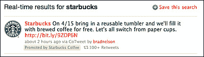

# Twitter 期待已久的广告平台的全部细节:推广推文 TechCrunch

> 原文：<https://web.archive.org/web/https://techcrunch.com/2010/04/12/full-details-on-twitters-long-awaited-ad-platform/>

# Twitter 期待已久的广告平台的全部细节:推广推文

今晚早些时候，我们[爆料【Twitter 即将推出新的广告平台。这一消息刚刚得到证实:不久前，纽约时报](https://web.archive.org/web/20221206102918/https://beta.techcrunch.com/2010/04/12/source-twitters-ad-platform-launches-tonight/)[发表了](https://web.archive.org/web/20221206102918/http://www.nytimes.com/2010/04/13/technology/internet/13twitter.html?ref=business)一篇详细介绍这一新平台的报道，官方称之为“推广推文”。**更新:**老话有[发表](https://web.archive.org/web/20221206102918/http://adage.com/digiconf10/article?article_id=143237)一篇报道也一样。

以下是文章中概述的细节:

*   正如我们之前所描述的，新系统基于 Twitter 搜索查询中的关键词提供广告。
*   推广的推文将出现在搜索结果页面的顶部，用小文字表明它们是受赞助的。《纽约时报》的文章指出，公司可以利用这一点来打击负面推文(他们可以在页面顶部放置一条正面推文)
*   一条被推广的推文并不保证会持续很长时间——如果这条推文在回复、点击和 Twitter 称之为“共鸣”的其他一些指标方面跟踪不好，它将被删除，广告商也不会为此付费。
*   一次将显示一个广告

*   最初的广告合作伙伴包括百思买、维珍美国、星巴克和 Bravo
*   广告客户最初将按 CPM 付费，一旦 Twitter 能够更好地衡量人们如何参与推广的推文，他们就计划调整这一模式

两份报告都指出，Twitter 最终将允许第三方 Twitter 客户端整合推广的推文，应用开发者将获得部分收入。

这篇文章还称，Twitter 计划最终在你的 Twitter 信息流中投放广告，这可能会激怒 Twitter 用户。

> 在 Twitter 收入计划的下一阶段，它将在用户的 Twitter 信息流中显示推广的帖子，即使用户没有进行搜索，也没有关注广告客户。
> 
> 例如，如果有人一直在写关于 7 月 4 日的帖子，他们可以看到维珍美国关于假日票价折扣的促销帖子。

现在是时候指出去年 11 月推特首席运营官[迪克·科斯特罗](https://web.archive.org/web/20221206102918/http://www.crunchbase.com/person/dick-costolo)在我们的实时汇总中对即将到来的广告平台的一些评论了:

> “这将是令人着迷的。非传统。人们会喜欢它的……它会变得非常酷。”

推广的推文兑现了这个承诺吗？在这一点上，我们还没有机会亲自尝试它们，但这肯定比我预期的更传统。这听起来也很像昨晚[比尔·格罗斯](https://web.archive.org/web/20221206102918/http://www.crunchbase.com/person/bill-gross)T4 推出的新推特搜索/广告平台 TweetUp。

*图片来源于[格言](https://web.archive.org/web/20221206102918/http://adage.com/digiconf10/article?article_id=143237)*