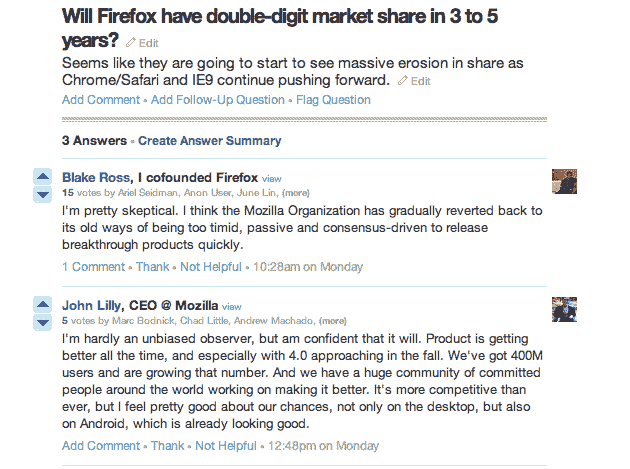

# 火狐正在走向大规模衰落吗？它的联合创始人是这样认为的 TechCrunch

> 原文：<https://web.archive.org/web/https://techcrunch.com/2010/05/18/future-of-firefox/>

Quora 是一个从知名人士那里寻找产品答案的好地方。这也是那些杰出人士公开表达不同意见的好地方。这就是现在在一个关于火狐未来的帖子中正在发生的事情。

最近有人给 Quora 发了以下问题:[火狐在 3 到 5 年内会有两位数的市场份额吗？](https://web.archive.org/web/20220930171843/http://www.quora.com/Will-Firefox-have-double-digit-market-share-in-3-to-5-years)够直白。是的，即将离任的 Mozilla 首席执行官约翰·莉莉说。不，火狐联合创始人[布雷克·罗斯](https://web.archive.org/web/20220930171843/http://www.crunchbase.com/person/blake-ross)说。根据 Quora 用户的投票，到目前为止，罗斯正在赢得这场争论。

罗斯是这样说的:

> 我很怀疑。我认为 Mozilla 组织已经逐渐回到了过去的老路，过于胆小、被动和受共识驱动，无法快速发布突破性产品。

与此同时，莉莉提供了这个:

> 我不是一个不带偏见的观察者，但我相信它会的。产品一直在变得更好，尤其是随着 4.0 在秋季的到来。我们有 4 亿用户，而且这个数字还在增长。我们在世界各地有一个庞大的致力于让它变得更好的社区。它比以往任何时候都更具竞争力，但我对我们的机会感到非常乐观，不仅是在桌面上，也在 Android 上，Android 已经看起来不错。

罗斯目前是脸书的产品总监(巧合的是[在 Quora 的竞争对手那里工作](https://web.archive.org/web/20220930171843/http://gigaom.com/2010/04/13/whats-the-deal-with-facebooks-qa-competitor-blake-ross-answers-on-quora/))，他有一个观点似乎和他的脸书同事(前 Parakey 联合创始人)[乔·休伊特](https://web.archive.org/web/20220930171843/http://www.crunchbase.com/person/joe-hewitt)一致。也就是说，管理机构(在这种情况下，Mozilla——在 Hewitt 的情况下，W3C)正在[减缓网络开发过程](https://web.archive.org/web/20220930171843/https://beta.techcrunch.com/2010/04/30/joe-hewitt-web-development/)，并使创新更加困难。罗斯和休伊特在这一领域都有很长的历史，因为他们在创建 Firefox 之前都在 Netscape 工作。

显然，两者都对他们曾经的叛逆网络浏览器的遭遇感到恼火。Firefox 出现的时候，微软的 Internet Explorer 已经完全控制了市场，占有超过 90%的份额。在过去 5 年多的时间里，IE 的份额已经下降到 60%以下，这主要归功于 Firefox，它现在占据了 25%-30%的市场份额。但是，从很多方面来看，Firefox 不再像以前那样被认为是轻量级、开放的替代产品。其中包括在 Quora 上提问的人，他在描述中说:“*随着 Chrome/Safari 和 IE9 继续向前推进，他们似乎将开始看到份额的大幅下降。*”

当然，谷歌 Chrome 现在的发展速度比火狐快得多。与此同时，苹果的 Safari 在过去几年中增长缓慢但稳定。这两种浏览器都基于 WebKit 引擎，这似乎是目前的布局引擎选择。火狐不使用 WebKit。相反，它依赖于 Mozilla 的 Gecko 引擎。

当 Lilly 暗示这场争论的关键很可能在移动领域时，他是对的。问题是，由于谷歌的安卓平台和苹果的 iPhone 的流行，WebKit 浏览器开始占据主导地位(黑莓也将很快拥有 WebKit 浏览器)。Android 版火狐浏览器的早期版本已经在[推出](https://web.archive.org/web/20220930171843/https://beta.techcrunch.com/2010/04/27/fennec-firefox-android/)，但是要让人们使用它而不是 Android 的内置 WebKit 浏览器，还需要一些真正令人印象深刻的东西。与此同时，苹果也开始发布替代浏览器——尤其是 Opera。但同样，任何浏览器都很难击败紧密集成的内置浏览器(谁知道苹果是否会在应用商店中推出移动版 Firefox)。

[谷歌的一些人不同意翰威特对移动缓慢的网络的评估。但是，这是在谷歌，他们似乎比 Mozilla 现在推进得更快。休伊特和现在罗斯的批评能让他们摆脱困境吗？](https://web.archive.org/web/20220930171843/https://beta.techcrunch.com/2010/05/06/google-hewitt-old/)

