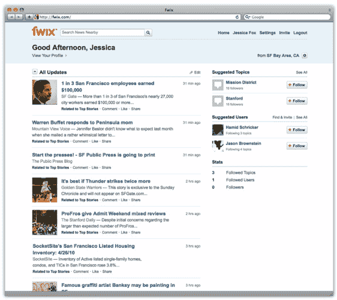

# Fwix 利用脸书的开放图形来社会化超本地新闻聚合器 

> 原文：<https://web.archive.org/web/http://techcrunch.com/2010/04/28/fwix-taps-into-facebooks-open-graph-to-socialize-hyperlocal-news-aggregator/>

# Fwix 利用脸书的开放图表，将超本地新闻聚合器社会化

[Fwix，](https://web.archive.org/web/20230125110935/http://fwix.com/)一个新闻网站，提供一系列超本地的实时新闻，正在利用脸书最近推出的[Open Graph API](https://web.archive.org/web/20230125110935/https://techcrunch.com/2010/04/23/facebook-open-graph/)来社会化其平台上的内容。正如我们在脸书发布 API 的最初报道[中所写的，它旨在根据人们的兴趣和“喜欢”在网络上的每个页面上添加一层社交联系和即时个性化。](https://web.archive.org/web/20230125110935/https://techcrunch.com/2010/04/21/hacking-the-graph-live-from-facebooks-f8-conference/)

Fwix 上的用户现在可以喜欢平台上的任何内容。读者可以根据地点、话题或脸书朋友定制任何级别的新闻，然后与对相同话题感兴趣的人联系。与你相似的其他读者的兴趣和评论也会出现在你自己的新闻订阅中，以及围绕新闻、建议话题等的社交互动中，旨在创建一个实时本地和超本地新闻的生态系统。

Fwix 汇集了与某个地区相关的新闻文章和博客帖子(该网站现在支持美国和加拿大的 80 多个城市)。为了做到这一点，Fwix 团队选择了它认为与每个城市相关的新闻来源和博客，并使用自动算法来确定其他内容何时也可能相关。Fwix 最近还调整了其算法和产品，加入了“附近”的本地内容功能。因此 Fwix 上的内容显示了主题和附近位置之间的关系。例如，在阅读了一篇关于发生在旧金山教会区的抢劫案的报道后，你将能够找到关于教会社区的任何其他犯罪和/或故事。

虽然 Fwix 之前提供了脸书连接，但这些社交功能代表了与脸书更深入、更有意义的整合，创始人达里安·什拉济说。Fwix 刚刚[与纽约时报公司](https://web.archive.org/web/20230125110935/https://techcrunch.com/2010/03/17/fwix-lands-deal-with-the-new-york-times-company-to-license-realtime-hyperlocal-news-stream/)签署了一项协议，在该出版商的地产上提供本地和超本地内容，[推出了其 iPad 应用](https://web.archive.org/web/20230125110935/https://techcrunch.com/2010/04/04/fwixs-brings-hyperlocal-news-feed-to-the-ipad/)，该应用现在是平板设备上排名前 15 的新闻应用。