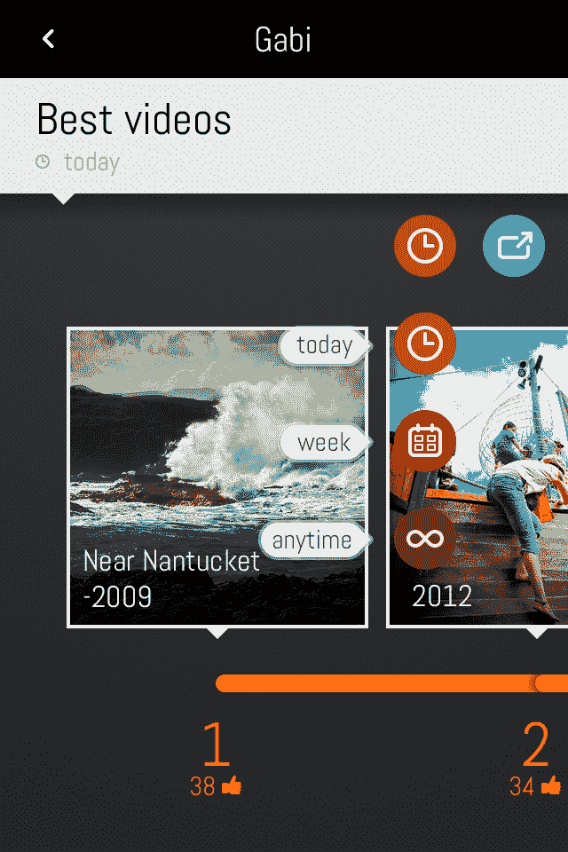
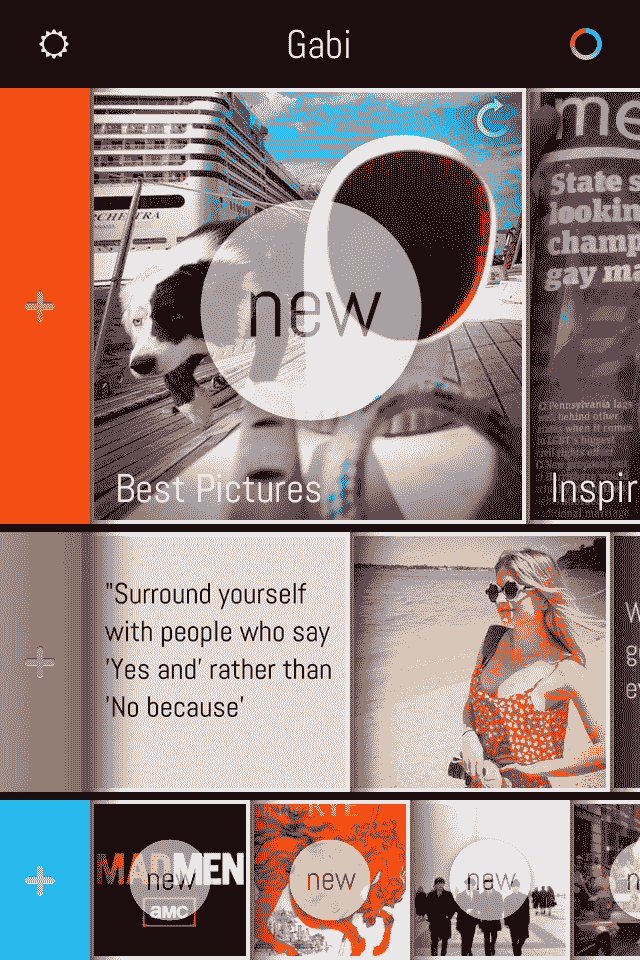

# Gabi:一个非常独特的、最高级的浏览脸书的界面

> 原文：<https://web.archive.org/web/https://techcrunch.com/2012/06/21/gabi-a-very-unique-superlative-interface-for-browsing-facebook/>

# Gabi:一个非常独特的浏览脸书的顶级界面

 我们现在已经很熟悉了:脸书的新闻提要、通知和滚动条。此外，已经有大量的脸书客户端、阅读器和 iPad 应用程序。

自从脸书在 2004 年推出以来，经历了这么多年的反复，还有什么需要彻底反思的呢？

显然很多。

我看了一款名为 [Gabi](https://web.archive.org/web/20221205202542/http://gogogabi.com/) 的应用，它来自柏林的 iOS 开发者 loui Apps。这完全不同于我为脸书见过的任何其他界面。

首先，这实际上是问最高级的问题(见顶部的特色图片)。

你可以找到你的哪些照片在一天、一周或无限期内最受你的朋友喜欢。你可以找到你的哪些朋友是单身或已婚(这是脸书几年前隐藏的一个特征)。

你也可以找出你的哪些朋友有当天最喜欢的照片。或者最喜欢的状态更新。或者哪些书和电视剧是你的朋友最喜欢的。

在这个应用程序中，你可以问 100 多种不同的问题，其中大部分是传统形式的脸书无法回答的。

这是一种全新的浏览社交网络的方式。它有一个网格状的主页，应用程序中的所有答案都会生成可标记的列表，可以共享到时间轴中。

这款应用是由柏林的一个由斯蒂芬妮·霍夫曼和加布里埃尔·帕洛米诺领导的设计和开发小组开发的。这款应用是付费的，售价 0.99 美元。

