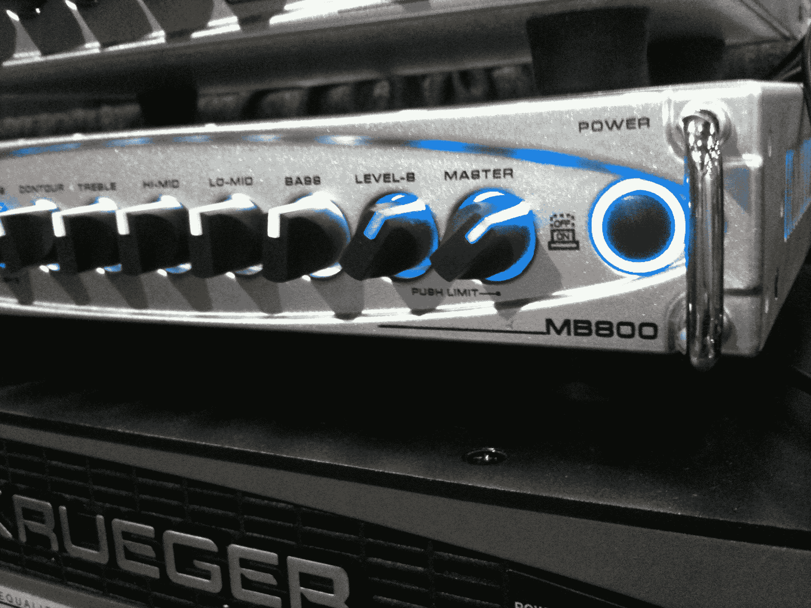

# Gallien Krueger MB 800 即将上市 

> 原文：<https://web.archive.org/web/http://techcrunch.com/2011/07/22/gallien-krueger-mb-800-ships-soon/>

# Gallien Krueger MB 800 即将发货

在田纳西州纳什维尔举行的夏季 NAMM 会议上，当我在这里寻找音乐设备时，我想起了在这个两年一度的会议的冬季版本中获得“最佳表演”评级的一位明星。虽然 [MB 800](https://web.archive.org/web/20230204201936/http://www.sweetwater.com/store/detail/MB800/) 自去年冬天宣布以来一直备受期待，但我今天听说这款产品计划在未来 4-6 周内发货，最早可能在 8 月 15 日。

你问的 Gallien Krueger MB 800 是什么？它是 800 瓦的低音放大器，装在一个 4.9 磅重的盒子里。让我再说一遍…4.9 磅重的盒子里有 800 瓦。作为一个对来回携带易碎和沉重的电子管放大器头记忆犹新的人，我觉得这个外形令人印象深刻。听起来也不错。我哄着 GK 销售经理杰森·芬利演奏了一会儿，这样我就能捕捉到一些声音。

下面是 MB 800 的声音。

现在说说技术规格:

4 欧姆时 800 瓦或 8 欧姆时 500 瓦
离散 FET 前置放大器
按压激活增益 A/B 和限幅器失效
10dB 衰减器
带可变轮廓的四频段有源均衡器
效果环路&调谐器静音
XLR 输出、前置/后置均衡器
失效限幅器
两个扬声器输出
耳机/线路输出
10.75×8。

虽然[场效应晶体管(场效应晶体管)](https://web.archive.org/web/20230204201936/http://en.wikipedia.org/wiki/Field-effect_transistor)运算放大器已经有相当好的记录，但什么是“谨慎的”场效应晶体管呢？让我先说一下，我已经看到它被拼写为“谨慎”和“离散”，但它与更小的组件占用空间以及更温暖、更少数字的音调和“管状”特征有关。根据加林·克鲁格的说法，这是他们用这种架构建造的第一个放大器。

无论如何，如果你想缩小你的放大器头，提高你的功率输出，这个小家伙可能是你的答案。

我希望很快能得到一个。