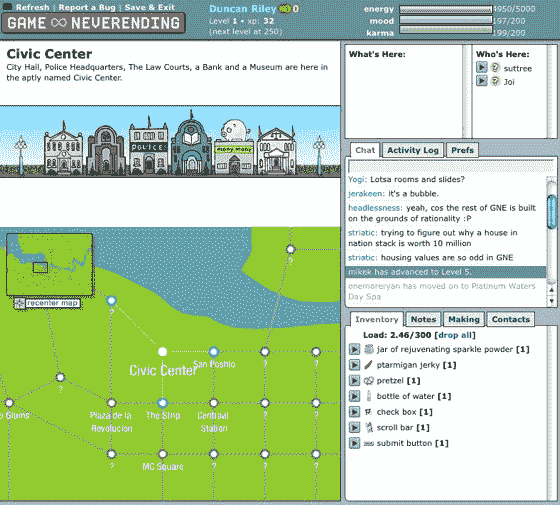

# 游戏《永无止境起死回生》

> 原文：<https://web.archive.org/web/https://techcrunch.com/2008/04/02/game-neverending-rises-from-the-dead/>

# 游戏《永无止境起死回生》

来自 Ludicorp 的第一个项目，Flickr 的基础游戏《永不落幕的 T2》已经起死回生。

MMOG 是一个角色扮演游戏，专注于社交互动和对象操作。据说游戏《永无止境》是“轻松幽默”的，没有获胜的方法，也没有给出成功的定义。“对象”可以被组合来创建其他对象，但是任何给定的对象都只能起到可疑的作用第一个原型于 2002 年上线，2004 年关闭。

游戏背后的工具被用作 Flickr 的基础。Flickr 中的 gne 文件扩展名是游戏《永无止境》的遗产。

游戏《永无止境》正在使用 Flickr 帐户细节进行登录；如果你已经登录了 Flickr，当你访问[网站](https://web.archive.org/web/20221226010536/http://gne.flickr.com/)时，你会自动登录游戏。
 *(感谢[理查德·贾尔斯](https://web.archive.org/web/20221226010536/http://www.scouta.tv/)的提示)*

