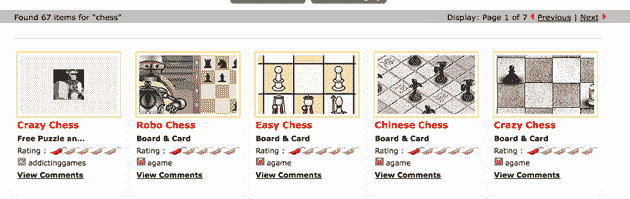

# Games2Win 推出游戏库里，一个 Flash 游戏的搜索引擎 

> 原文：<https://web.archive.org/web/https://techcrunch.com/2008/10/22/games2win-launches-gamecurry-a-search-engine-for-flash-games/>

# Games2Win 推出游戏库里，一个 Flash 游戏的搜索引擎

总部位于印度的公司 [Games2Win](https://web.archive.org/web/20221007141816/http://www.games2win.com/) 在很大程度上受到了美国媒体的关注，但在不到一年的时间里，它成功地将自己打造成网络上发展最快的游戏网站之一。该公司由企业家 Alok Kejriwal 和经验丰富的游戏专业人士 Mahesh Khambadkone 于 2007 年 6 月创立，现在每月约有 600 万用户，分布在世界各地。

该公司采取了多管齐下的方法来应对休闲游戏市场，在 Games2Win 提供了一个门户网站，其中有一个大型 Flash 游戏库，以及该公司授权给其他 Flash 开发者的广告技术。如今，该网站通过推出名为 [Game Curry](https://web.archive.org/web/20221007141816/http://www.gamecurry.com/) 的 Flash 游戏搜索引擎，进一步扩大了其影响力。

这两位联合创始人表示，虽然网络上有无数的 Flash 游戏，但往往很难找到你想要的特定游戏，因为游戏聚合器只有一小部分可用的样本。通过 Game Curry，该网站创建了一个涵盖所有这些游戏网站的游戏索引，用户可以通过关键字进行搜索。在搜索结果中，每款游戏都有一个缩略图，以及该游戏所在网站的链接，还有其他游戏库里用户留下的评论和评级。当你点击其中一个游戏时，你会被带到原始内容持有人的网站，旁边有一个游戏库里侧边栏供进一步搜索(该网站不会抓取游戏)。

虽然我可以看到 Flash 游戏搜索引擎的用途，但我不认为它会比按类别排列的传统游戏列表更有帮助——人们想要的东西不会有太多变化。除了像“网球”、“换装”或“乒乓”这样的流行名称之外，许多游戏名称完全是杜撰的，因此很难搜索。也就是说，随着排名的充实，如果游戏创作者在给他们的游戏贴标签方面做得更好，我可以看到这个引擎有更多的用途。

即使游戏 Curry 没有 Games2Win 希望的那样成功，该公司仍然为自己做得很好。Games2Win 的主要精力放在开发 Flash 游戏上。该公司雇佣了一个由 45 名开发人员组成的团队，他们以每月 16 款左右的速度生产游戏(该网站现在有超过 170 款游戏的目录)。其中一些游戏被分发到其他网站(例如，一些 Games2Win 游戏经常出现在[上瘾游戏](https://web.archive.org/web/20221007141816/http://www.addictinggames.com/)。

除了自己的游戏，Games2Win 还开发了一项名为 [inviziads](https://web.archive.org/web/20221007141816/http://www.inviziads.com/index.html) 的广告技术。因为许多 Flash 游戏都是从其原始网站上刮下来并发布到其他地方，所以很难通过传统的横幅广告来赚钱。Games2Win 为游戏建立了一个广告包装器，无论游戏出现在网络的什么地方，开发者都可以从游戏中获得报酬。