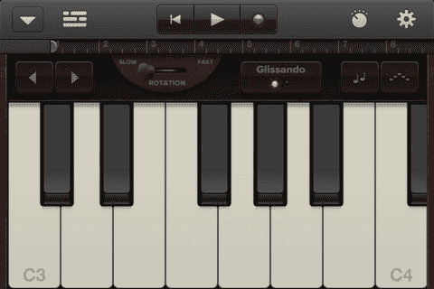
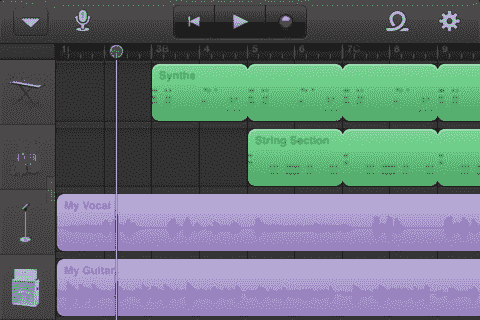
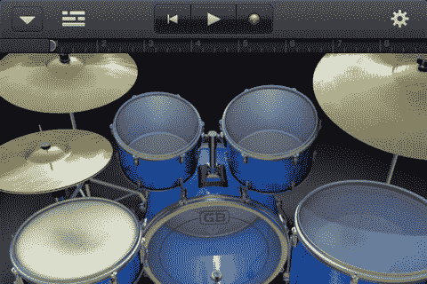

# GarageBand 登陆 iPhone 和 iPod Touch 

> 原文：<https://web.archive.org/web/http://techcrunch.com/2011/11/01/garageband-arrives-on-the-iphone-and-ipod-touch/>

# GarageBand 出现在 iPhone 和 iPod Touch 上

苹果的音乐创作应用 GarageBand 在今年早些时候被引入 iPad [后，现在可以在 iPhone 和 iPod Touch 的小屏幕上使用。与 iPad 版本一样，新应用程序也有触摸乐器，如键盘、钢琴、风琴、鼓、吉他和贝司。它还允许你插入电吉他来录制音乐，或者插入麦克风来录制人声。](https://web.archive.org/web/20230302221110/https://techcrunch.com/2011/03/02/imovie-and-garageband-for-ipad-announced/)

GarageBand 的“智能乐器”可让您从新的自定和弦资源库中选取，这是对仅适用于 iPad 的旧版本的更新。它还包括声音效果，一个采样器，它可以从您录制的声音中创建一个乐器，以及 250 多个专业循环，您可以将它们用作歌曲的背景音乐。

您可以使用内建混音器来微调轨道的音量(独奏/静音、调整声相、混响、回声)，将您的歌曲与多达八个轨道进行排列和混合，修剪和放置音乐片段等等。

歌曲可以从应用程序中共享，并导出到您的 Mac 或 PC 上，以便在桌面上进行其他编辑。

至于这个版本(版本 1.1)的新功能，苹果列出了以下功能:

为智能乐器创建自定义和弦
支持 3/4 和 6/8 拍号
在不移调原始录音的情况下重置歌曲调
以半音或全八度移调歌曲
录音的附加量化选项，包括直音、三连音和摇摆
AAC 和 AIFF(未压缩)的新音频导出质量设置
智能键盘中提供自动琶音器
触摸乐器的可调速度设置
众多增强功能，包括自动淡出和改进的音频导入选项

新的 GarageBand 现在是一个通用应用程序，在 iTunes 中售价为 4.99 美元。

