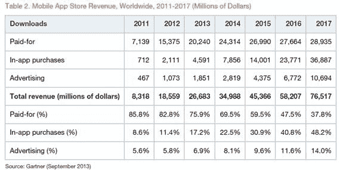

# Gartner:2013 年全球应用商店下载量达 1020 亿次，销售额达 260 亿美元，17%来自应用内购买 TechCrunch

> 原文：<https://web.archive.org/web/https://techcrunch.com/2013/09/19/gartner-102b-app-store-downloads-globally-in-2013-26b-in-sales-17-from-in-app-purchases/>

根据 Gartner 的[新研究，智能手机采用的持续趋势——今年](https://web.archive.org/web/20221005100016/http://www.gartner.com/newsroom/id/2592315)[最终超过了](https://web.archive.org/web/20221005100016/https://beta.techcrunch.com/2013/08/14/gartner-q2-smartphone/)购买的非智能手机数量——将推动今年 1020 亿次应用商店下载，其中 90%将在苹果的应用商店和 Google Play 上进行。这将导致 2013 年全球应用收入达到 260 亿美元，未来收入的增长将超过应用下载量的增长。

随着免费下载继续占据主导地位——今年，近 830 亿下载应用将是免费的，占所有下载的 91%——应用内购买和广告对开发者的商业模式将继续变得越来越重要。今年，IAP 将占收入的 17%，超过 40 亿美元，但在未来四年内将大幅增长，到 2017 年将占所有收入的 48%。

作为参考，2011 年，IAP 占收入的 11%。作为另一个参考点，IHS ScreenDigest 的分析师认为，我们已经超过了应用商店收入的临界点。移动媒体首席分析师杰克·肯特表示，今年，80%的应用收入将来自应用内购买。Gartner 预计，IAP 只会在 2017 年超过付费下载销售额。

到 2017 年，Gartner 预计每年将有 2680 亿次下载，相当于 770 亿美元的收入。如果准确的话，这意味着总的来说，应用收入的增长实际上将超过下载量的增长。未来四年，下载量将增长 2.6 倍，而收入将增长 2.9 倍。

**表 1。2010-2016 年全球移动应用商店下载量(百万次下载)**

|  | **2012 年** | **2013 年** | **2014 年** | **2014 年** | **2016** | **2017 年** |
| --- | --- | --- | --- | --- | --- | --- |
| 免费下载 | 57,331 | 82,876 | 127,704 | 167,054 | 211,313 | 253,914 |
| 付费下载 | 6,654 | 9,186 | 11,105 | 12,574 | 13,488 | 14,778 |
| **总下载量** | **63985** | **102062** | **138809** | **179628** | **224801** | **268692** |
| *免费下载百分比* | *89.6* | *91.0* | *92.0* | *93.0* | *94.0* | *94.5* |

*资料来源:Gartner(2013 年 9 月)*

Gartner 补充道，IAP 实际上非常流行，甚至在付费应用中也能有效使用。“我们看到，用户不会因为已经为一款应用付费而却步，如果他们对这种体验感到满意，他们会愿意花更多的钱，”该分析师集团的研究主管布莱恩·布劳(Brian Blau)写道。“因此，我们认为 IAP 是一种有前途和可持续的货币化方法，因为它鼓励基于绩效的购买；也就是说，用户只有在对体验感到满意时才会付费，开发者必须努力通过良好的设计和性能来赚取收入。”

至于 2013 年的其余收入——215.8 亿美元——Gartner 指出，其中大部分(超过 200 亿美元)将来自付费应用下载。2013 年付费应用的平均价格约为 2 美元。

与此同时，广告是大多数应用程序制造商收入的边际驱动力，尤其是因为传统的展示和搜索广告是主要只奖励非常、非常大的玩家的形式(在线情况也是如此)。它今年只会带来 18.5 亿美元的收入。

Gartner 指出，使用广告的免费应用的比例实际上正在下降:将从 2013 年的 88%下降到 2017 年的 86%。“应用内广告还不是广告商接触目标受众的有效手段，”Gartner 指出。“尽管在应用内广告的定位、质量和衡量方面进展缓慢。”事实上，广告技术的创新将有助于大品牌更好地购买移动广告，并可能意味着消费者对广告的反应更好。

无论如何，用户下载应用程序需要付费的趋势已经非常明显。它已经对开发者如何在商店定价产生了影响:布劳写道，免费应用程序占苹果应用商店应用程序的 60%，占谷歌 Play 应用程序的 80%。

Gartner 没有公布这两个超大应用商店中哪一个目前带来的收入最多，但 Distimo 在 8 月份的研究[表明，尽管 Android 目前在全球手机销售中占据主导地位，但苹果的 iOS 平台仍然带来更多的应用收入。](https://web.archive.org/web/20221005100016/https://beta.techcrunch.com/2013/08/12/google-play-revenue-up-67-over-past-6-months-fueled-by-japan-s-korea/)

虽然很多人将此归因于 iPhone(和 iPad)用户更有获取欲和参与度，但 Gartner 指出了其他原因:消费者在成为新用户时会购买更多应用，而在拥有设备一段时间后会减少购买。举例来说，这可以部分解释为什么 Distimo 指出，Android 应用的收入在过去几个月中增长了 67%，而苹果的收入仅增长了 15%。在此期间，Android 一直在抢占 iPhone 的销售市场。

这也会产生相反的效果。“我们预计每台 iOS 设备的平均月下载量将从 2013 年的 4.9 下降到 2017 年的 3.9，而每台 Android 设备的平均月下载量将从 2013 年的 6.2 下降到 2017 年的 5.8，”布劳写道。“这与用户更频繁地使用相同应用而不是下载新应用的总体趋势有关。”

虽然 Blau 没有添加这一点，但手表的另一个“切换”是苹果目前正在经历的 iOS 7。不仅仅是对 iOS 6 的升级，这是一次完整的视觉和功能革新，产生了我们都知道并已经在使用的新版本应用。

随着开发人员谈论他们不得不做的大量工作来让他们的新版本上线并运行，iOS 7 的引入无疑使许多领先的应用程序玩家回到了苹果的行列。现在，取决于苹果新系列 iPhone 5s 和 5c 设备的成功程度，以及有多少旧款设备的用户决定值得冒险尝试将旧款设备升级到新操作系统，这可能会对 iOS 下载和购买产生强烈的连锁效应——以及更大的应用程序画面。

谷歌和苹果完全主导了大局，这并不奇怪。布劳写道，iOS 和 Android 应用商店合计将占 2017 年全球下载量的 90%，与这两个操作系统占 2017 年全球智能手机和平板电脑安装量的 87.5%相一致。而其他平台呢？今天不是好消息，明天也不是:“其他应用程序商店——如 Windows Marketplace、黑莓应用程序世界和诺基亚商店——以及许多通信服务提供商商店将在 2017 年前占
总下载量的不超过 10%，”布劳写道。"这是由于设备安装基数小或设备碎片化造成的."不幸的是，对于诺基亚(很快，微软)和黑莓来说，几乎可以肯定的是，更多的是因为“安装基数小”(即没有用户)，而不是后一个原因。

但是，尽管 Google Play 很强大，但它也不是没有挥之不去的碎片化，即基于分叉的 Android 实现的应用商店。这包括亚马逊为 Kindle Fire 开设的商店，也包括中国的应用商店。Gartner [指出](https://web.archive.org/web/20221005100016/http://www.theage.com.au/digital-life/smartphone-apps/inapp-purchases-to-drive-revenue-growth-20130919-2u0n7.html)到 2017 年，Google Play 将占据应用商店下载量的 47 %,比今天有所下降，因为中国的 91 Wireless 和 360 Market 等“国内”应用商店正在崛起。