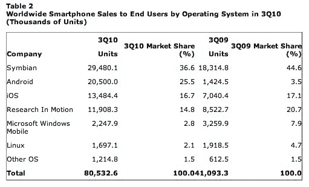

# Gartner: Android 份额跃升至 25.5%，现为全球第二大最受欢迎的操作系统 

> 原文：<https://web.archive.org/web/https://techcrunch.com/2010/11/10/gartner-android-share-jumps-to-25-5-percent-now-second-most-popular-os-worldwide/>

# Gartner: Android 份额跃升至 25.5%，现在是全球第二大最受欢迎的操作系统

Gartner 的[第三季度智能手机数据](https://web.archive.org/web/20221007060425/http://www.gartner.com/it/page.jsp?id=1466313)今天发布，看起来 Android 继续突飞猛进。根据最新报告，Android 占全球智能手机销量的 25.5%，成为第二大操作系统，而 2009 年同期的市场份额为 3.5%。另一方面，苹果的 iOS 从去年开始下降，从 2009 年的 17.1%下降到 2010 年的 16.6%。Symbian 以 36.6%的销售份额位居榜首。

Gartner 还表示，2010 年第三季度全球手机总销量为 4.17 亿部，比 2009 年第三季度增长了 35%。智能手机销量比去年第三季度增长了 96%，智能手机在 2010 年第三季度手机总销量中占 19.3%。

就北美的统计数据而言，苹果的份额超过了 RIM，但仍落后于 Android。Gartner 估计，2010 年第三季度，Android 手机占威瑞森无线智能手机交易的 75%到 80%。

考虑到已经有[类似的报道](https://web.archive.org/web/20221007060425/https://beta.techcrunch.com/2010/11/03/comscore-android-continues-to-close-in-on-apple-rim/)关于操作系统在智能手机食物链上的上升，安卓惊人的增长并不令人惊讶。最近的尼尔森数据显示，在过去的六个月里，Android 设备是购买新智能手机最受欢迎的选择。