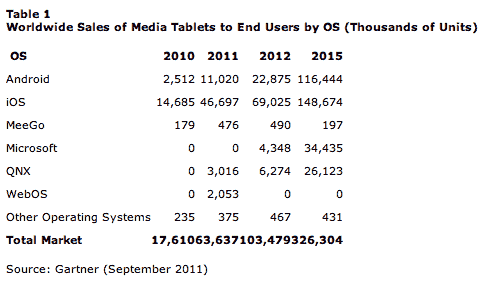

# Gartner:苹果 iPad 将成为 2014 年的顶级平板电脑

> 原文：<https://web.archive.org/web/http://techcrunch.com/2011/09/22/gartner-apple-ipad-will-be-top-tablet-through-2014/>

Gartner 的分析师今天发布了一份新的[报告](https://web.archive.org/web/20230320034816/http://www.gartner.com/it/page.jsp?id=1800514)，详细介绍了平板电脑市场趋势和预测。毫不奇怪，他们的发现证实了一个显而易见的事实:iPad 正在扼杀它。据该公司称，苹果 iPad 将占今年全球平板电脑销量的 73.4%，在此期间，除了安卓以外，没有其他平台的市场份额超过 5%。

此外，据研究副总裁卡罗琳娜·米拉内西(Carolina Milanesi)称，在 2014 年之前，苹果将继续占据平板电脑市场 50%以上的份额，她将这一统计数据归功于苹果最初创造这一市场的远见，以及苹果“跨越其硬件、软件和服务的卓越和统一的用户体验”

米拉内西认为，不能提供类似体验的竞争对手不会对苹果的发展构成太大挑战。也就是说，竞争对手的产品确实影响了苹果的平板电脑销售*非常轻微的*。如上所述，苹果预计在 2011 年占有 73.4%的市场份额，但这比 2010 年的 83%有所下降。

与此同时，Android 平板电脑今年将占据 17.3%的市场份额，出货量为 1，100 万台。去年，Android 占据了 14.3%的市场份额。

但米兰内西表示，Gartner 正在下调 Android 上季度的预测，因为该平台“受到高价格、用户界面薄弱和平板电脑应用有限的制约。”Gartner 声称，如果不是低端平板电脑在亚洲的成功以及对亚马逊 Android 平板电脑的预期，降幅会更大。(坦白地说，该公司可能有点低估了这一点。)

并非所有的事情都与报告完全一致。例如，Gartner 称 RIM 的 QNX 操作系统是一个“有前途的平台”，但表示该公司“正在经历一段艰难时期”考虑到 RIM 的困境和市场份额的急剧下降，这已经不仅仅是仁慈了。称 RIM 目前的状况为“艰难时期”似乎暗示着这家智能手机制造商将在某个时候到达彼岸，擦一擦额头，惊呼，“*咻！我们成功了！”这是否真的会发生还不清楚。*

Gartner 对 Windows 8 就不那么友好了，它的未来可能会因其姗姗来迟而受到限制。Gartner 说，该平台的最佳机会可能在企业中。

对于任何敢于挑战 iPad 的人来说，重点应该是在硬件方面匹配屏幕质量和处理能力，其他一切都被认为是“最好的，而不是必不可少的”。在平台方面，应用程序、直观的用户界面以及在设备之间共享内容的能力最为重要。祝你们好运，非 iPads。这是一个很难完成的订单。