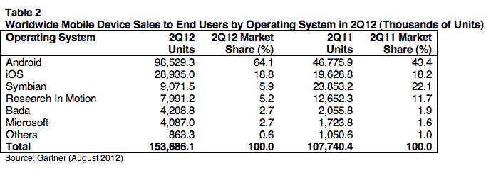
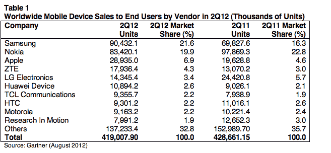

# Gartner:全球手机销量下降 2%，智能手机销量飙升 43%，苹果停滞不前，粉丝等待新 iPhone 

> 原文：<https://web.archive.org/web/https://techcrunch.com/2012/08/14/gartner-global-mobile-sales-down-2-smartphones-surge-43-apple-stalls-as-fans-hold-out-for-new-iphone/>

Gartner 是最新一家发布 T2 智能手机和 Q2 整体手机销售数据的大型分析公司。它描绘的画面是一个目前实际上只有一个赢家的市场:Android——更具体地说是三星——苹果 iPhone 的增长“暂停”,因为用户坚持购买下一代 iPhone，并安然度过艰难的经济。

Gartner 说，全球范围内，终端用户共售出 4.19 亿部手机，比一年前下降了 2.3%。在售出的所有设备中，超过三分之一(36.7%)是智能手机，即使更广泛的市场(包括功能手机)出现下滑，智能手机仍继续保持良好增长。智能手机的销量增长了 42.7%，达到 1.54 亿部，苹果和三星共占智能手机总销量的 83%。

在智能手机类别中，目前以三星为首的安卓系统从这一增长中获益最大。凭借近 9900 万部的销量，Android 设备在该季度占据了智能手机市场 64%的份额(去年同期为 43.4%)。三星的 Galaxy 系列设备占所有 Android 销售的一半以上，达到 4560 万台。

新款 S3 在发布的头两个月就卖出了 1000 万台，这证明了一款优秀新产品的强大威力。“Galaxy S3 是本季度最畅销的安卓产品，如果不是产品短缺，销量还会更高，”Gartner 指出。

与此同时，苹果基于 iOS 的 iPhone 设备也出现了增长，销量接近 2，900 万部，但这只是与智能手机市场的整体扩张保持一致，因此其份额基本保持不变:它在智能手机市场的份额为 18.8%(去年为 18.2%)。Gartner 指出，与 Q1 相比，iPhone 的销量下降了 12.6%。

Symbian 和 RIM 都出现了大幅下滑，上个季度的销售市场份额都在 5%至 6%之间徘徊，而三星的 bada 和微软则出现了温和的单个百分比的增长，份额为 2.7%(相当于约 400 万台设备)。

顺便说一句，你还记得[诺基亚说它在 Q2](https://web.archive.org/web/20221006203459/https://beta.techcrunch.com/2012/07/19/nokia-reports-q2-2012-results-e7-5-billion-in-net-sales-negative-eps-of-0-09/) 卖出了 400 万部 Lumia 设备吗？这为其他原始设备制造商在 WP7 上的表现描绘了一幅特别糟糕的画面:根据 Gartner 的数据，其他原始设备制造商仅售出了约 87，000 台设备。哎哟。

苹果公司的蒂姆·库克在上个月的 Q2 财报中告诉我们，由于经济压力，特别是在欧洲，以及人们等待新 iPhone 上市的普遍滞后(根据许多报道，新 iPhone 将于 9 月上市)，该公司本季度的 iPhone 销量下降。Gartner 基本同意这一评估:

Gartner 首席研究分析师 Anshul Gupta 在一份声明中写道:“充满挑战的经济环境和用户推迟升级以利用今年晚些时候推出的高调设备和促销活动，减缓了整个市场的需求。”

但他补充说，如果 iPhone 真的推出，也有相反的情况。“预期的苹果 iPhone 5，加上中国制造商推动 3G，并为 2012 年下半年的主要设备发布做准备，将推动智能手机市场向上，”他指出。

他说，这种增长将主要出现在智能手机领域。低端设备将“继续面临压力”，即使它们在新兴市场继续畅销。

事实上，目前，似乎是功能手机让诺基亚在手机销售方面保持活力(是的，这个平台正在燃烧，但它仍然屹立不倒)。虽然诺基亚的智能手机地位大幅下降——Symbian 的市场份额下降了近 17 个百分点，Windows Phone 7 的市场份额仅略有上升——但其影响只是全球整体排名略有下降，诺基亚目前的市场份额不到 20%，而一年前为 23%。这要归功于功能手机。

对于世界领导者来说，情况有所不同:受智能手机(超过三星销售的所有设备的一半)和功能手机的强劲销售的鼓舞，三星正在完美地玩这场游戏。它的市场份额提高了近 5 个百分点，达到 21.6%，销量超过 9000 万台。目前，三星/诺基亚与其他公司之间的差距很大。苹果位居第三，但以 2900 万台的销量远远落后。这表明，对于行业的大多数人来说，需要规模化运营才能盈利的移动市场目前是多么具有挑战性。

谷歌的摩托罗拉是受到挑战的公司之一。昨天，该公司制定了一项长期计划，从功能手机转向智能手机；值得关注的是，这将如何影响该公司在更广泛排名中的地位——可能很少，因为 Motorla 对功能手机销售的依赖程度低于诺基亚和三星等公司。它占 Q2 销售额的 2.2%，比去年下降了 0.2 个百分点。

