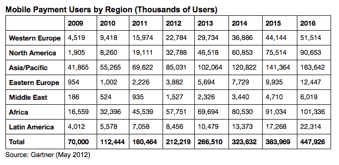

# Gartner:2012 年移动支付超过 1720 亿美元；短信、网络最受欢迎的路线

> 原文：<https://web.archive.org/web/https://techcrunch.com/2012/05/29/gartner-over-172b-in-mobile-payments-in-2012-with-212m-users-sms-web-most-popular-transaction-methods/>

不，NFC 还没有出现在 iPhone 上——或者许多其他设备上。但这似乎并没有阻止移动支付领域的发展势头。Gartner 今天发布的研究称，今年移动支付交易将超过 1715 亿美元，比 2011 年的 1059 亿美元增长 60%以上，有 2.122 亿人(比 2011 年的 1.605 亿人增长 32%)使用某种形式的移动支付服务。是什么推动了这种增长？尽管智能手机的崛起，但它是基于传统的服务，如短信和基于网络的交易。

从长远来看，Gartner 认为，到 2016 年，交易量将达到 6170 亿美元，平均增长率将略微放缓至 42%左右，届时将有 4.48 亿用户使用此类服务。

Gartner 研究主管 Sandy Shen 指出，在发展中市场，短信仍然是支付的“主导”接入技术，而在更成熟的市场，绝大多数交易是通过移动互联网门户进行的。Gartner 预测，2012 年，北美 80%的移动支付交易将通过 Web/WAP 途径进行；西欧的数字甚至更高，为 88%。

这并不是说近场通信——让人们在支付终端前挥动手机支付商品和服务的技术——完全不存在，但它的使用在 2015 年仍将“相对较低”。(我的理论是，如果苹果在 iPhone 中安装 NFC 芯片，并在 2015 年之前激活这项服务，这些预测可能会改变:我听到不止一位移动支付行业人士告诉我，他们“只是在等待 iPhone 实现 NFC”，然后事情才会真正开始。)

有趣的是，Gartner 并没有将 NFC 的缓慢采用归咎于手机制造商，但似乎提到了其他参与者的挑战:“NFC 支付涉及用户行为的变化，需要包括银行、移动运营商、卡网络和商户在内的利益相关者之间的合作，”沈指出。

她的预测是:NFC *将会被用于支付，但不是用于支付:“是票务，而不是零售支付，将会推动 NFC 交易，”她说。*

研究中其他值得注意的地方:

——**碎片化**。这似乎是一把双刃剑。一方面，从服务提供商和技术(NFC、SMS、Square 和 Paypal 等公司的加密狗)的角度来看，产品的分散似乎阻碍了任何一个解决方案或提供商群体成为移动支付事实上的标准。这当然会对商家和消费者产生连锁反应，因为他们不太信任这种解决方案。Gartner 认为，这种碎片化问题将在未来两年持续存在。

但另一方面，分裂可能是成功的必要之恶。高德纳指出，随着移动支付的不断成熟，提供商将需要根据当地市场定制产品，或者“根据当地需求模式定制产品”，沈说。这不仅包括监管和获得在特定市场提供服务的批准，还包括不同的零售商业模式、现有的嵌入式技术和当地偏好。例如，虽然美国客户可能喜欢 Square，但杰克·多西公司是否能如此成功地将这一解决方案推广到更远的地方还不得而知。

这并不是说，移动支付领域不会像信用卡领域那样出现庞然大物，而是说，本地公司在移动支付领域的作用可能会比我们迄今在信用卡领域看到的更大。“将会有一些全球性的公司拥有服务大客户和大众市场的规模和资源，这些市场的需求可以通过标准解决方案轻松满足，”Shen 指出。“然而，总会有一些细分市场无法得到全球企业的充分服务。这些细分市场的需求只能由能够更好地了解该细分市场并拥有应对独特挑战的具体解决方案的专业化或本地参与者来满足。”

谁在驾驶座上？【Gartner 表示，在北美和西欧，将会是商家，他们将会在实体店和在线支付中看到移动支付交易。在线支付将由易贝和亚马逊等公司引领，这些公司已经在快速推进移动支付。在线下，星巴克使用应用程序作为支付方式/积分卡的模式将是其他人也会走的路线。

发展中市场是另一回事。不会是商家为移动支付定下基调并使用移动支付。更确切地说，移动支付将主要用于其他类型的服务，如转账、手机通话和短信充值。Gartner 说，一个有趣的领域是票务，我以前没有看到有人提到过:显然，在非洲和南亚等市场，移动支付被用来提高购买公共交通车票的效率。

— **区域细分**。Gartner 表示，北美可能会发出最大的声音，但到了 2016 年，它只会成为移动支付的第三大市场。亚太地区将是最大的地区，非洲位居第二，这两个地区在四年内将占所有移动支付的 60%以上。下面的完整表格

[图片:Steven DePolo， [Flickr](https://web.archive.org/web/20230228042134/http://www.flickr.com/photos/stevendepolo/3354726208/sizes/m/in/photostream/) ]