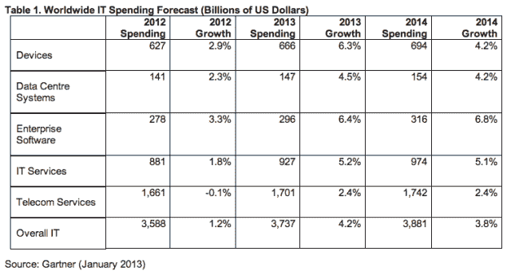

# Gartner:2013 年全球 IT 支出将达到 3.7 万亿美元，增长 4.2%；得益于更便宜的安卓平板电脑 

> 原文：<https://web.archive.org/web/https://techcrunch.com/2013/01/03/gartner-worldwide-it-spending-to-reach-3-7t-in-2013-up-4-2-on-2012-devices-spending-growth-revised-down-helped-by-cheaper-android-tablets/>

分析师 Gartner 提高了对 2013 年全球 IT 支出的预测，将其 2012 年第三季度的增长数字从 3.8%上调至 4.2%。该分析师现在预测，2013 年全球 IT 支出将达到 3.7 万亿美元。高德纳表示，这种支出增长在很大程度上归因于外币兑美元汇率的预期升值。他指出，如果以“不变美元”衡量，2013 年的支出增幅预计将为 3.9%。

Gartner 常务副总裁理查德·戈登(Richard Gordon)在一份声明中表示:“全球经济增长前景的不确定性是 IT 增长的主要阻碍因素。”“这种不确定性导致了全球企业和消费者的悲观情绪。然而，这种不确定性的大部分正在接近解决，随着这种情况的出现，我们预计 2013 年的支出增长将比 2012 年更快。”

Gartner 预测，2013 年全球设备支出(包括个人电脑、平板电脑、手机和打印机)预计将达到 6660 亿美元，比 2012 年增长 6.3%。尽管出现了这种增长，但这一预测仍比 Gartner 之前对 2013 年全球设备 7060 亿美元和 7.9%增长的预测“大幅减少”。该分析师指出，其对全球设备支出的长期预测也已下调，“目前预计从 2012 年到 2016 年，以现值美元计算，年平均增长率为 4.5%(低于 6.4%)，以定值美元计算，年平均增长率为 5.1%(低于 7.4%)。

Gartner 表示，这些减少反映了个人电脑和平板电脑支出预测增长的“大幅减少”，这只能部分抵消手机和打印机支出预测增长的“小幅增加”。该分析师还指出，来自更便宜的 Android 平板电脑的竞争加剧，导致其设备支出预测下降。

戈登在一份声明中指出:“平板电脑市场面临着来自 Android 设备以及新兴市场中更小、低价设备的更大价格竞争。”“最终，这种向相对低价平板电脑的转移降低了我们对 2012 年至 2016 年平均销售价格的预测，这反过来又导致设备支出增长总体放缓，特别是 PC 和平板电脑支出增长。”

根据 Gartner 的数据，企业软件在 2013 年的 IT 支出增长最快，预计增长 6.4%，2013 年的支出为 2960 亿美元。

Forrester 还发布了 2013 年全球 IT 支出预测。该分析师预测增长率为 5.4%(当地货币)，并将今年描述为过渡年，因为目前影响市场的大部分经济不稳定因素都在消退，“如财政悬崖、欧洲经济衰退、中国领导层换届”。该分析师预计 2014 年 IT 支出将进一步增加，并预计明年全球 IT 支出将增长 6.7%。

Forrester 分析师 Andrew Bartels 在博客中写道:“我们认为全球科技市场在 2013 年会比 2012 年好一点，在 2014 年会更好。”。弗雷斯特表示，随着对 IT 预算的挤压接近尾声，2014 年的增长可能会受到对“移动性、云计算和智能计算”等技术的压抑需求的推动。

今年 IT 支出的地区增长将有所不同，其中欧洲增长最低(0.8%)，但包括美国在内的其他地区增长更快。Forrester 预测美国的 IT 支出将增长 7.5%，亚太地区将增长 4%。

根据 Forrester 的数据，今年电脑硬件将继续停滞不前，该公司指出，“个人电脑供应商经历了糟糕的 2012 年”，总体增长为零，而服务器供应商的表现更糟，下降了 4%。该分析师预计，今年这些类别的业务不会复苏，Wintel 个人电脑销售将持平，存储购买量将下降，外设增长将放缓至 3%。

Forrester 预测的今年个人电脑 4%的总体增长具有误导性，因为该分析师指出，这“主要是由于”平板电脑——它在更广泛的个人电脑类别中计算。苹果还继续抵制个人电脑销量下降的趋势:Forrester 估计，2013 年苹果将向企业市场销售 70 亿美元的 MAC 电脑和 110 亿美元的 ipad，2014 年将销售 80 亿美元的 MAC 电脑和 130 亿美元的 ipad。

根据 Forrester 的数据，2012 年，全球企业在 Wintel PCs 和平板电脑上的支出下降了 4%，预计 2013 年将持平，因为企业将缓慢地用 Windows 8 设备替换旧的 Windows PCs。明年对雷德蒙德来说有更好的消息，因为 Forrester 预计 2014 年 PC 需求的增加和 Windows 8 设备的改进将导致这些产品的强劲增长 8%。然而，这一增长仍将低于它对 Linux、Android 和苹果产品的两位数增长预测。