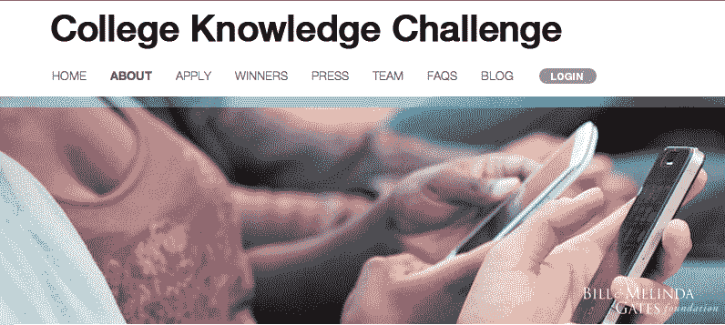
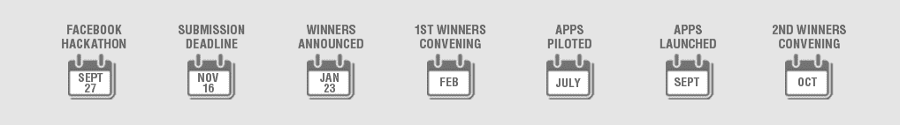

# 盖茨基金会与 EdTech Hackathon 在脸书 TechCrunch 举办价值 250 万美元的大学知识应用竞赛

> 原文：<https://web.archive.org/web/https://techcrunch.com/2012/09/27/gates-foundation-college-knowledge-challenge/>

# 盖茨基金会在脸书与 EdTech Hackathon 共同举办价值 250 万美元的大学知识应用竞赛

为了激励开发者开发出帮助孩子进入大学、留在学校并从大学毕业的应用程序，比尔盖茨基金会今天发起了脸书教育科技应用程序大赛，共有 30 个奖项，总奖金为 250 万美元。为了启动[大学知识挑战赛](https://web.archive.org/web/20221124021604/http://www.collegeknowledgechallenge.org/)的提交期，它今天在位于门洛帕克 Hacker Way 1 号的脸书总部联合举办了一场 edtech 黑客马拉松。

各个年龄段的开发人员都被赋予了创建应用程序的任务，这些应用程序可以构建通往大学的道路，为即将到来的大学生建立同龄人群体，并帮助大学入学和获得财政援助。所以，如果你想让孩子们变得更聪明，就给他们做点什么，赢得 10 万美元的奖金。

盖茨基金会的教育副主任 Stacey Childress 在介绍该活动时说:“在盖茨基金会，我们越来越注重个性化学习。我们的意思是每天在他们所在的地方会见每一个学生，这样他们就能得到下一步取得成功所需的东西。技术不能解决这个问题，但它是其中的一部分。”

至于为什么大学知识挑战赛特别要求开发者开发脸书应用程序，她指出，“社交网站……对学生来说变得至关重要，尤其是对低收入家庭的学生来说，可以在社区之外建立社会资本。脸书……不仅有助于学术上的成功，也有助于他们的坚持。他们觉得联系更紧密，也更有可能留在学校。”

脸书公共政策副总裁 Elliot Schrage 表示，他的公司和盖茨基金会“对一个开放和互联的世界有着共同的愿景，在这个世界上，每个人都有机会过上健康、富有成效的成功生活。我们都相信黑客文化。”

他接着解释说，“技术不仅使信息的获取民主化，也使信息的传播民主化。”施拉格指出，脸书的开放图表低摩擦共享系统允许“年轻人有可能成为病毒的体验。”他认为社交网络和教育的结合“就是利用分享的力量来改变人们的生活方式。”

虽然这些应用程序是为低收入和第一代大学生设计的，但他们不一定要自己开发。盖茨基金会的黛博拉·罗宾逊告诉我，“我们需要打破障碍，让任何有好主意的人都来提出来。”

今天晚些时候将颁发 18，000 美元的黑客马拉松奖金，其中 30 个最佳大学知识挑战应用程序将在 11 月 16 日提交结束后命名。开发者可以[在这里](https://web.archive.org/web/20221124021604/http://www.collegeknowledgechallenge.org/)申请。

*该活动刚刚在脸书总部拉开帷幕，我们将在今天发布最新消息，并在今晚宣布黑客马拉松的获胜者。*

