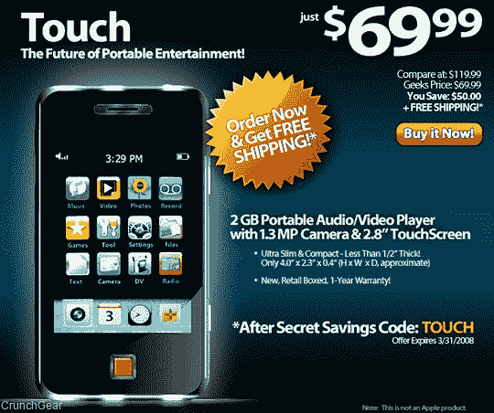
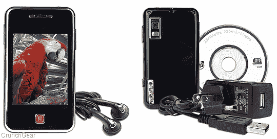

# Geeks.com 出售 70 美元的 iPod Touch 山寨版 

> 原文：<https://web.archive.org/web/https://techcrunch.com/2008/03/12/geekscom-selling-70-ipod-touch-knockoff/>

# Geeks.com 出售 70 美元的 iPod Touch 仿制品

我刚刚收到一封来自 Geeks.com 的电子邮件，邀请我用这款 70 美元的设备“触摸便携式娱乐的未来”,它看起来非常像我更昂贵的 iPod Touch，我愚蠢地认为它已经是便携式娱乐的未来了。那么，就规格而言，这款产品与 iPod Touch 相比如何呢？

首先，您不必担心填满整个 8g、16g 或 32g 的驱动器。不，有了这个小家伙，你只需要填满 2gb。此外，2.8 英寸的触摸屏比 iPod Touch 的 3.5 英寸屏幕略低。你还会错过 Wi-Fi 连接，电池寿命最高只有 6 小时的音频。

不过，你会得到一个 130 万像素的摄像头、录音机和调频收音机。还有一个 miniSD 卡插槽来增加存储空间，它也可以处理 MP3，WMA，WAV，AVI 和 JPEG 文件。另外，它非常便宜！

[2GB 便携式 USB 2.0 MP4/MP3/130 万像素摄像头，带 2.8 英寸触摸屏](https://web.archive.org/web/20230121164530/http://www.geeks.com/details.asp?invtid=BLK-4GBMP4SD-TS&cm_mmc=geekmail-_-daily_html-_-12mar08_TOUCH-_-TOUCHmain)【Geeks.com】