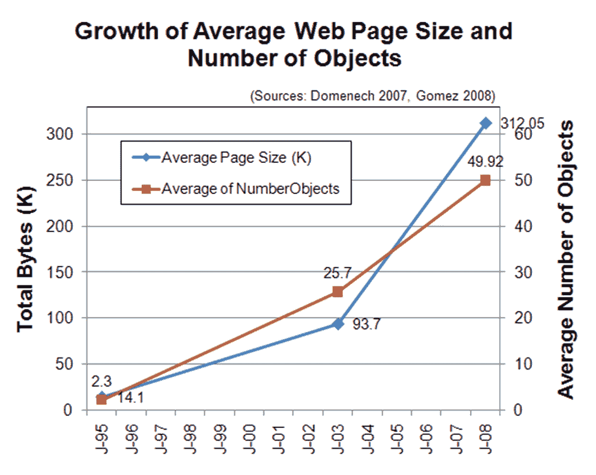
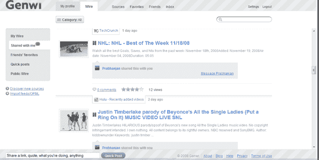
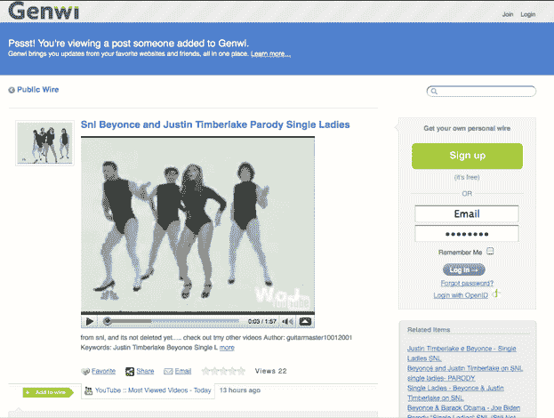
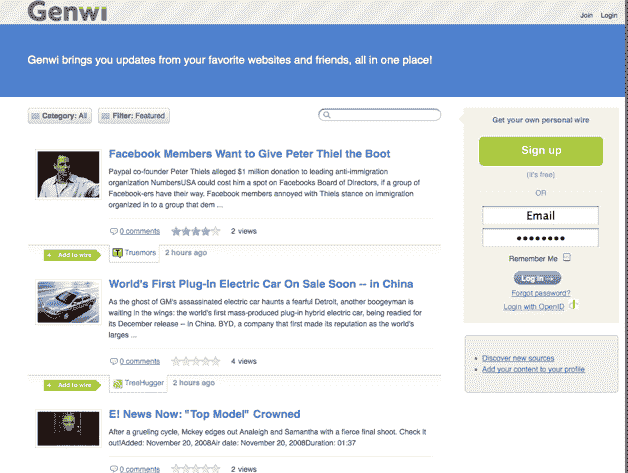

# Genwi 进一步模糊了 Feed 阅读器和好友阅读器之间的界限 TechCrunch

> 原文：<https://web.archive.org/web/https://techcrunch.com/2008/11/20/genwi-further-blurs-the-line-between-a-feed-reader-and-a-friend-reader/>

一年前，当我们第一次写关于 [Genwi](https://web.archive.org/web/20221208065315/http://www.genwi.com/) 的时候，它是一个[社交订阅阅读器](https://web.archive.org/web/20221208065315/http://www.beta.techcrunch.com/2007/09/01/genwi-browse-and-share-syndicated-content/)，内容订阅可以按不同类别(博客、新闻、视频、音乐、播客)组织，并与你的朋友分享。今天，它重新推出了一个全新的设计，考虑到你的朋友在网上做什么。

你可以把 Genwi 看作是 Google Reader 和 FriendFeed 的结合，具有复杂的搜索、自动分类和过滤功能。和以前一样，Genwi 是一个超级 RSS 阅读器。它会按类别推荐订阅源，或者你也可以添加自己的订阅源(通过搜索或从其他阅读器导入 OPML 文件)。你也可以邀请你的朋友，允许 Genwi 将其成员与你在 Gmail、Yahoo Mail、LinkedIn、AOL、Outlook 和其他地方的联系人进行匹配(尽管它还没有脸书集成)。

一旦你这样做了，你就可以在网上追踪你朋友的社交活动，就像在 FriendFeed 上一样。每当联系人在 Twitter、Digg、Flickr、YouTube 或其他社交媒体网站上做了什么，它就会出现在 Genwi 上。(其他支持的服务有 Vimeo、Blogger、WordPress、Tumblr、Pownce、Yelp、Upcoming、Last.fm、iLike、del.icio.us、ma.gnolia、Jaiku、Webshots、Picasa、Smugmug、Zoomr、Furl、Reddit、Mixx 和 Diigo)。

到目前为止，那又怎么样。但 Genwi 有一些有趣的功能，可以推动网络过滤/生活流游戏的发展。Genwi 将 Web 视为信息对象的集合。一个对象可以是一篇博文、一个视频、一首流媒体歌曲、一张照片、一条推文、一个挖掘。Genwi 可以让你直接通过 RSS 订阅获取你关心的对象，或者通过关注你朋友的行为间接获取你关心的对象，并将它们全部呈现在一个可管理的、个性化的、可搜索的订阅源中。Genwi 联合创始人 Killian P. McKiernan 解释道:

> 起初，网页是一个发布的文档。它已经演变成一个对象集合——通过搜索和加载页面涉水通过所有这些对象可能不是消费它们的最有效方式。更好的办法是把所有对你重要的对象都带进来，创建一个环境，让你能够过滤并直接消费最感兴趣的东西。

一旦所有的对象都被接收到 Genwi 中，它就开始对它们做一些有趣的事情。每个帖子/视频/歌曲/对象都可以按类型和类别过滤，也可以按最受欢迎、最高评级和最近的过滤。他们可以被评分、分享或添加为收藏。你所有朋友的最爱都会出现在你的连线中(也就是 Genwi 所说的你的个人超级 feed)。最受欢迎的商品在公共线路上提供，也可以用各种方式进行分类。当你搜索东西的时候，网络上最喜欢的东西会出现在最前面，给搜索增加了一个社会等级的元素。

还有其他值得注意的特点。不用“加好友”就可以跟着别人的线走。如果你想给你所有朋友发送一个“快速帖子”，它会像 Twitter 一样出现在他们的所有订阅源中(FriendFeed 有一个类似的东西叫做“消息”)。它相当熟练地处理各种媒体。它能更好地以一种非常精细的方式展示服务上的流行内容。

不利的一面是，该网站比 FriendFeed 加载时间更长，响应速度也不如 FriendFeed。但是它有一些技巧值得一试。

