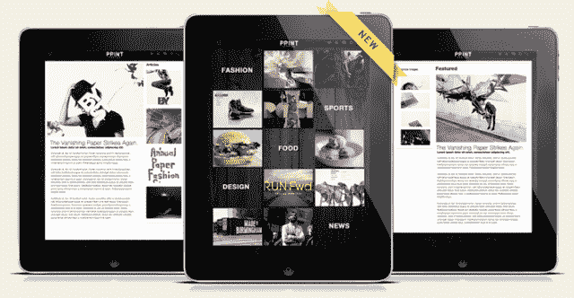

# GENWI 为平板电脑和智能手机的云发布平台筹集了 400 万美元 

> 原文：<https://web.archive.org/web/https://techcrunch.com/2011/10/11/genwi-raises-4m-for-cloud-publishing-platform-for-tablets-smartphones/>

# GENWI 为平板电脑和智能手机的云发布平台筹集了 400 万美元

**独家-**[GENWI](https://web.archive.org/web/20230205042135/http://genwi.com/)，为移动设备提供[漂亮的云发布平台](https://web.archive.org/web/20230205042135/https://techcrunch.com/2011/07/13/genwi-launches-ipad-app-publishing-solution-and-enhanced-mobile-cms/)，已经从 [Nexus Venture Partners](https://web.archive.org/web/20230205042135/http://www.crunchbase.com/financial-organization/nexus-venture-partners) 和早期支持者[invent us Capital Partners](https://web.archive.org/web/20230205042135/http://www.crunchbase.com/financial-organization/inventus-capital-partners)和 [Quest Venture Partners](https://web.archive.org/web/20230205042135/http://www.crunchbase.com/financial-organization/quest-venture-partners) 处筹集了[400 万美元](https://web.archive.org/web/20230205042135/http://www.crunchbase.com/company/genwi)的首轮融资。

迄今为止，该公司已经筹集了总计 510 万美元的资金。

GENWI 提供了一个基于云的平台，用于在平板电脑和智能手机上发布内容，它表示已经为“数千家”出版商创建并积极管理超过 1，500 个应用程序。GENWI 让其客户一次性发布实时内容，同时在各种移动设备(iOS、Android、HTML5 等)上提供交互式应用。

GENWI 的云发布套件提供了移动优化的内容聚合和管理系统、自定义界面布局引擎、使用分析、基于分析的智能内容监管、社交和广告网络集成以及应用分发，所有这些都来自云。

额外的资金将用于建设基础设施和广泛的应用程序网络，为出版商提供更先进的货币化和分发功能，进行全球扩张和多语言功能的开发。

GENWI 成立于 2010 年，是一家总部位于加利福尼亚州洛斯阿尔托斯的私营公司。

Nexus Venture Partners 的 Jishnu Bhattacharjee 将加入 GENWI 的董事会。

