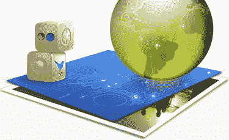

# 针对地点、推文、Flickr 照片等发布 GeoAPI 

> 原文：<https://web.archive.org/web/https://techcrunch.com/2009/11/12/geoapi-places-twitter-flickr/>

# 针对地点、推文、Flickr 照片等的 GeoAPI 启动

位置，位置，位置。随着配备 GPS 的手机越来越普遍，现在正在虚拟地掀起一股将地理定位功能放入每个移动应用程序的热潮。今天，Mixer Labs，TownMe 背后的人[，推出了](https://web.archive.org/web/20221006202333/http://www.beta.techcrunch.com/2009/07/13/cougars-yuppies-and-sugar-daddies-oh-my-ex-googlers-working-on-local-startup-townme/) [GeoAPI](https://web.archive.org/web/20221006202333/http://geoapi.com/) ，面向那些希望以即插即用的方式将地理定位功能添加到他们的应用程序中的开发者。

GeoAPI 建立在以前称为 [TownMe GeoAPI](https://web.archive.org/web/20221006202333/http://blog.townme.com/2009/10/townme-geoapi-allows-new-types-of.html) 的基础上，它为 1600 万个企业和兴趣点的经纬度坐标和地理数据库提供了反向地理编码器。但现在它是自己的独立产品，随着今天的发布，GeoAPI 现在包括地理编码的推文和 Flickr 照片，改进的搜索，用于特定位置链接的专用短 URL (http//:geo.am)，iPhone SDK 和更好的路口数据。你可以在这里找到更多的细节。

因此，想要构建自己的带有签到和地理推文的 Foursquare/Gowalla 类型的移动应用程序的开发人员可以在 GeoAPI 的基础上构建它，而不是从头开始组装所有底层数据。开发者每天可以免费获得多达 20，000 个查询。他们还可以将自己的数据存储在 GeoAPI 服务器中，并针对这些数据运行地理查询。

为了对这是如何工作的有个基本的感觉，看看这些在旧金山的地理编码的推文的简单演示。你点击一个社区，它会显示最近的推文或从那里拍摄的照片。

Mixer Labs 联合创始人 [Elad Gil](https://web.archive.org/web/20221006202333/http://www.crunchbase.com/person/elad-gil) 是谷歌移动地图的第一任产品经理。他将为来自 [SimpleGeo](https://web.archive.org/web/20221006202333/http://www.simplegeo.com/) 的开发者创建[地理定位基础设施](https://web.archive.org/web/20221006202333/http://www.beta.techcrunch.com/2009/10/27/matt-galligan-and-joe-stump-are-building-an-infrastructure-for-location-based-services/)寻找竞争对手，SimpleGeo 由 [Matt Galligan](https://web.archive.org/web/20221006202333/http://www.crunchbase.com/person/matt-galligan) (前 Socialthing)和[乔·斯坦普](https://web.archive.org/web/20221006202333/http://www.crunchbase.com/person/joe-stump)(Digg 前首席架构师)创立。Gil 和 Galligan 都将在下周的[实时会议](https://web.archive.org/web/20221006202333/http://www.beta.techcrunch.com/real-time-crunchup-sf/)上在 Geo Streams 小组上发言，还有来自 Twitter、Foursquare、Google 和 Hot Potato 的 Geo 专家。([票](https://web.archive.org/web/20221006202333/http://realtimecrunchupsf.eventbrite.com/)还有)。我相信我们会听到很多关于哪个 geo API 会更好的消息。