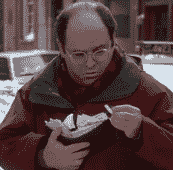

# 乔治·克斯坦萨臭名昭著的钱包是新的谷歌钱包商业 TechCrunch 的明星

> 原文：<https://web.archive.org/web/http://techcrunch.com/2011/09/16/george-constanzas-infamous-wallet-is-the-star-of-new-google-wallet-commercial/>

# 乔治·克斯坦萨臭名昭著的钱包是新的谷歌钱包广告的明星

【YouTube = http://www . YouTube . com/watch？v = gKGptWtzeaU & feature = player _ embedded & w = 630]

虽然谷歌钱包没有像预期的那样在今年夏天推出，[谷歌刚刚推出了第一个谷歌钱包广告，主演不是别人，正是宋飞的乔治·克斯坦萨和他的臃肿钱包。](https://web.archive.org/web/20230204224932/https://techcrunch.com/2011/05/26/google-wallet-offers/)

对于那些不太熟悉的人，乔治·克斯坦萨的钱包在《宋飞正传》第一集[“反向窥视孔”](https://web.archive.org/web/20230204224932/http://en.wikipedia.org/wiki/The_Reverse_Peephole)中很出名，乔治随身带着一个钱包，它太胖了，以至于妨碍他坐着，让他的背很疼。看起来谷歌重新录制了那一集的爆炸场景，以推广其 NFC 产品，指引人们去 http://www.google.com/wallet 了解更多信息。

我已经给谷歌发了电子邮件，询问具体的钱包发布日期，当他们给我回复时，我会更新这篇文章。同时，这里有一些原剧集中的对话和场景。

> **杰瑞·宋飞/strong >:你的背痛是因为你的钱包。它是巨大的。乔治·克斯坦萨:这不仅仅是我的钱包。是组织者，是回忆，是老朋友。杰瑞·宋飞:嗯，你的朋友有病态的肥胖。乔治·克斯坦萨:嗯，至少我没有带钱包。杰瑞·宋飞:这不是一个钱包，这是欧洲的。**

【YouTube = http://www . YouTube . com/watch？v = yopf 98 I 8 a 0g & feature = player _ embedded & w = 630]