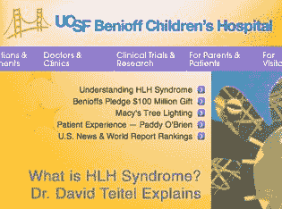

# 掏出你的钱包，帮助建造一所儿童医院 TechCrunch

> 原文：<https://web.archive.org/web/https://techcrunch.com/2010/11/15/get-your-wallet-out-and-help-build-a-childrens-hospital/>

帮助我们创造社交媒体的历史，支持一项伟大的事业，即 [UCSF 儿童挑战赛](https://web.archive.org/web/20221209133214/http://news.ucsf.edu/releases/ucsf-launches-social-media-fundraising-campaign-for-benioff-childrens-hospi/)。他们试图为一个 16 亿美元的大型项目筹集 6 亿美元。**我们正在寻求您的帮助，我个人将通过 TechCrunch 匹配第一笔 10，000 美元的捐款。**

作为整个项目的一部分，加州大学旧金山分校医疗中心正在旧金山建造一座新的独立的儿童医院，马克和林恩·贝尼奥夫夫妇出资 1 亿美元。人们已经从全州各地，事实上是全国各地，来到 UCSF 医疗中心接受高度专业化的癌症治疗、手术和其他重要治疗。新医院将提供一个美好的新环境，让孩子们和他们的家人感到更加舒适。SV 天使投资人[罗恩·康韦](https://web.archive.org/web/20221209133214/http://www.crunchbase.com/person/ron-conway)是加州大学旧金山分校医学中心的董事会成员，为这项事业贡献了大量时间。

这就是我们的切入点。UCSF 与 [Causes](https://web.archive.org/web/20221209133214/http://www.crunchbase.com/company/causes) 合作举办[儿童 UCSF 挑战赛](https://web.archive.org/web/20221209133214/https://www.causes.com/fb/donations/new?ts=1289846253&cause_id=539326)。从现在起到 12 月 16 日，获得最多捐款(最低捐款 10 美元)的团队将能够赠送并命名为“The Link”，这是一个儿童活动空间，用于在新医院中学习、玩耍和探索。这通常是为百万美元及以上级别的捐助者保留的。这也是一个超级酷的方式，使用社交媒体作为一个主要工具来推动意识和大规模参与新医院的建设。TechCrunch 团队很高兴能参与其中。

我们将举行每周一次的比赛来支持 TechCrunch 团队参加儿童挑战赛。本周，帮助我们获得最高贡献的人或初创企业将在旧金山的 TechCrunch 获得一天的奖励。我们很乐意在办公室接待最多六个人一天。参观一下，看看视频工作室，吃顿午餐，看看最新的科技新闻，玩玩新的科技产品，和我们一起努力工作，尽情玩耍。我们还将随机选择六名通过脸书或 Twitter 与朋友分享捐赠的捐赠者，制作 TechCrunch 恤。本周的比赛将于太平洋时间 11 月 19 日星期五中午结束。

要参与本周的内容，请向 [Team TechCrunch 为孩子们举办的 UCSF 挑战赛](https://web.archive.org/web/20221209133214/https://www.causes.com/fb/donations/new?ts=1289846253&cause_id=539326)捐款。

敬请关注。在 12 月 16 日之前，我们每周都会有新的赠品。帮助我们在行驶过程中获得最高总参与者数量的初创公司将能够为 team TechCrunch 命名医院房间。在儿童医院里，你有多少机会给一个房间命名？

如果你喜欢组建自己的团队，你可以点击[这里](https://web.archive.org/web/20221209133214/http://www.causes.com/campaigns/142642?cause_id=539326)的公益广告页面。一位匿名捐助者同意为挑战前 25 名的每支队伍增加 1000 美元。

将会有激烈的竞争。脸书、Zynga、Twitter、foursquare、DailyBooth、Seesmic 和其他公司都在参与，看看每家公司如何利用其平台来提高知名度和参与度将是一件有趣的事情。当然，我们在 TechCrunch 非常有竞争力，所以不要仅仅因为我们是一个技术博客，就指望我们只是坐着报道新闻……如果你对 TechCrunch 团队如何获胜有想法，请在下面的评论中告诉我们，或者在我们的[脸书页面](https://web.archive.org/web/20221209133214/http://www.facebook.com/techcrunch)告诉我们的新社区经理 Elin。

顺便说一句，今天是国家慈善日，也是一个支持伟大事业的好借口。

在这里捐款。