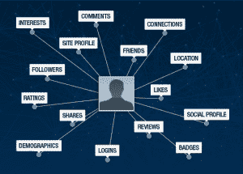

# Gigya 推出平台，让企业获得用户的完整社交身份 

> 原文：<https://web.archive.org/web/http://techcrunch.com/2011/11/02/gigya-launches-platform-to-give-businesses-access-to-users-complete-social-identities/>

许多公司已经开始意识到，社交不仅仅是一种新的渠道或新的时尚，它还是一种新的经营方式。但学会诀窍，如何使用社交网络和社交渠道，并为自己的业务优化和定制社交功能，说起来容易做起来难。这就是 Gigya 进入等式的地方。这家初创公司提供 SaaS 技术(或者社交 CRM 平台，如果你愿意的话)来帮助企业使他们的网站社会化，将他们的在线附属物与脸书、Twitter、LinkedIn 等整合在一起。并将最好的社交功能整合到一个解决方案中。

迄今为止，这家初创公司每月在 50 多万个网站上支持超过 2.8 亿用户，客户包括哥伦比亚广播公司(CBS)、福克斯体育(Fox Sports)、Intuit、可口可乐公司(Coca-Cola Company)、家得宝(Home Depot)和特纳网络(Turner Networks)等。

Gigya 擅长社交小工具和插件，为企业提供两者的最佳选择，努力增加社交注册，以获得用户和客户梦寐以求的社交图信息，并使他们更容易从他们最喜欢的社交平台注册，口碑营销，社区互动和参与——所有这些都是好东西。这听起来可能像是行业术语，但利用这种优化的社交功能对企业来说是一件好事，增加了企业内容或品牌在平台上的共享，老实说，世界上一半的人现在都在互动。

而这家初创公司已经利用小工具将电子商务平台与社交网络等整合到了社交商务中。Gigya 今天宣布推出一项具有大数据影响的重要(或许有些吓人)新技术。当然是社会数据的含义。这项技术被称为“身份管理平台”，从本质上说，它使企业能够更好地管理用户数据，为他们提供完整的、基于权限的访问用户的社交、个人资料和行为数据，这些数据是从他们的网站上收集的。

身份管理平台与其他用户管理系统的不同之处在于，它结合了社交数据和现场活动数据(如评论和分享)。重点是帮助企业解决数据收集/管理固有的一个大难题，即许多大企业努力保持客户注册的最新状态。大多数情况下，他们不得不依赖于客户在最初注册时提供的注册信息，这些信息往往会随着潮流而变化。

否则，企业可能会被迫走出去，从第三方购买客户数据，这可能会很昂贵，往往缺乏兴趣图信息，而且，嗯，只会让你觉得不舒服。作为一个客户，你可能会感谢你的兴趣图信息不包括在第三方包装的身份信息(那是你的)买卖中，但对于企业来说，这代表着客户锁定、保留和服务金矿。而且，说实话，这是常态。

通过将社交和现场活动数据放在云中，Gigya 允许其客户访问其访客的最新社交数据，通过电子邮件营销活动、内容推荐甚至细分来利用这些数据进行高度相关的广告定位。

 重要的是，当用户通过 Gigya 的社交插件(集成到企业网站上)进行注册或登录时，他们授权网站访问他们的社交/行为图数据。同样，对用户来说可能是可怕的，但对大型零售商、媒体公司等来说却是巨大的时间和金钱节省。新平台还提供了一个基于云的用户注册系统，以便网站可以通过单点登录的方式在网站网络中维护一个统一的用户数据库，用于社交和传统身份验证。

身份管理平台还集成了 Gigya 的社交插件套件，包括社交登录、评级和评论、评论、共享和游戏机制，因此客户可以更有效地锁定他们的用户。例如，使用该平台，营销人员可以很容易地创建一个名单，列出所有拥有大学学位、喜欢旅游、有社会影响力的用户。

显然，社交网络为企业提供了以更精细和更专注的方式了解客户的机会，通过允许这些客户在云中访问(和映射)他们用户的社交数据，这有可能为品牌和他们的营销团队带来高价值主张。所以请注意，这些团队现在正在用实时社交数据和工具来武装自己，这些工具有助于广告和内容的个性化，很快他们就会知道如何使用它们，并且知道你是谁。总是吗？