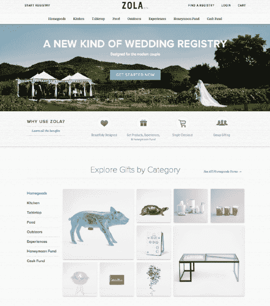

# Gilt 创始人 Kevin Ryan 的新创公司 Zola 希望彻底改造婚礼登记处 

> 原文：<https://web.archive.org/web/https://techcrunch.com/2013/10/02/gilt-founder-kevin-ryans-new-startup-zola-wants-to-reinvent-the-wedding-registry/>

几个月前，Kevin Ryan 在 Disrupt NY 透露他正在扩张自己的帝国，我们一直在想这个秘密创业公司 Gilt、AlleyCorp 和 10Gen 的创始人 Kevin Ryan 在做什么。我们了解到 Ryan 将继续留在电子商务领域，但将进入利润丰厚的垂直领域——婚礼。来认识一下[佐拉、](https://web.archive.org/web/20230129103022/http://www.zola.com/)瑞安和一群前 Gilt 员工组成的新创公司，他们想彻底改造婚礼登记处。

正如 Ryan 向我解释的那样，几年来他一直想进入这个领域。他一直对网上结婚登记处感到失望，因为大多数电子商务网站的注册用户界面都很差，而且为爱人和好朋友购买结婚礼物的体验也不人性化。他知道，利用他从 Gilt 获得的一些知识和专业技能，可能有更好的方法来解决这个特殊的问题。

因此，他向 Gilt 的两位前员工寻求帮助，他们是马善琳和中口伸司。马是 Gilt 最优秀的产品经理之一，他帮助领导了 Gilt Taste 的推出，而中口则负责 Gilt 的设计，开发 flash 销售网站的移动应用程序。两人都在几年前离开了吉尔特，所以瑞安没有从他的另一家公司挖人。他继续组建一个 8 人团队，其中有 6 名前 Gilt 员工。他们的创意是 Zola，它仍处于私人测试阶段，但将在未来几周内推出。

那么左拉是什么，它与现在的产品有什么不同？如果你没有进行婚礼登记，这是一个非常耗时的过程，缺乏任何经验(这与计划和经历婚礼的实际经验形成鲜明对比)。你选择你想注册的每家商店(如贝德柏士比昂公司、梅西百货、亚马逊等)。)，然后分别选择你想在商店或网上添加的商品。当聚合这些注册表时，您可以将它们添加到一个婚礼网站，但这些注册表和 Wedding Channel 等聚合器的整个用户界面都很笨重，无法提供与婚礼等事件的重要性相适应的个性化电子商务体验。正如 Ryan 解释的那样，“大多数婚礼登记处都停留在 web 1.0 上。”

马将左拉的目标描述为重新思考“我们这一代”中一对夫妇的婚礼登记。当您访问该网站并注册 Zola 婚礼登记处时，您可以做一些与您的婚礼网站相同的事情，包括设计一个带有自定义 URL、照片等的主页。事实上，这种体验是相对简单的，正如 Ryan 解释的那样，在第一次注册时填写大量字段会立即让用户失去兴趣。佐拉也为同性婚姻量身定制，如果你愿意，你可以指定这一点。

注册表主页的设计是高度可定制的，或者你可以选择使用 Gilt 提供的一些图片(但这是你想要使用的实际图片)。然后，您可以创建您想要在注册表中设置的不同类型类别的集合，包括厨房、食物、体验、蜜月、家具等。你甚至可以创建一个现金基金来购买房屋和接受捐赠。用户体验与在 Pinterest 上创建一个公告板惊人地相似，除了你从 Zola 添加项目。

在每个集合中，Zola 允许您简单地将产品类别中的项目添加到集合中。因此，如果你注册了厨房用品，你可以添加一系列器皿、瓷器、玻璃器皿、厨房工具、小配件等等(包括像 Cuisinart 或 Le Creuset 这样的品牌)。Zola 部分作为电子商务网站运营，因为他们从品牌本身采购所有产品。当然，你不会在布鲁明戴尔(Bloomingdale's)或 Macys.com(Bernstein)找到那种你会选择的家居商品，但佐拉有雄心增加库存(该网站目前列出了大约 1000 种需要注册/购买的商品)。此外，Zola 允许您在注册表中添加传统商店中找不到的其他项目，如烹饪课、音乐课、KitchenSurfing 礼券、自行车、按摩等。

您还可以将某些对象表示为可由团体购买的物品，或者个人可以支付部分购买价格的物品。这对像家具这样的高价产品特别有用。

设计是这个网站的一大部分，很明显，这类似于镀金般的高端体验，不同于传统的在线零售商。正如瑞安所说，基本上，这不是你的 Target.com 经历。正如 Ryan 和他的团队向我解释的那样，没有一个很好的方法让注册表既能反映这对夫妇的个性和风格，又易于使用。还有一个策划的因素在起作用。Zola 将展示某些注册表，并根据主题管理收藏。虽然我对这种情况一无所知，但你可以想象这里的内容特别有用和相关，因为新娘和新郎正在寻求专家对购买什么类型的锅碗瓢盆、是否值得购买瓷器等的建议。

我最喜欢的功能之一是能够控制你的礼物何时到达。对于任何人(像我一样)来说，已经被淹没在婚礼和订婚礼物中，并在盒子和泡沫包装的海洋中生活了几个月，这是巨大的。实际上，新娘和新郎可以推迟收到礼物，直到婚礼结束，那时他们不那么疲惫，可以花时间打开包装。您还可以导入所有购买信息，以便于整理感谢信。

就商业而言，Zola 的运作很像一个电子商务网站——他们获得商品价格的一部分(我们被告知，大约 20%的上下浮动)。Ryan 补充说，这些都是全价商品。这对夫妇是免费的。迄今为止，这家初创公司已经得到了瑞安的完全支持，但将在未来几个月内寻求筹集约 300 万至 400 万美元的 A 轮融资。

Ryan 说，该网站已经和大约 20 对夫妇进行了测试，到目前为止，参与度令人印象深刻。他还支持登记处的内在营销方面——随着越来越多的年轻夫妇在朋友间使用它，他们可能想在自己的婚礼上使用 Zola。

最终，Zola 将扩展到为夫妇创建真正的婚礼网站，能够添加诸如婚礼在哪里举行、旅游信息等内容。佐拉并不是第一家试图重新发明婚礼登记的公司。去年，作为一个普遍的夫妻登记处，爱情登记处正式成立。婚礼网站领域有许多竞争者，包括英国人莫林的[婚礼](https://web.archive.org/web/20230129103022/https://techcrunch.com/2012/04/30/brit-morin-engages-1-25m-from-marissa-mayer-founders-fund-and-more-to-launch-her-first-app-weduary/)。

除了易于使用之外，Zola 引人注目的地方在于它在视觉上非常漂亮，为婚礼登记处提供了一种美感，使其感觉更加个性化。Ryan 还拥有运营大型电子商务网站的经验，这应该有助于这家初创公司更高效地运营。

