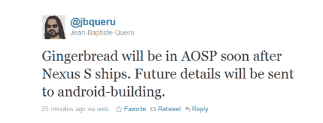

# 姜饼即将登陆 AOSP，极客们心潮澎湃 TechCrunch

> 原文：<https://web.archive.org/web/https://techcrunch.com/2010/12/15/gingerbread-coming-soon-to-aosp-geek-hearts-all-aflutter/>

# 姜饼即将在 AOSP 上市，极客们的心沸腾了

[Android 开源项目](https://web.archive.org/web/20221006075145/http://source.android.com/)(极客们简称为 AOSP)，是所有*真正的* Android 行动发生的地方。它是所有辛勤工作的修改者和 ROM 构建者去获取 Android 源代码的地方，这样他们就可以编译所有那些你知道并且非常喜欢的精彩的定制 ROM。

因此，不难想象，对于 Android 开发者社区来说，从宣布新版本的 Android 到它出现在 AOSP 绿野之间的这段时间是一段特别艰难的时期。

今天，当谷歌员工让·巴普蒂斯特·奎鲁[在一条推特](https://web.archive.org/web/20221006075145/http://twitter.com/#!/jbqueru/status/14915850251280384)中同时提到“姜饼”和“AOSP”两个词时，全世界的极客们都吓了一跳。

可悲的是，这 102 个字符中唯一提到的日期是“Nexus 发布后不久”

虽然我们都很清楚这一点，但我不禁对姜饼 Cyanogen mod 感到有点兴奋——如果你曾经认为自己是 Android 的粉丝，你也应该感到兴奋。

[通过 [AndroidCentral](https://web.archive.org/web/20221006075145/http://www.androidcentral.com/gingerbread-be-aosp-soon-says-googler)