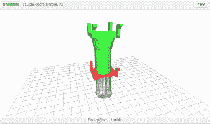

# GitHub 增加了 3D 建模功能，使其成为与打印机无关的对象共享选择 

> 原文：<https://web.archive.org/web/https://techcrunch.com/2013/09/18/github-adds-3d-modeling-features-that-make-it-a-printer-agnostic-choice-for-object-sharing/>

# GitHub 增加了 3D 建模功能，使其成为对象共享的独立于打印机的选择

每个人都喜欢的 nerdery Github 在 4 月份增加了 STL 对象文件支持——基本上是一个上传和渲染 3D 模型的系统。然而，现在他们已经改进了他们的服务，增加了一个系统来发现这些 3D 文件后续版本的差异，本质上是给 [3D 建模](https://web.archive.org/web/20221127135506/https://beta.techcrunch.com/tag/3d-printing)增加了一个撤销按钮。

这个系统，正如这里所演示的，获取两个或更多的 STL 文件并叠加在一起，这样你就可以看到它们之间的差异和随时间的变化。GH [乡亲们写](https://web.archive.org/web/20221127135506/https://github.com/blog/1633-3d-file-diffs):

这是如何工作的？我们采用模型的两个版本，并使用二进制空间划分，计算添加、删除和未更改的部分。这是通过使用 csgtool 来完成的，CSG tool 是一个通过 FFI 与 Ruby gem 配对的 C 库。这些片段被缓存并由我们现有的 3D 查看器显示，尽管我们对它们进行了不同的着色，并利用它们的透明度来帮助说明这些变化。

你可以在这里看到正在运行的修订滑块[，但基本上它采用每个版本，然后使用一些漂亮的过渡叠加在下一个版本上。与代码差异(比较一个软件的两次迭代的过程)没有什么不同，这让您对设计过程有更多的控制，并让您看到有人在哪里搞砸了(或做了一些令人惊讶的事情)。](https://web.archive.org/web/20221127135506/https://github.com/underverk/3D_Printer/commit/d6b19d047647fcd4415b739903b630649c487cc1)

然而，与 [Thingiverse](https://web.archive.org/web/20221127135506/https://beta.techcrunch.com/tag/Thingiverse) 和 [YouMagine](https://web.archive.org/web/20221127135506/https://beta.techcrunch.com/tag/YouMagine) 不同的是， [Github](https://web.archive.org/web/20221127135506/https://beta.techcrunch.com/tag/Github) 在打印机和型号方面是不可知的，因此它是几乎每个打印机用户玩耍和工作的安全场所。