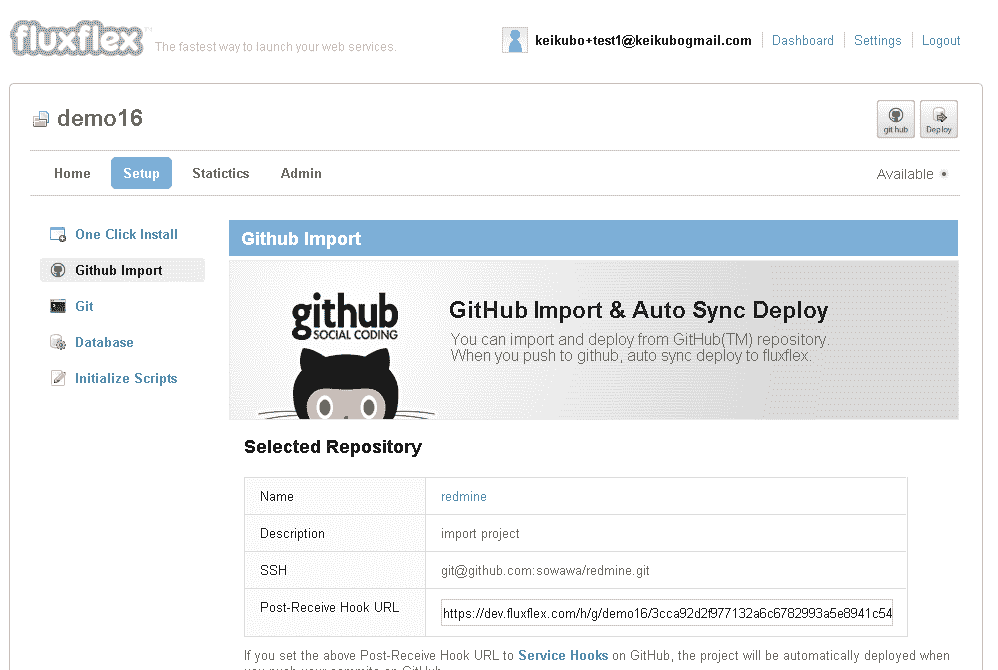

# 集成 Github 的 fluxflex 旨在使云托管更简单、更便宜 TechCrunch

> 原文：<https://web.archive.org/web/https://techcrunch.com/2011/08/17/github-integrated-fluxflex-aims-at-making-cloud-hosting-easier-and-cheaper/>

# 集成 Github 的 fluxflex 旨在使云托管更简单、更便宜

有相当多的云托管平台即服务提供商为 web 应用程序开发人员做繁重的工作，这些开发人员希望他们的网站有一定的流量。一家名为 [fluxflex](https://web.archive.org/web/20230203095507/https://www.fluxflex.com/) 的新提供商旨在通过以相对较低的成本提供一个非常容易使用的“一键安装”解决方案，使自己与 Heroku、谷歌应用引擎、DotCloud 和其他公司区分开来:这项服务是免费的，升级的[价格](https://web.archive.org/web/20230203095507/https://www.fluxflex.com/pricing)从每月 1 美元开始。

fluxflex 表示，除了经验丰富的开发人员，深度集成 Github 平台的主要目标群体是个人和“随意”的 web 应用程序开发人员，他们不想在维护他们的云托管环境上投入太多时间。这些用户可以安装应用程序(WordPress、Rails、Django 等)。)通过“一次点击”(而不是使用原始命令)，使用 Git 定制它们，并在[库](https://web.archive.org/web/20230203095507/http://www.fluxflex.com/library)与其他用户共享任何 GitHub 库。

首席执行官 Kei Kubo 告诉我，他将 fluxflex 视为一个“社交托管”平台，社区成员可以在这个平台上相互交流，从更有经验的用户那里学习最佳实践，并与他人共享应用程序。

fluxflex 还可以自动从 Github 导入和部署项目，目前支持 PHP、Python、Ruby、Perl、Node.js 和 Haskell(有关更详细的功能集，请单击[此处](https://web.archive.org/web/20230203095507/https://www.fluxflex.com/about))。未来的计划是增加语言和框架，旁边是更多用户可以一键安装的应用程序。

总部位于旧金山和东京的 fluxflex 迄今已筹集了 24 万美元的天使资金。